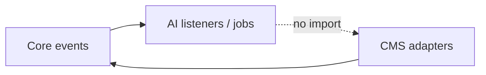

<p>&nbsp;</p>
<p align="center">
	<a href="https://github.com/swolley" target="_blank">
		
    </a>
</p>
<p>&nbsp;</p>

> ⚠️ **Caution**: This package is a **work in progress**. **Don't use this in production or use at your own risk**—no guarantees are provided... or better yet, collaborate with me to create the definitive Laravel boilerplate; that's the right place to instroduce your ideas. Let me know your ideas...

## Table of Contents

-   [Description](#description)
-   [Installation](#installation)
-   [Configuration](#configuration)
-   [Features](#features)
-   [Architecture](#architecture)
-   [Scripts](#scripts)
-   [Contributing](#contributing)
-   [License](#license)

## Description

The AI Module provides artificial intelligence capabilities for embeddings generation, vector search, and automatic translation. This module is **optional** and can be activated/deactivated independently. When disabled, the application continues to function normally without AI features.

**Key Features:**
- ✨ Embeddings generation for vector search
- 🌐 Automatic translation (AI-powered and DeepL)
- 💬 AI Chat with conversation history and streaming
- 📚 RAG (Retrieval-Augmented Generation) for FAQ/documentation
- 🛠️ Tool/Function calling with 3-level risk management
- 🧠 Conversation memory with automatic summarization
- 🛡️ Guardrails for prompt injection detection and output validation
- 🔄 Event-driven architecture for seamless integration
- 🎯 Zero dependencies from Core/Cms modules (Core never depends on AI)

## Installation

If you want to add this module to your project, you can use the `joshbrw/laravel-module-installer` package.

Add repository to your `composer.json` file:

```json
"repositories": [
    {
        "type": "composer",
        "url": "https://github.com/swolley/laraplate-core.git"
    },
    {
        "type": "composer",
        "url": "https://github.com/swolley/laraplate-ai.git"
    }
]
```

```bash
composer require joshbrw/laravel-module-installer swolley/laraplate-core swolley/laraplate-ai
```

Then, you can install the module by running the following command:

```bash
php artisan module:install Core
php artisan module:install AI
```

## Configuration

The AI module configuration is automatically mapped as `ai.*` when the module is active. Configuration file: `Modules/AI/config/config.php`.

```env
# AI Features
AI_EMBEDDINGS_ENABLED=true          # Enable embeddings generation
AI_TRANSLATION_ENABLED=true          # Enable automatic translation

# AI Provider (default: ollama)
AI_PROVIDER=ollama                   # Options: ollama, openai, voyageai, mistral, sentence-transformers

# OpenAI Configuration
OPENAI_API_KEY=                      # OpenAI API key
OPENAI_API_URL=                      # OpenAI compatible API URL (optional)
OPENAI_MODEL=                        # OpenAI model (e.g., gpt-3.5-turbo, text-embedding-3-small)

# Ollama Configuration
OLLAMA_API_URL=http://localhost:11434  # Ollama API URL
OLLAMA_MODEL=llama3.2:3b            # Ollama model for embeddings/translation

# VoyageAI Configuration
VOYAGEAI_API_KEY=                    # VoyageAI API key
VOYAGEAI_MODEL=voyage-3-lite        # VoyageAI model

# Mistral Configuration
MISTRAL_API_KEY=                     # Mistral API key
MISTRAL_MODEL=mistral-large-latest  # Mistral model

# Sentence Transformers Configuration
SENTENCE_TRANSFORMERS_URL=http://localhost:8000  # Sentence Transformers API URL
SENTENCE_TRANSFORMERS_API_KEY=       # Sentence Transformers API key (optional)

# DeepL Configuration (for automatic translation)
DEEPL_API_KEY=                       # DeepL API key

# Chat Configuration
AI_CHAT_ENABLED=true                 # Enable chat functionality
AI_CHAT_PROVIDER=ollama              # Chat provider (ollama, openai, mistral, anthropic)
AI_CHAT_MAX_CONTEXT=50               # Max messages in context window
AI_CHAT_ENABLE_SUMMARY=false         # Enable automatic conversation summarization

# FAQ/RAG Configuration
AI_FAQ_ENABLED=true                  # Enable FAQ/RAG functionality
AI_FAQ_DOCS_PATH=                    # Optional extra documentation root (default scan: docs/rag + active Modules/*/docs/rag; see docs/README.md)
AI_FAQ_VECTOR_STORE=filesystem       # Vector store type (memory, filesystem)
AI_FAQ_MAX_DOCS=5                    # Max documents to retrieve
AI_FAQ_MIN_SIMILARITY=0.7            # Minimum similarity score

# Tools Configuration
AI_TOOLS_ENABLED=true                # Enable tool/function calling

# Guardrails Configuration
AI_GUARDRAILS_ENABLED=false          # Enable guardrails
AI_GUARDRAILS_PROMPT_INJECTION=false # Enable prompt injection detection
LAKERA_API_KEY=                      # Lakera Guard API key
LAKERA_ENDPOINT=https://api.lakera.ai/  # Lakera endpoint
```

### Module Priority

The AI module has priority **999** (loaded after Core and Cms) to ensure proper event listener registration order.

## Features

### Requirements

-   PHP >= 8.5
-   Laravel 12.0+
-   **Core Module** (mandatory dependency)
-   **PHP Extensions:**
    -   `ext-curl`: For HTTP requests to AI providers
    -   `ext-json`: For JSON serialization

### Installed Packages

The AI Module utilizes several packages to enhance its functionality:

-   **Embeddings:**
    -   [theodo-group/llphant](https://github.com/theodo-group/llphant): Embedding generation for multiple providers (OpenAI, Ollama, VoyageAI, Mistral)

-   **Development and Testing:**
    -   [pestphp/pest](https://github.com/pestphp/pest): Testing framework
    -   [laravel/pint](https://github.com/laravel/pint): Code style fixer

### Supported AI Providers

#### Embeddings Generation
- **OpenAI**: `text-embedding-3-small`, `text-embedding-3-large`, `text-embedding-ada-002`
- **Ollama**: `nomic-embed-text`, `nomic-embed-large` (and custom models)
- **VoyageAI**: `voyage-3`, `voyage-3-large`, `voyage-3-lite`, `voyage-code-2`, `voyage-code-3`, `voyage-finance-2`, `voyage-law-2`
- **Mistral**: Mistral embedding models
- **Sentence Transformers**: Self-hosted Sentence Transformers API

#### Automatic Translation
- **OpenAI**: GPT models for translation
- **Ollama**: Local LLM models for translation
- **Mistral**: Mistral models for translation
- **DeepL**: Professional translation service (considered AI-powered)

### Additional Functionalities

The AI Module includes built-in features such as:

-   **Embeddings Generation:**
    - Automatic embeddings generation for searchable models
    - Multilingual embeddings (concatenates all available translations)
    - Vector search integration with Elasticsearch and Typesense
    - Batch processing for large documents

-   **Automatic Translation:**
    - Automatic translation on model creation/update
    - Support for multiple translation providers
    - Translation caching for performance
    - Fallback mechanisms for failed translations
    - DeepL integration for professional translations

-   **AI Chat:**
    - Multi-provider support (OpenAI, Ollama, Mistral, Anthropic)
    - Conversation history with database persistence
    - Streaming responses (Server-Sent Events)
    - System message customization per conversation

-   **FAQ/RAG (Retrieval-Augmented Generation):**
    - Documentation indexing with embeddings
    - Vector similarity search for relevant context
    - Automatic question detection (locale-aware)
    - Citations in responses with source attribution
    - Command: `php artisan ai:index-docs`

-   **Tool/Function Calling:**
    - Register custom tools with `ToolRegistry`
    - 3-level risk classification (low, medium, high)
    - Low risk: immediate execution
    - Medium risk: user confirmation required
    - High risk: admin approval required
    - Async execution via jobs

-   **Conversation Memory:**
    - Automatic summarization after N messages
    - Key facts extraction
    - Summary snapshots for history
    - Opt-in/opt-out per conversation
    - "Forget" functionality

-   **Guardrails:**
    - Prompt injection detection (Lakera Guard API)
    - JSON format validation
    - Retry strategy for failed validations
    - Configurable per feature

-   **Event-Driven Architecture:**
    - `ModelRequiresIndexing`: Event emitted when a model needs indexing
    - `ModelPreProcessingCompleted`: Event emitted when pre-processing (embeddings/translation) completes
    - `TranslatedModelSaved`: Event emitted when a model with translations is saved
    - Seamless integration with Core module's search functionality

-   **Modular Design:**
    - Can be disabled without breaking application functionality
    - Extensible architecture for future AI features

## Architecture

### Event-driven integration

Core is the **event bus**; this module registers AI listeners and jobs. Full diagrams (Mermaid) and class maps:

| Topic | Document |
|-------|----------|
| **Overview** (indexing + moderation, comparison, extension) | [Modules/Core/docs/EVENT_ORCHESTRATION.md](../Core/docs/EVENT_ORCHESTRATION.md) |
| **Embeddings, Elasticsearch, translations** | [docs/SEARCH_AND_TRANSLATION.md](docs/SEARCH_AND_TRANSLATION.md) |
| **Modification moderation (AI vote)** | [docs/MODERATION.md](docs/MODERATION.md) |
| Chat, RAG, tools (module-internal) | [docs/ARCHITECTURE.md](docs/ARCHITECTURE.md) |



### Decoupling strategy

- **Core** never imports classes from **AI**
- **AI** listens to events from **Core**
- Configuration-based model class resolution (no hardcoded dependencies)
- Service container bindings for optional features

### Fallback Behavior

When the AI module is disabled:
- Embeddings generation is skipped (vector search disabled)
- Automatic translation is disabled (manual translation still works)
- Core's `IndexModelFallbackListener` handles indexing without pre-processing
- Application continues to function normally

## Scripts

The AI Module provides several useful scripts for development and maintenance:

### Code Quality and Testing

```bash
# Run all tests and quality checks
composer test

# Run specific test suites
composer test:unit          # Run unit tests with coverage
composer test:type-coverage # Check type coverage (target: 100%)
composer test:typos         # Check for typos in code
composer test:lint          # Check code style
composer test:types         # Run PHPStan analysis
composer test:refactor      # Run Rector refactoring
```

### Code Quality Tools

```bash
# Code style and IDE helpers
composer lint               # Fix code style and generate IDE helpers

# Static analysis
composer check              # Run PHPStan analysis
composer fix                # Run PHPStan analysis with auto-fix
composer refactor           # Run Rector refactoring
```

### Version Management

```bash
# Version bumping
composer version:major      # Bump major version
composer version:minor      # Bump minor version
composer version:patch      # Bump patch version
```

### Development Setup

```bash
# Setup Git hooks
composer setup:hooks
```

## Contributing

If you want to contribute to this project, follow these steps:

1. Fork the repository.
2. Create a new branch for your feature or correction.
3. Send a pull request.

## License

AI Module is open-sourced software licensed under the [GNU AGPL v3](https://www.gnu.org/licenses/agpl-3.0.html).

## TODO and FIXME

This section tracks all pending tasks and issues that need to be addressed in the AI Module.

### High Priority

- [ ] **Filament Admin Panel for AI**
  - ActionRequest approval interface (for high-risk actions)
  - Conversation monitoring
  - Tool usage analytics
  - Guardrails configuration UI

- [ ] **User/Tenant-Selectable AI Provider**
  - Allow users or tenants to select their preferred AI provider
  - Store provider preferences in user/tenant settings
  - Support per-conversation provider override
  - Implement provider capability detection

### Medium Priority

- [ ] **Per-Module Feature Activation**
  - Implement `features.*.modules` configuration
  - Allow enabling embeddings/translation per specific module
  - Currently commented in config for future implementation

- [ ] **Frontend UI for AI Features**
  - Chat widget component
  - Action confirmation dialogs
  - Suggestion display component

- [ ] **Register Default Tools**
  - Create tool definitions for common CRUD operations
  - Document tool registration best practices

### Low Priority

- [ ] **Additional AI Providers**
  - Support for more embedding providers
  - Support for more translation providers
  - Provider abstraction layer improvements

- [ ] **Advanced RAG Features**
  - Multi-document source types (database, API)
  - Hybrid search (keyword + vector)
  - Re-ranking with cross-encoder

### Completed Features

- [x] **Chat System** - Streaming and non-streaming support
- [x] **RAG/FAQ** - Documentation indexing and question answering
- [x] **Memory/Summarization** - Automatic conversation summarization
- [x] **Guardrails** - Prompt injection detection (Lakera integration)
- [x] **Contextual Suggestions** - Proactive AI suggestions with rate limiting
- [x] **Tool System Infrastructure** - ToolRegistry, ActionRequest, risk classification
- [x] **Tool System API** - Full API exposure with confirm/approve/reject endpoints
- [x] **Event-Driven Architecture** - Clean decoupling from Core module

### Notes

- The module is designed to be extracted as a standalone package
- Future plans include making it installable via Composer
- Consider making it a paid package option
- Architecture supports easy extension with new AI features
- **Privacy**: Ollama provider enables fully local AI processing
