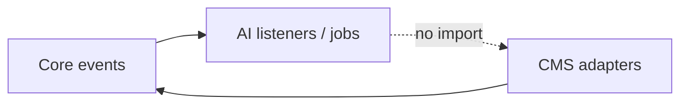

<p>&nbsp;</p>
<p align="center">
	<a href="https://github.com/swolley" target="_blank">
		
    </a>
</p>
<p>&nbsp;</p>
<p align="center">
    
    
    
</p>
<p>&nbsp;</p>

# Laraplate AI Module

> ⚠️ **Caution**: This package is a **work in progress**. **Don't use this in production or use at your own risk**—no guarantees are provided... or better yet, collaborate with me to create the definitive Laravel boilerplate; that's the right place to instroduce your ideas. Let me know your ideas...

## Table of Contents

-   [Description](#description)
-   [Installation](#installation)
-   [Configuration](#configuration)
-   [Features](#features)
-   [Architecture](#architecture)
-   [Scripts](#scripts)
-   [Contributing](#contributing)
-   [License](#license)

## Description

The AI Module provides artificial intelligence capabilities for embeddings generation, vector search, and automatic translation. This module is **optional** and can be activated/deactivated independently. When disabled, the application continues to function normally without AI features.

**Key Features:**
- ✨ Embeddings generation for vector search
- 🌐 Automatic translation (AI-powered and DeepL)
- 💬 AI Chat with conversation history and streaming
- 📚 RAG (Retrieval-Augmented Generation) for FAQ/documentation
- 🛠️ Assistant tools: reads under the user's permissions, writes as proposals the user confirms
- 🧠 Conversation memory with automatic summarization
- 🛡️ In-app assistance guardrails: policy, input and output limits, a deterministic injection classifier, tool results checked before the model reads them
- 🔄 Event-driven architecture for seamless integration
- 🎯 Zero dependencies from Core/Cms modules (Core never depends on AI)

## Installation

If you want to add this module to your project, you can use the `joshbrw/laravel-module-installer` package.

Add repository to your `composer.json` file:

```json
"repositories": [
    {
        "type": "composer",
        "url": "https://github.com/swolley/laraplate-core.git"
    },
    {
        "type": "composer",
        "url": "https://github.com/swolley/laraplate-ai.git"
    }
]
```

```bash
composer require joshbrw/laravel-module-installer swolley/laraplate-core swolley/laraplate-ai
```

Then, you can install the module by running the following command:

```bash
php artisan module:install Core
php artisan module:install AI
```

## Configuration

The AI module configuration is automatically mapped as `ai.*` when the module is active. Configuration file: `Modules/AI/config/config.php`.

Feature switches and tuning are runtime settings managed from Filament > Settings, not env vars: `features.{embeddings,translation,faq,contextual_suggestions,moderation}.enabled` (seeded off: they need a configured provider), `features.chat.summary.enabled`, `features.faq.{max_documents,min_similarity,format_citations}`, `features.faq.splitter.*`, the `features.moderation.*` thresholds and `features.moderation.queue` (the queue of the moderation jobs, read when a job is dispatched), `features.text_generation.{enabled,max_output_chars,cache_ttl_seconds}` and `features.text_generation.rate_limit.{max,per_seconds}` (seeded off, 500, 0, 60 and 60), `features.faq.vector_store` (`elasticsearch` or `filesystem`, seeded `elasticsearch`) and `features.faq.policy_classification_version` (seeded `in-app-docs-v1`), `features.media_analysis.enabled` (seeded off), and the model of each AI feature, `features.*.model` (value `provider:model`, choices refreshed from the providers by `ai:models:refresh`, nightly or from the setting row; see `docs/rag/AI_MODEL_SELECTION_DEVELOPER.md`). Settings are listed without the module prefix (the module is a column) and read from config as `ai.<name>`. A value managed by a setting has no env variable: its default lives in code.

```env
# AI Features

# Embeddings: the provider and model are the setting `features.embeddings.model` (provider:model),
# no longer an env var. Configure the provider's key or URL (below); only configured profiles are offered.

# OpenAI Configuration
OPENAI_API_KEY=                      # OpenAI API key
OPENAI_MODEL=                        # Model used by embeddings with OpenAI (AI features take their model from Settings)

# Ollama Configuration
OLLAMA_API_URL=                      # Ollama API URL, e.g. http://localhost:11434. Required to use Ollama: unset means not configured
OLLAMA_MODEL=llama3.2:3b            # Model used by embeddings with Ollama (AI features take their model from Settings)

# VoyageAI Configuration
VOYAGEAI_API_KEY=                    # VoyageAI API key
VOYAGEAI_MODEL=voyage-3-lite        # VoyageAI model

# Mistral Configuration
MISTRAL_API_KEY=                     # Mistral API key
MISTRAL_MODEL=mistral-large-latest  # Model used by embeddings with Mistral (AI features take their model from Settings)

# Sentence Transformers Configuration
SENTENCE_TRANSFORMERS_URL=http://localhost:8000  # Sentence Transformers API URL
SENTENCE_TRANSFORMERS_API_KEY=       # Sentence Transformers API key (optional)
SENTENCE_TRANSFORMERS_TIMEOUT=30     # Per-request HTTP timeout in seconds (raise for slow CPU-bound services)
SENTENCE_TRANSFORMERS_BATCH_SIZE=32  # Documents per /embed batch (lower it if one batch exceeds the timeout)
CROSS_ENCODER_URL=                   # Base URL of the service exposing POST /score; falls back to SENTENCE_TRANSFORMERS_URL (no built-in address)
CROSS_ENCODER_API_KEY=               # Key for that service; falls back to SENTENCE_TRANSFORMERS_API_KEY

# Embedding model switch
AI_EMBEDDINGS_INDEX_CHUNK_SIZE=250   # Records per IndexDocumentsChunkJob when a switch writes the search indexes (embeddings-index queue); below 1 or not a number: 250, capped at 2000
AI_EMBEDDINGS_RAG_CHUNK_SIZE=20     # Documentation files per IndexDocumentsChunkJob when a switch rebuilds the Elasticsearch documentation indexes; below 1 or not a number: 20, capped at 200
AI_EMBEDDINGS_INDEX_CHUNK_STALL_SECONDS=900  # A chunked switch phase fails, naming the queue, when embeddings-index holds jobs and no chunk was written for this long; below 1 or not a number: 900
AI_EMBEDDINGS_STATE_LOCK_WAIT_SECONDS=10     # Seconds a writer of the switch state waits for its lock before failing (the job is retried); below 1 or not a number: 10

# DeepL Configuration (for automatic translation)
DEEPL_API_KEY=                       # DeepL API key

# Optional Text Generation (answers Core's AiTextGenerationRequested event): the settings features.text_generation.* in Filament
# Live smoke test (tests/Integration/AiTextGenerationLiveSmokeTest.php) runs only with AI_LIVE_TESTS=1 + provider credentials.

# FAQ/RAG Configuration
AI_FAQ_DOCS_PATH=                    # Optional extra roots (comma/semicolon/newline); see docs/README.md and rag_paths()
# The vector store is the setting features.faq.vector_store in Filament (elasticsearch or filesystem)
AI_FAQ_VECTOR_STORE_PATH=            # Filesystem store file (default: storage/app/ai/faq-vectorstore.store); use shared volume in multi-instance
AI_FAQ_ES_INDEX=laraplate_rag_docs   # Elasticsearch index name when the vector store is elasticsearch
AI_FAQ_QUERY_LOG_INDEX=laraplate_rag_queries   # Elasticsearch index of the documentation query log (ai:create-rag-query-index); the switch, the question mode and the retention are the settings features.faq.query_logging.* in Filament
# (AI_FAQ_ES_EMBEDDING_DIMS was removed: the RAG vector length is the active embedding profile's `dimensions`)

```

Removed on 2026-09-29, now settings in Filament > Settings (see above): `AI_CHAT_PROVIDER`, `AI_TEXT_GENERATION_PROVIDER`, `AI_TEXT_GENERATION_MODEL`, `AI_MODERATION_PROVIDER`, `AI_COMMENT_MOD_PROVIDER`, `AI_SEARCH_ORCHESTRATION_PROVIDER`, `AI_TRANSLATION_PROVIDER`, `ANTHROPIC_MODEL`, `AI_MEDIA_ANALYSIS_ENABLED`, `AI_MEDIA_VISION_MODEL`, `AI_MEDIA_VISION_OLLAMA_MODEL`, `AI_MEDIA_TRANSCRIPTION_MODEL`, `AI_MEDIA_WHISPER_LOCAL_MODEL`.

Removed on 2026-10-07, now settings in Filament > Settings, group `ai`: `AI_TEXT_GENERATION_ENABLED`, `AI_TEXT_GENERATION_MAX_CHARS`, `AI_TEXT_GENERATION_CACHE_TTL`, `AI_TEXT_GENERATION_RATE_MAX`, `AI_TEXT_GENERATION_RATE_WINDOW` (`features.text_generation.*`), `AI_FAQ_VECTOR_STORE` (`features.faq.vector_store`), `AI_FAQ_POLICY_CLASSIFICATION_VERSION` (`features.faq.policy_classification_version`), `AI_MODERATION_QUEUE` and its fallback `AI_COMMENT_MOD_QUEUE` (`features.moderation.queue`). Removed with nothing in their place, since nothing read them or the code they drove is gone: `AI_TOOLS_ENABLED`, `AI_GUARDRAILS_ENABLED`, `AI_GUARDRAILS_PROMPT_INJECTION`, `AI_GUARDRAILS_JSON_VALIDATION`, `LAKERA_API_KEY`, `LAKERA_ENDPOINT`. `AI_EMBEDDINGS_ENABLED`, `AI_CHAT_ENABLE_SUMMARY`, the `AI_MODERATION_*` switches and the other `AI_COMMENT_*` variables are read by nothing: the switches are the settings `features.embeddings.enabled`, `features.chat.summary.enabled` and `features.moderation.*`.

### Module Priority

The AI module has priority **999** (loaded after Core and Cms) to ensure proper event listener registration order.

## Features

### Privacy: what the assistant stores

The assistant collects **no usage data**: nothing is recorded in the background, and nothing learns from what
a user clicks. The instance keeps only what a user's own request or setting creates:

-   the **preferences** of the user (`users.preferences`, written by the client the user uses);
-   the user's **conversations**: messages with their citations and proposals, summaries and title;
-   **contextual suggestions** (off by default): the page and the action they are about, pruned after 7 days.

A deleted conversation takes its messages, summaries and title with it, and a deleted user takes their
conversations and suggestions. Details, the wire contract and the purge rules:
`docs/rag/ASSISTANT_PROPOSALS_DEVELOPER.md`.

### Requirements

-   PHP >= 8.5
-   Laravel 12.0+
-   **Core Module** (mandatory dependency)
-   **PHP Extensions:**
    -   `ext-curl`: For HTTP requests to AI providers
    -   `ext-json`: For JSON serialization

### Installed Packages

The AI Module utilizes several packages to enhance its functionality:

-   **Embeddings:** generated by this module's own providers, built by
    `Modules\AI\Ai\Embeddings\EmbeddingsProviderFactory` from
    the active profile (Core's managed setting `search.vector.model`, read as `core.search.vector.model`). `theodo-group/llphant` was listed here and is **not
    a dependency of this application**: it is absent from the root `composer.json`. Two classes in
    Core still implement its interfaces and cannot be loaded; retiring them is Task 4 of
    `docs/superpowers/plans/2026-09-16-search-modes-and-strategy-resolution.md`.

-   **Development and Testing** (declared by the application, not by this module):
    -   [pestphp/pest](https://github.com/pestphp/pest): Testing framework
    -   [laravel/pint](https://github.com/laravel/pint): Code style fixer

### Supported AI Providers

#### Embeddings Generation
- **OpenAI**: `text-embedding-3-small`, `text-embedding-3-large`, `text-embedding-ada-002`
- **Ollama**: `nomic-embed-text`, `nomic-embed-large` (and custom models)
- **VoyageAI**: `voyage-3`, `voyage-3-large`, `voyage-3-lite`, `voyage-code-2`, `voyage-code-3`, `voyage-finance-2`, `voyage-law-2`
- **Mistral**: Mistral embedding models
- **Sentence Transformers**: Self-hosted Sentence Transformers API — [installation guide](docs/SENTENCE_TRANSFORMERS_INSTALLATION.md)

#### Automatic Translation
- **OpenAI**: GPT models for translation
- **Ollama**: Local LLM models for translation
- **Mistral**: Mistral models for translation
- **DeepL**: Professional translation service (considered AI-powered)

### Additional Functionalities

The AI Module includes built-in features such as:

-   **Embeddings Generation:**
    - Automatic embeddings generation for searchable models
    - Multilingual embeddings (concatenates all available translations)
    - Vector search integration with Elasticsearch and Typesense
    - Batch processing for large documents
    - Graceful degradation: a permanent embedding failure indexes the document keyword-only instead of dropping it; backfill missing embeddings with `php artisan ai:embeddings:repair "<Model FQCN>"`. See [docs/SEARCH_AND_TRANSLATION.md](docs/SEARCH_AND_TRANSLATION.md).
    - Model switch: the model is the setting `features.embeddings.model` (`provider:model`); changing it asks for confirmation and runs `ai:embeddings:switch`, which re-embeds, rebuilds the indexes, verifies and activates the new model while vector search is off. Each profile declares its `dimensions`, measured with `ai:embeddings:probe {profile}`. Follow a switch with `ai:embeddings:status`, continue or give it up with `--resume` / `--abandon`, delete unused rows with `ai:embeddings:prune --model-key=<key>`. The switch job runs on the `embeddings-switch` queue (Horizon supervisor `supervisor-embeddings-switch`, timeout 960 s) and writes the search documents through `IndexDocumentsChunkJob` chunks on the `embeddings-index` queue (supervisor `supervisor-embeddings-index`, 1 process, timeout 300 s; `AI_EMBEDDINGS_INDEX_CHUNK_SIZE` records per chunk); with FAQ on Elasticsearch it writes the documentation indexes through the same chunks (`AI_EMBEDDINGS_RAG_CHUNK_SIZE` files per chunk). The switch job itself writes no document but keeps a 900 s timeout for its corpus walks, the pgvector index build and the activation's row delete, which grow with the corpus and are not timed: the queue connection's `retry_after` must be at least 1000 s. See [docs/rag/MODULE.md](docs/rag/MODULE.md), section *Embedding model and model switch*.

-   **Automatic Translation:**
    - Automatic translation on model creation/update
    - Support for multiple translation providers
    - Translation caching for performance
    - Fallback mechanisms for failed translations
    - DeepL integration for professional translations

-   **AI Chat:**
    - Multi-provider support (OpenAI, Ollama, Mistral, Anthropic)
    - Conversation history with database persistence
    - The answer is sent whole, after the protected assistant has validated it: `POST /app/ai/agent` streams the run as AG-UI events (the message is one event), and `streamMessage` answers 422
    - System message customization per conversation

-   **FAQ/RAG (Retrieval-Augmented Generation):**
    - Answers from a **documentation corpus** indexed under `docs/rag/` and `Modules/*/docs/rag/` (not from general `docs/` unless copied into `rag/`)
    - **Two audiences, two server-owned profiles and separate corpora:**
        - **End users** — in-app chat (`InAppAssistanceService`, behind `POST /app/ai/agent` and the `messages` route): help using the application (workflows, screens, permissions), from the documentation corpus and the tools the policy allows.
        - **Developers** — terminal assistant: `php artisan ai:help` (interactive REPL or `--question="..."` one-shot), with access to the developer documentation corpus and no application-content tool.
    - Citations with source attribution in answers
    - **Commands:**
        - `php artisan ai:index-rag-docs` — build or update a profile corpus (`--profile=developer|user|all`, `--path=`, `--full`)
        - `php artisan ai:create-rag-es-index` — create Elasticsearch index when the setting `features.faq.vector_store` is `elasticsearch`
        - `php artisan ai:help` — developer documentation assistant in the terminal
        - `php artisan ai:evaluate-application-content --dataset=... --source=... --output=...` — provider retrieval evaluation without chat generation
    - **Vector store options** (the setting `features.faq.vector_store`): `elasticsearch` (default, recommended for multi-instance), `filesystem`; `memory` is for tests only. See [docs/rag/DEPLOYMENT.md](docs/rag/DEPLOYMENT.md).
    - **Corpus authoring:** [docs/rag/README.md](../../docs/rag/README.md) (what to index, structure, conventions). **Implementation detail:** [docs/rag/MODULE.md](docs/rag/MODULE.md).

-   **Assistant tools:**
    - Authenticated in-app read-only Core Graph tools with request permission and ACL enforcement
    - Authenticated `application_content_search` with explicit module providers, server-side routing, safe citations, and evidence-free abstention
        - `php artisan ai:evaluate-application-content --dataset=... --source=... --output=...` — provider retrieval evaluation without chat generation
    - **Vector store options** (the setting `features.faq.vector_store`): `elasticsearch` (default, recommended for multi-instance), `filesystem`; `memory` is for tests only. See [docs/rag/DEPLOYMENT.md](docs/rag/DEPLOYMENT.md).
    - **Corpus authoring:** [docs/rag/README.md](../../docs/rag/README.md) (what to index, structure, conventions). **Implementation detail:** [docs/rag/MODULE.md](docs/rag/MODULE.md).

-   **Assistant writes (governed):**
    - The in-app assistant can read and propose changes to the entities the operator opts into (`ai.features.tools.crud.entities`), as the signed-in person and under their permissions.
    - A write is only a **proposal**: the person confirms it in the application (`POST /app/crud/update/ai/assistant-writes/{id}/confirm`), and on entities with approvals it then goes to a vote. The model cannot apply, confirm or approve anything.
    - Entities without approvals are written only if listed in `ai.features.tools.crud.unmoderated_writes`. Proposals expire after `ai.features.tools.crud.proposal_ttl_minutes` (30). See [docs/rag/MODULE.md](docs/rag/MODULE.md) (*Writes through the assistant*) and [docs/TOOLS_USAGE_EXAMPLE.md](docs/TOOLS_USAGE_EXAMPLE.md).

-   **Conversation Memory:**
    - Automatic summarization after N messages
    - Key facts extraction
    - Summary snapshots for history
    - Opt-in/opt-out per conversation
    - "Forget" functionality

-   **Guardrails (in-app assistance):**
    - `AssistanceGuardrailPipeline` checks the input, the retrieved context, the citations and the output, fail-closed, with the limits `ai.features.guardrails.in_app_*`; they are mandatory and have no switch
    - Prompt injection is recognised by `DeterministicAssistanceSafetyClassifier` (patterns, no model call)
    - `ToolResultGuard` withholds an entity read-tool result whose text reads like an instruction, before the model sees it
    - The model's answers that must be data go through Neuron's structured output, which validates them and asks again (see `docs/rag/MODULE.md`, *Structured output of the model*)

-   **Event-Driven Architecture:**
    - `ModelRequiresIndexing`: Event emitted when a model needs indexing
    - `ModelPreProcessingCompleted`: Event emitted when pre-processing (embeddings/translation) completes
    - `TranslatedModelSaved`: Event emitted when a model with translations is saved
    - Seamless integration with Core module's search functionality

-   **Modular Design:**
    - Can be disabled without breaking application functionality
    - Extensible architecture for future AI features

## Architecture

### Event-driven integration

Core is the **event bus**; this module registers AI listeners and jobs. Full diagrams (Mermaid) and class maps:

| Topic | Document |
|-------|----------|
| **Overview** (indexing + moderation, comparison, extension) | [Modules/Core/docs/EVENT_ORCHESTRATION.md](../Core/docs/EVENT_ORCHESTRATION.md) |
| **Embeddings, Elasticsearch, translations** | [docs/SEARCH_AND_TRANSLATION.md](docs/SEARCH_AND_TRANSLATION.md) |
| **Self-hosted Sentence Transformers** | [docs/SENTENCE_TRANSFORMERS_INSTALLATION.md](docs/SENTENCE_TRANSFORMERS_INSTALLATION.md) |
| **Modification moderation (AI vote)** | [docs/MODERATION.md](docs/MODERATION.md) |
| **Optional text generation** (answers `AiTextGenerationRequested`, e.g. SAO ownership phrasing) | `HandleAiTextGenerationListener`, gated by the setting `features.text_generation.enabled` |
| Chat, tools (module-internal) | [docs/ARCHITECTURE.md](docs/ARCHITECTURE.md) |
| **RAG corpus conventions** (what to put in `docs/rag/`) | [docs/rag/README.md](../../docs/rag/README.md) |
| **RAG implementation** (pipeline, agents, stores) | [docs/rag/MODULE.md](docs/rag/MODULE.md) |
| **RAG deployment** (filesystem vs Elasticsearch, multi-instance) | [docs/rag/DEPLOYMENT.md](docs/rag/DEPLOYMENT.md) |


```mermaid
flowchart LR
    Core[Core events]
    AI[AI listeners / jobs]
    CMS[CMS adapters]
    Core --> AI
    CMS --> Core
    AI -.->|no import| CMS
```

### Decoupling strategy

- **Core** never imports classes from **AI**
- **AI** listens to events from **Core**
- Configuration-based model class resolution (no hardcoded dependencies)
- Service container bindings for optional features

### Fallback Behavior

When the AI module is disabled:
- Embeddings generation is skipped (vector search disabled)
- Automatic translation is disabled (manual translation still works)
- Core's `IndexModelFallbackListener` handles indexing without pre-processing
- Application continues to function normally

#### Search modes and the AI overlay

A search asks for a mode per request: `fast` (default, Core's own cheap path), `balanced` (adds the query
embedding) or `deep` (adds LLM intent parsing and planning, and cross-encoder reranking). `AIServiceProvider`
binds one Core contract, `ISearchStrategyResolver`, to `AiSearchStrategyResolver`; it no longer rebinds the
planner, reranker or intent parser, so a `fast` search never builds an AI class. A mode that cannot be served is
answered by a cheaper one and `meta.search.degraded_reason` says why.

| Mode | Components | Needs |
|------|------------|-------|
| `fast` | Core's `FallbackSearchPlanner`, `HeuristicReranker`, `SimpleQueryIntentParser`, no vector | nothing |
| `balanced` | the same, plus the query embedding (`SearchEmbedder`) | the embedding service |
| `deep` | `SearchOrchestratorAgent`, `LlmQueryIntentParser`, `CrossEncoderService`, embedding | an LLM provider (for example `OLLAMA_API_URL`) |

| Variable | Default | Effect |
|----------|---------|--------|
| `AI_SEARCH_ORCHESTRATION_ENABLED` | `true` | when false, `balanced` and `deep` are served as `fast` (`search_orchestration_disabled`) |
| `AI_SEARCH_LLM_TIMEOUT` | `10` | seconds one LLM call of a `deep` search may take before it falls back to rules |

Vector retrieval needs **both** `core.search.vector.enabled` = true in Core and the AI module providing the
embedder. Pipeline details: `Modules/Core/docs/rag/SEARCH_RETRIEVAL_PIPELINE.md`.

## Scripts

The AI Module provides several useful scripts for development and maintenance:

### Code Quality and Testing

```bash
# Run all tests and quality checks
composer test

# Run specific test suites
composer test:unit          # Run unit tests with coverage
composer test:type-coverage # Check type coverage (target: 100%)
composer test:typos         # Check for typos in code
composer test:lint          # Check code style
composer test:types         # Run PHPStan analysis
composer test:refactor      # Run Rector refactoring
```

### Code Quality Tools

```bash
# Code style and IDE helpers
composer lint               # Fix code style and generate IDE helpers

# Static analysis
composer check              # Run PHPStan analysis
composer fix                # Run PHPStan analysis with auto-fix
composer refactor           # Run Rector refactoring
```

### Version Management

Releases are run from the application, not from the module. From the `laraplate` root:

```bash
composer run version:minor AI   # or version:major / version:patch, see docs/releasing.md
```

## Contributing

If you want to contribute to this project, follow these steps:

1. Fork the repository.
2. Create a new branch for your feature or correction.
3. Send a pull request.

## License

AI Module is open-sourced software licensed under the [GNU AGPL v3](https://www.gnu.org/licenses/agpl-3.0.html).

## TODO and FIXME

This section tracks all pending tasks and issues that need to be addressed in the AI Module.

### High Priority

- [ ] **Filament Admin Panel for AI**
  - Write proposals overview (what the assistant proposed, confirmed and rejected)
  - Conversation monitoring
  - Tool usage analytics

- [ ] **User/Tenant-Selectable AI Provider**
  - Allow users or tenants to select their preferred AI provider
  - Store provider preferences in user/tenant settings
  - Support per-conversation provider override
  - Implement provider capability detection

### Medium Priority

- [ ] **Frontend UI for AI Features**
  - Chat widget component
  - Action confirmation dialogs
  - Suggestion display component

### Low Priority

- [ ] **Additional AI Providers**
  - Support for more embedding providers
  - Support for more translation providers
  - Provider abstraction layer improvements

- [ ] **Advanced RAG Features**
  - Build and version an evaluation dataset before changing retrieval defaults
  - Add stable audience/module/locale/source metadata and retrieval scoping
  - Evaluate hybrid search (keyword + vector) against the vector baseline
  - Evaluate cross-encoder reranking on a bounded candidate set
  - Consider graph retrieval only for measured residual multi-hop failures; Graphify/GraphRAG are not selected dependencies and graph remains optional and disabled by default
  - Keep application content retrieval outside documentation indexes; add module providers through the Core contract
  - Session-based guest content assistance requires a separate Phase 2 threat model, `GuestAssistance` profile, session-level conversation isolation, dataset, and approval

The locked retrieval direction is documented in `docs/superpowers/specs/2026-07-16-rag-retrieval-strategy-design.md`; its phased plan is `docs/superpowers/plans/2026-07-16-rag-retrieval-strategy.md`. The Graph Explorer UI is unrelated to documentation RAG storage and retrieval.

### Completed Features

- [x] **Chat System** - Protected in-app assistant: a JSON answer, or the run as an event stream, the answer sent whole
- [x] **RAG/FAQ** - Documentation indexing and question answering
- [x] **Memory/Summarization** - Automatic conversation summarization
- [x] **Guardrails** - In-app assistance guardrails and a deterministic injection classifier (the optional Lakera and LLM injection check, `GuardrailsService`, was removed 2026-10-07: nothing called it)
- [x] **Contextual Suggestions** - Proactive AI suggestions with rate limiting
- [x] **Governed assistant writes** - Write proposals the person confirms outside the model, over Core approvals (the earlier ActionRequest/risk-classification path was retired 2026-10-07)
- [x] **Protected In-App Assistance** - Separate profile/corpus, fail-closed guardrails, read-only Graph and module evidence tools
- [x] **Application Content Evaluation** - Synthetic datasets, sliced metrics, reproducible CMS record baseline
- [x] **Event-Driven Architecture** - Clean decoupling from Core module
- [x] **Per-Module Feature Activation** - Optional `ai.features.{embeddings,translation}.modules` allowlist gating auto-indexing/translation by the model's owning module (empty = all; `FeatureModuleGate`)
- [x] **Default CRUD Tools** - Opt-in `ai.features.tools.crud.entities` exposing Core CRUD (list/detail/search/create/update/delete) as in-app assistant tools via `CrudToolProvider`; a tool is exposed only for operations the user is permitted to perform, ACL-enforced by `CrudService`. Moderation is the model's job: `HasApprovals` entities capture writes for approval on save unless the writer holds the `approve` credit

### Notes

- The module is designed to be extracted as a standalone package
- Future plans include making it installable via Composer
- Consider making it a paid package option
- Architecture supports easy extension with new AI features
- **Privacy**: Ollama provider enables fully local AI processing
