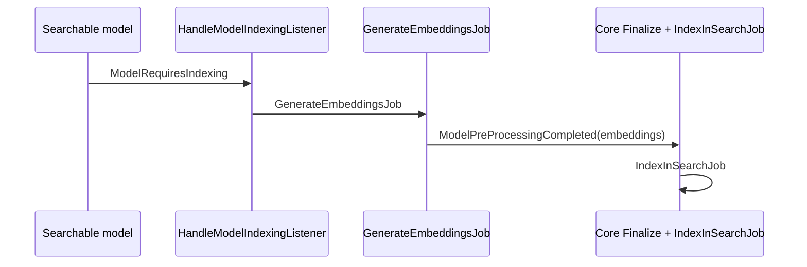
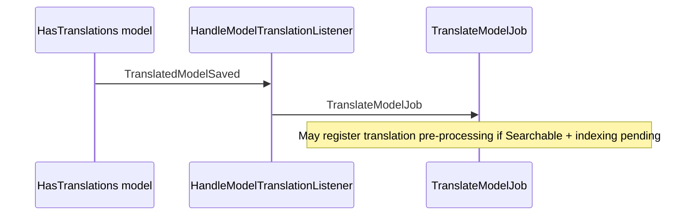

# AI Module - Architecture Documentation

## Table of Contents

- [Overview](#overview)
- [Core integration (indexing & moderation)](#core-integration-indexing--moderation)
- [Chat System](#chat-system)
- [Tool System (ActionRequest)](#tool-system-actionrequest)
- [Embedding & RAG System](#embedding--rag-system)
- [Translation System](#translation-system)
- [Memory & Summarization](#memory--summarization)
- [Contextual Suggestions](#contextual-suggestions)
- [API Endpoints](#api-endpoints)
- [Code Status & Future Work](#code-status--future-work)

---

## Overview

The AI Module provides AI-powered features through a layered architecture:

```
┌─────────────────────────────────────────────────────────────────┐
│                        Controllers                               │
│  ChatController, SuggestionController                           │
└─────────────────────────────────────────────────────────────────┘
                              │
                              ▼
┌─────────────────────────────────────────────────────────────────┐
│                         Services                                 │
│  ChatService, ActionRequestService, EmbeddingService, etc.      │
└─────────────────────────────────────────────────────────────────┘
                              │
                              ▼
┌─────────────────────────────────────────────────────────────────┐
│                      LLPhant Library                            │
│  OpenAIChat, OllamaChat, MistralChat, AnthropicChat             │
└─────────────────────────────────────────────────────────────────┘
```

---

## Core integration (indexing & moderation)

Cross-module pipelines are documented with **Mermaid** diagrams in dedicated guides (keep this file for in-module features: chat, RAG, tools).

| Pipeline | Canonical doc |
|----------|----------------|
| Search indexing, embeddings, `IndexInSearchJob` | [Core: EVENT_ORCHESTRATION §1](../../Core/docs/EVENT_ORCHESTRATION.md#1-search-indexing-embeddings--translations) · [AI: SEARCH_AND_TRANSLATION](./SEARCH_AND_TRANSLATION.md) |
| Modification moderation, registry, votes | [Core: EVENT_ORCHESTRATION §2](../../Core/docs/EVENT_ORCHESTRATION.md#2-modification-moderation-approvals--optional-ai) · [AI: MODERATION](./MODERATION.md) · [CMS: COMMENT_MODERATION](../../CMS/docs/COMMENT_MODERATION.md) |

---

## Chat System

### Core Components


| Component        | File                                  | Purpose                  |
| ---------------- | ------------------------------------- | ------------------------ |
| `ChatController` | `Http/Controllers/ChatController.php` | HTTP layer               |
| `ChatService`    | `Services/ChatService.php`            | Business logic           |
| `Conversation`   | `Models/Conversation.php`             | Conversation persistence |
| `Message`        | `Models/Message.php`                  | Message persistence      |


### Message Flow

#### 1. Streaming Response (Primary Use Case)

```
User → POST /crud/stream/conversations/{id}/messages
       │
       ▼
ChatController::streamMessage()
       │
       ▼
ChatService::sendMessageStream()
       │
       ├─► conversation.addMessage('user', message)
       │
       ├─► chat.generateStreamOfText()
       │       │
       │       └─► SSE chunks to client (real-time)
       │
       └─► conversation.addMessage('assistant', full_response)
```

**Why Streaming?** For interactive chat UIs, users expect to see text appearing gradually (like ChatGPT). Waiting 10-30 seconds for a complete response provides poor UX.

#### 2. Non-Streaming Response

```
User → POST /crud/insert/conversations/{id}/messages
       │
       ▼
ChatController::insertMessage()
       │
       ▼
ChatService::sendMessage()
       │
       ├─► conversation.addMessage('user', message)
       │
       ├─► chat.generateText() (blocking)
       │
       └─► conversation.addMessage('assistant', response)
```

**When to use Non-Streaming:**

- Job/Queue processing (no SSE support)
- API integrations expecting JSON response
- Automated testing
- Retry mechanisms after streaming failures

### RAG Integration

When FAQ/RAG is enabled and the message looks like a question:

```php
// ChatService::sendMessage()
if ($should_use_rag && $documentation_service->isAvailable()) {
    $result = $documentation_service->answerQuestion($userMessage, $chat);
    return $conversation->addMessage('assistant', $result['answer'], [
        'citations' => $result['citations'],
    ]);
}
```

---

## Tool System (ActionRequest)

> **IMPORTANT:** The tool system is **partially implemented but not exposed** via API endpoints.

### Architecture

```
┌──────────────────────────────────────────────────────────────────┐
│                        ToolRegistry                               │
│  Registers tools with: name, description, parameters, handler    │
└──────────────────────────────────────────────────────────────────┘
                              │
                              ▼
┌──────────────────────────────────────────────────────────────────┐
│                    ChatService::sendMessageWithTools()            │
│  1. Send message to LLM with tool definitions                    │
│  2. LLM returns tool calls (not executes)                        │
│  3. Create ActionRequest for each tool call                      │
└──────────────────────────────────────────────────────────────────┘
                              │
                              ▼
┌──────────────────────────────────────────────────────────────────┐
│                    ActionRequestService                           │
│  1. Classify risk level (low/medium/high)                        │
│  2. Set status based on risk                                     │
│  3. Execute immediately if low risk                              │
└──────────────────────────────────────────────────────────────────┘
                              │
                              ▼
┌──────────────────────────────────────────────────────────────────┐
│                    ExecuteActionRequestJob                        │
│  Executes the tool handler asynchronously                        │
└──────────────────────────────────────────────────────────────────┘
```

### Risk Levels & Status Flow


| Risk Level | Initial Status              | User Action Required | Execution           |
| ---------- | --------------------------- | -------------------- | ------------------- |
| `low`      | `approved`                  | None                 | Immediate (via job) |
| `medium`   | `pending_user_confirmation` | User confirms        | After confirmation  |
| `high`     | `pending_admin_approval`    | Admin approves       | After approval      |


### ActionRequest Status Transitions

```
                    ┌──────────────┐
                    │   Created    │
                    └──────┬───────┘
                           │
            ┌──────────────┼──────────────┐
            ▼              ▼              ▼
    ┌───────────┐  ┌──────────────┐  ┌─────────────┐
    │ approved  │  │ pending_user │  │ pending_    │
    │ (low)     │  │ confirmation │  │ admin_      │
    └─────┬─────┘  │ (medium)     │  │ approval    │
          │        └──────┬───────┘  │ (high)      │
          │               │          └──────┬──────┘
          │               ▼                 │
          │        ┌──────────────┐         │
          │        │ confirmed/   │         │
          │        │ rejected     │         │
          │        └──────┬───────┘         │
          │               │                 ▼
          │               │          ┌──────────────┐
          │               │          │ approved/    │
          │               │          │ rejected     │
          │               │          └──────┬───────┘
          │               │                 │
          ▼               ▼                 ▼
    ┌─────────────────────────────────────────────┐
    │              executing                       │
    └──────────────────┬──────────────────────────┘
                       │
            ┌──────────┴──────────┐
            ▼                     ▼
    ┌───────────────┐    ┌───────────────┐
    │   completed   │    │    failed     │
    └───────────────┘    └───────────────┘
```

### Where ActionRequests Are Created

ActionRequests are created **only** in `ChatService::sendMessageWithTools()`:

```php
// Line 99-178 in ChatService.php
public function sendMessageWithTools(
    Conversation $conversation,
    string $user_message,
    ?array $context = null,
): array {
    // ...
    $result = $chat->generateTextOrReturnFunctionCalled($user_message);
    
    if (is_string($result)) {
        // LLM returned text, no tools called
        return ['message' => ..., 'action_requests' => []];
    }
    
    // LLM proposed tool calls
    foreach ($result as $function_info) {
        $action_request = $action_request_service->createRequest(
            $conversation->user,
            $tool_name,
            $tool_args,
            $conversation,  // <-- linked to conversation
        );
        // ...
    }
}
```

### Current Status: NOT EXPOSED

`**sendMessageWithTools()` is NOT called by any controller or route.**

This means:

1. Tools can be registered but never invoked
2. ActionRequests are never created via API
3. The entire tool system is dormant

### Why This Exists (Design Intent)

The tool system was designed for:

1. **AI-triggered actions** - LLM can propose actions like:
  - "Create a new content"
  - "Update user settings"
  - "Send an email"
2. **Human-in-the-loop** - Medium/high risk actions require approval:
  - User sees: "AI wants to delete this record. Confirm?"
  - Admin sees: "AI wants to change system settings. Approve?"
3. **Audit trail** - All AI-triggered actions are logged as ActionRequest records

### To Activate Tool System

You need to:

1. **Create endpoint** for tool-enabled chat:

```php
// ChatController
public function sendMessageWithTools(SendMessageRequest $request, Conversation $conversation): JsonResponse
{
    $this->authorizeConversationAccess($conversation);
    
    $result = $this->chatService->sendMessageWithTools(
        $conversation,
        $request->validated('message'),
        $request->validated('context'),
    );
    
    return (new ResponseBuilder($request))
        ->setData([
            'message' => $result['message'],
            'action_requests' => $result['action_requests'],
        ])
        ->json();
}
```

1. **Create endpoint** for action confirmation/approval:

```php
public function confirmAction(ActionRequest $actionRequest): JsonResponse
{
    $this->actionRequestService->confirmRequest($actionRequest);
    return (new ResponseBuilder(request()))->setData(['status' => 'executing'])->json();
}

public function approveAction(ActionRequest $actionRequest): JsonResponse
{
    $this->actionRequestService->approveRequest($actionRequest, Auth::user());
    return (new ResponseBuilder(request()))->setData(['status' => 'executing'])->json();
}
```

1. **Register tools** in a ServiceProvider:

```php
// AIServiceProvider
public function boot(): void
{
    $registry = app(ToolRegistry::class);
    
    $registry->register(
        name: 'create_content',
        handler: fn($title, $body) => Content::create(['title' => $title, 'body' => $body]),
        description: 'Create a new content item',
        parameters: [
            ['name' => 'title', 'type' => 'string', 'description' => 'Content title'],
            ['name' => 'body', 'type' => 'string', 'description' => 'Content body'],
        ],
        riskLevel: 'medium',
    );
}
```

---

## Embedding & RAG System

### Embedding generation flow

> **Full workflow (sequence + state diagrams):** [SEARCH_AND_TRANSLATION.md](./SEARCH_AND_TRANSLATION.md) · [Core EVENT_ORCHESTRATION](../../Core/docs/EVENT_ORCHESTRATION.md#1-search-indexing-embeddings--translations)



### RAG (Documentation Search) Flow

```
php artisan ai:index-docs
        │
        ▼
DocumentationService::indexDocuments()
        │
        ├─► Read files from docs path
        │
        ├─► Split into chunks
        │
        ├─► Generate embeddings
        │
        └─► Store in VectorStore (filesystem/memory)

---

User asks question
        │
        ▼
ChatService::sendMessage()
        │
        ├─► looksLikeQuestion() returns true
        │
        └─► DocumentationService::answerQuestion()
                    │
                    ├─► QuestionAnswering (LLPhant)
                    │       │
                    │       ├─► Embed question
                    │       │
                    │       ├─► Vector similarity search
                    │       │
                    │       └─► Generate answer with context
                    │
                    └─► Return answer + citations
```

---

## Translation System

### Automatic translation flow

> **Full workflow:** [SEARCH_AND_TRANSLATION.md](./SEARCH_AND_TRANSLATION.md#2-automatic-translation)



---

## Memory & Summarization

### When Summarization Triggers

```php
// MemoryService::shouldSummarize()
if (!$conversation->memory_enabled) return false;
if (!config('ai.features.chat.enable_summary')) return false;

$message_count = $conversation->messages()->count();
$threshold = config('ai.features.chat.summary_threshold', 20);

// Check messages since last summary
$last_summary = $conversation->summaries()->first();
if ($last_summary) {
    return ($message_count - $last_summary->message_count) >= $threshold;
}

return $message_count >= $threshold;
```

### Summary Creation

```
After sendMessage/sendMessageStream
        │
        ▼
checkAndCreateSummaryIfNeeded()
        │
        ├─► shouldSummarize() returns true?
        │
        └─► MemoryService::createSummarySnapshot()
                    │
                    ├─► summarizeConversation() → LLM call
                    │
                    ├─► extractFacts() → LLM call (JSON array)
                    │
                    ├─► conversation.update(['summary' => ...])
                    │
                    └─► ConversationSummary::create([...])
```

---

## Contextual Suggestions

### Purpose

Proactive AI suggestions based on user's current UI context (page, action, data).

### Flow

```
Frontend sends context
        │
        ▼
POST /crud/insert/suggestions
        │
        ▼
SuggestionController::generateSuggestion()
        │
        ▼
ContextualSuggestionService::generateSuggestion()
        │
        ├─► Check rate limit (cooldown per user)
        │
        ├─► Check cache (same context = same suggestion)
        │
        ├─► Generate suggestion via LLM
        │
        └─► Store ContextualSuggestion record
```

---

## API Endpoints

All routes are prefixed with `/crud/` following the application's CRUD convention.

### Chat Routes


| Method | Path                                                            | Controller Method      | Purpose                        |
| ------ | --------------------------------------------------------------- | ---------------------- | ------------------------------ |
| GET    | `/crud/select/conversations`                                    | `listConversations`    | List user's conversations      |
| POST   | `/crud/insert/conversations`                                    | `insertConversation`   | Create conversation            |
| GET    | `/crud/detail/conversations/{conversation}`                     | `detailConversation`   | Get conversation details       |
| DELETE | `/crud/delete/conversations/{conversation}`                     | `deleteConversation`   | Delete conversation            |
| GET    | `/crud/list/conversations/{conversation}/messages`              | `listMessages`         | List messages                  |
| POST   | `/crud/stream/conversations/{conversation}/messages`            | `streamMessage`        | Send message (SSE streaming)   |
| POST   | `/crud/insert/conversations/{conversation}/messages`            | `insertMessage`        | Send message (JSON response)   |
| POST   | `/crud/insert/conversations/{conversation}/messages-with-tools` | `sendMessageWithTools` | Send message with tool support |


### Action Request Routes (Tool Execution)


| Method | Path                                                   | Controller Method | Purpose                                              |
| ------ | ------------------------------------------------------ | ----------------- | ---------------------------------------------------- |
| GET    | `/crud/select/action-requests`                         | `list`            | List user's action requests (admins see all pending) |
| GET    | `/crud/detail/action-requests/{actionRequest}`         | `detail`          | Get action request details                           |
| POST   | `/crud/update/action-requests/{actionRequest}/confirm` | `confirm`         | Confirm medium-risk action (user)                    |
| POST   | `/crud/update/action-requests/{actionRequest}/approve` | `approve`         | Approve high-risk action (admin)                     |
| POST   | `/crud/update/action-requests/{actionRequest}/reject`  | `reject`          | Reject action request                                |


### Suggestion Routes


| Method | Path                                            | Controller Method    | Purpose                  |
| ------ | ----------------------------------------------- | -------------------- | ------------------------ |
| GET    | `/crud/select/suggestions`                      | `listSuggestions`    | List pending suggestions |
| POST   | `/crud/insert/suggestions`                      | `generateSuggestion` | Generate new suggestion  |
| POST   | `/crud/update/suggestions/{suggestion}/dismiss` | `dismissSuggestion`  | Dismiss suggestion       |


### Authorization

All endpoints require authentication. Conversation access is restricted to the owner:

```php
// ChatController::authorizeConversationAccess()
if ($conversation->user_id !== Auth::id()) {
    abort(403, 'You do not have access to this conversation.');
}
```

---

## Code Status & Future Work

### Feature Status


| Feature                | Status       | Notes                                       |
| ---------------------- | ------------ | ------------------------------------------- |
| Chat (streaming)       | ✅ **Active** | Primary use case via `streamMessage`        |
| Chat (non-streaming)   | ✅ **Active** | Available via `insertMessage` for jobs/APIs |
| Chat with Tools        | ✅ **Active** | Available via `sendMessageWithTools`        |
| RAG/FAQ                | ✅ **Active** | Automatic when question detected            |
| Memory/Summarization   | ✅ **Active** | Configurable via `AI_CHAT_ENABLE_SUMMARY`   |
| Guardrails             | ✅ **Active** | Configurable via `AI_GUARDRAILS_ENABLED`    |
| Contextual Suggestions | ✅ **Active** | Routes exposed, configurable                |
| Tool System            | ✅ **Active** | API exposed, needs tool registration        |
| ActionRequests         | ✅ **Active** | Full CRUD with confirm/approve/reject       |


### Tool System - How It Works

The tool system allows AI to propose actions that require human approval:

**Risk Levels:**

- `low`: Auto-executed immediately
- `medium`: Requires user confirmation
- `high`: Requires admin approval

**To Register Tools:**

```php
// In a ServiceProvider boot() method
$registry = app(ToolRegistry::class);

$registry->register(
    name: 'create_content',
    handler: fn($title, $body) => Content::create(['title' => $title, 'body' => $body]),
    description: 'Create a new content item',
    parameters: [
        ['name' => 'title', 'type' => 'string', 'description' => 'Content title'],
        ['name' => 'body', 'type' => 'string', 'description' => 'Content body'],
    ],
    riskLevel: 'medium',
);
```

**What's Still Needed:**

1. Frontend UI for action confirmation dialogs
2. Filament panel for admin approval queue
3. Tool definitions for your specific use cases

### When to Use Non-Streaming (`insertMessage`)


| Use Case          | Why Non-Streaming?                    |
| ----------------- | ------------------------------------- |
| Background jobs   | Queue workers don't support SSE       |
| API integrations  | External systems expect JSON response |
| Automated testing | Easier to assert on complete response |
| Retry logic       | Simpler to retry failed requests      |


