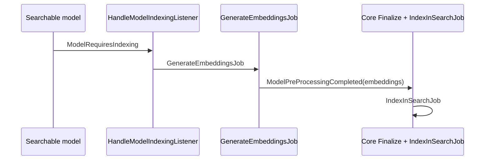
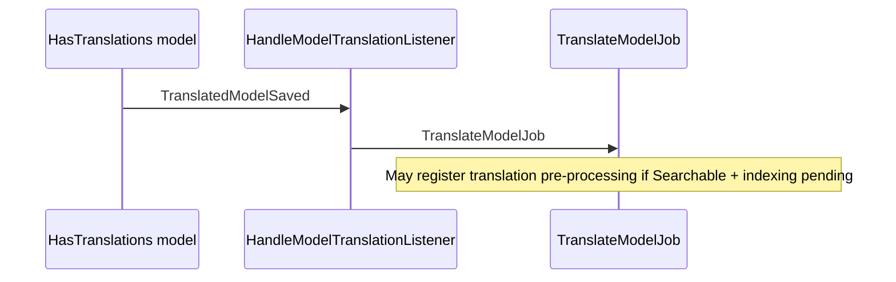

# AI Module - Architecture Documentation

> **Status note.** The chat sections below describe the superseded `ChatService` message path
> (`sendMessage()`, `sendMessageStream()`, `sendMessageWithTools()`, `buildAgent()`), which has been
> removed. Every HTTP message now goes through `InAppAssistanceService::respond()`, which is
> policy-compiled, guardrailed, scope-resolved and stateless per message; no token of the model is streamed (`POST /app/ai/agent` streams lifecycle events and one validated message).
> For the current picture, read `docs/rag/MODULE.md`, sections *Perimeters* and *Message orchestration*.
> The material here is kept because the tool, embedding, translation and suggestion sections remain accurate.

## Table of Contents

- [Overview](#overview)
- [Core integration (indexing & moderation)](#core-integration-indexing--moderation)
- [Chat System](#chat-system)
- [Tool System (governed writes)](#tool-system-governed-writes)
- [Embedding & RAG System](#embedding--rag-system)
- [Translation System](#translation-system)
- [Memory & Summarization](#memory--summarization)
- [Contextual Suggestions](#contextual-suggestions)
- [API Endpoints](#api-endpoints)
- [Code Status & Future Work](#code-status--future-work)

---

## Overview

The AI Module provides AI-powered features through a layered architecture:

```
┌─────────────────────────────────────────────────────────────────┐
│                        Controllers                               │
│  ChatController, SuggestionController                           │
└─────────────────────────────────────────────────────────────────┘
                              │
                              ▼
┌─────────────────────────────────────────────────────────────────┐
│                         Services                                 │
│  ChatService, WriteProposalService, EmbeddingService, etc.      │
└─────────────────────────────────────────────────────────────────┘
                              │
                              ▼
┌─────────────────────────────────────────────────────────────────┐
│                      LLPhant Library                            │
│  OpenAIChat, OllamaChat, MistralChat, AnthropicChat             │
└─────────────────────────────────────────────────────────────────┘
```

---

## Core integration (indexing & moderation)

Cross-module pipelines are documented with **Mermaid** diagrams in dedicated guides (keep this file for in-module features: chat, RAG, tools).

| Pipeline | Canonical doc |
|----------|----------------|
| Search indexing, embeddings, `IndexInSearchJob` | [Core: EVENT_ORCHESTRATION §1](../../Core/docs/EVENT_ORCHESTRATION.md#1-search-indexing-embeddings--translations) · [AI: SEARCH_AND_TRANSLATION](./SEARCH_AND_TRANSLATION.md) |
| Modification moderation, registry, votes | [Core: EVENT_ORCHESTRATION §2](../../Core/docs/EVENT_ORCHESTRATION.md#2-modification-moderation-approvals--optional-ai) · [AI: MODERATION](./MODERATION.md) · [CMS: COMMENT_MODERATION](../../CMS/docs/COMMENT_MODERATION.md) |

---

## Chat System

### Core Components


| Component        | File                                  | Purpose                  |
| ---------------- | ------------------------------------- | ------------------------ |
| `ChatController` | `Http/Controllers/ChatController.php` | HTTP layer               |
| `ChatService`    | `Services/ChatService.php`            | Business logic           |
| `Conversation`   | `Models/Conversation.php`             | Conversation persistence |
| `Message`        | `Models/Message.php`                  | Message persistence      |


### Message Flow

#### 1. Streaming Response (Primary Use Case)

```
User → POST /crud/stream/conversations/{id}/messages
       │
       ▼
ChatController::streamMessage()
       │
       ▼
ChatService::sendMessageStream()
       │
       ├─► conversation.addMessage('user', message)
       │
       ├─► chat.generateStreamOfText()
       │       │
       │       └─► SSE chunks to client (real-time)
       │
       └─► conversation.addMessage('assistant', full_response)
```

**Why Streaming?** For interactive chat UIs, users expect to see text appearing gradually (like ChatGPT). Waiting 10-30 seconds for a complete response provides poor UX.

#### 2. Non-Streaming Response

```
User → POST /crud/insert/conversations/{id}/messages
       │
       ▼
ChatController::insertMessage()
       │
       ▼
ChatService::sendMessage()
       │
       ├─► conversation.addMessage('user', message)
       │
       ├─► chat.generateText() (blocking)
       │
       └─► conversation.addMessage('assistant', response)
```

**When to use Non-Streaming:**

- Job/Queue processing (no SSE support)
- API integrations expecting JSON response
- Automated testing
- Retry mechanisms after streaming failures

### RAG Integration

When FAQ/RAG is enabled and the message looks like a question:

```php
// ChatService::sendMessage()
if ($should_use_rag && $documentation_service->isAvailable()) {
    $result = $documentation_service->answerQuestion($userMessage, $chat);
    return $conversation->addMessage('assistant', $result['answer'], [
        'citations' => $result['citations'],
    ]);
}
```

---

## Tool System (governed writes)

The assistant never changes data by itself. A write tool (`crud_create_*`, `crud_update_*`, `crud_delete_*`, `crud_bulk_update_*`, `crud_bulk_delete_*`) only stores a **write proposal** (`ai_write_proposals`) and tells the model that nothing has changed. The person confirms or rejects the proposal through an authenticated action the model cannot perform, and only then is the stored payload applied, as that person, through `CrudService`. Whether the write is also sent for a vote is decided by Core approvals at the model (`HasApprovals`), not by the assistant.

```
model calls crud_update_core_role         person (UI)                         server
        │                                      │
        ▼                                      │
  proposal stored (status proposed)            │
  tool result: "nothing has changed"           │
        │                                      │
        ▼                                      │
  assistant message, metadata.writes ─────────▶│ shows what would change, as whom
                                               │
                                               ├── POST .../assistant-writes/{id}/confirm ─▶ apply the stored payload
                                               │                                             as the signed-in user:
                                               │                                             applied | pending_approval | failed
                                               └── POST .../assistant-writes/{id}/reject  ─▶ rejected
```

Read tools (`crud_list_*`, `crud_detail_*`, ...) run inline, under the permissions and row-level ACL of the person. Which tools exist for a person is the intersection of three things: the operator's opt-in (`ai.features.tools.crud.entities`, plus `unmoderated_writes` for entities without approvals), the person's permissions, and the policy capabilities `crud_reads` and `governed_writes` of the in-app profile. `approve` and `disapprove` are never offered: a decision on a pending change is made by a person in the panel.

Details, states, routes and the metadata shape are in `docs/rag/MODULE.md` (*Writes through the assistant*) and `docs/TOOLS_USAGE_EXAMPLE.md`.

---

## Embedding & RAG System

### Embedding generation flow

> **Full workflow (sequence + state diagrams):** [SEARCH_AND_TRANSLATION.md](./SEARCH_AND_TRANSLATION.md) · [Core EVENT_ORCHESTRATION](../../Core/docs/EVENT_ORCHESTRATION.md#1-search-indexing-embeddings--translations)


```mermaid
sequenceDiagram
    participant M as Searchable model
    participant AI as HandleModelIndexingListener
    participant J as GenerateEmbeddingsJob
    participant C as Core Finalize + IndexInSearchJob

    M->>AI: ModelRequiresIndexing
    AI->>J: GenerateEmbeddingsJob
    J->>C: ModelPreProcessingCompleted(embeddings)
    C->>C: IndexInSearchJob
```

### RAG (Documentation Search) Flow

```
php artisan ai:index-rag-docs
        │
        ▼
DocumentationService::indexDocuments()
        │
        ├─► Read files from docs path
        │
        ├─► Split into chunks
        │
        ├─► Generate embeddings
        │
        └─► Store in VectorStore (filesystem/memory)

---

User asks question
        │
        ▼
ChatService::sendMessage()
        │
        ├─► looksLikeQuestion() returns true
        │
        └─► DocumentationService::answerQuestion()
                    │
                    ├─► QuestionAnswering (LLPhant)
                    │       │
                    │       ├─► Embed question
                    │       │
                    │       ├─► Vector similarity search
                    │       │
                    │       └─► Generate answer with context
                    │
                    └─► Return answer + citations
```

---

## Translation System

### Automatic translation flow

> **Full workflow:** [SEARCH_AND_TRANSLATION.md](./SEARCH_AND_TRANSLATION.md#2-automatic-translation)


```mermaid
sequenceDiagram
    participant M as HasTranslations model
    participant AI as HandleModelTranslationListener
    participant J as TranslateModelJob

    M->>AI: TranslatedModelSaved
    AI->>J: TranslateModelJob
    Note over J: May register translation pre-processing if Searchable + indexing pending
```

---

## Memory & Summarization

### When Summarization Triggers

```php
// MemoryService::shouldSummarize()
if (!$conversation->memory_enabled) return false;
if (!config('ai.features.chat.summary.enabled')) return false;

$message_count = $conversation->messages()->count();
$threshold = config('ai.features.chat.summary_threshold', 20);

// Check messages since last summary
$last_summary = $conversation->summaries()->first();
if ($last_summary) {
    return ($message_count - $last_summary->message_count) >= $threshold;
}

return $message_count >= $threshold;
```

### Summary Creation

```
After sendMessage/sendMessageStream
        │
        ▼
checkAndCreateSummaryIfNeeded()
        │
        ├─► shouldSummarize() returns true?
        │
        └─► MemoryService::createSummarySnapshot()
                    │
                    ├─► summarizeConversation() → LLM call
                    │
                    ├─► extractFacts() → LLM call (JSON array)
                    │
                    ├─► conversation.update(['summary' => ...])
                    │
                    └─► ConversationSummary::create([...])
```

---

## Contextual Suggestions

### Purpose

Proactive AI suggestions based on user's current UI context (page, action, data).

### Flow

```
Frontend sends context
        │
        ▼
POST /crud/insert/suggestions
        │
        ▼
SuggestionController::generateSuggestion()
        │
        ▼
ContextualSuggestionService::generateSuggestion()
        │
        ├─► Check rate limit (cooldown per user)
        │
        ├─► Check cache (same context = same suggestion)
        │
        ├─► Generate suggestion via LLM
        │
        └─► Store ContextualSuggestion record
```

---

## API Endpoints

All routes are prefixed with `/crud/` following the application's CRUD convention.

### Chat Routes


| Method | Path                                                            | Controller Method      | Purpose                        |
| ------ | --------------------------------------------------------------- | ---------------------- | ------------------------------ |
| GET    | `/crud/select/conversations`                                    | `listConversations`    | List user's conversations      |
| POST   | `/crud/insert/conversations`                                    | `insertConversation`   | Create conversation            |
| GET    | `/crud/detail/conversations/{conversation}`                     | `detailConversation`   | Get conversation details       |
| DELETE | `/crud/delete/conversations/{conversation}`                     | `deleteConversation`   | Delete conversation            |
| GET    | `/crud/list/conversations/{conversation}/messages`              | `listMessages`         | List messages                  |
| POST   | `/crud/stream/conversations/{conversation}/messages`            | `streamMessage`        | Send message (SSE streaming)   |
| POST   | `/crud/insert/conversations/{conversation}/messages`            | `insertMessage`        | Send message (JSON response)   |
| POST   | `/crud/insert/conversations/{conversation}/messages-with-tools` | `sendMessageWithTools` | Send message (JSON, with the tools the policy allows) |


### Assistant Write Routes (proposals)


| Method | Path                                                          | Controller Method | Purpose                                              |
| ------ | ------------------------------------------------------------- | ----------------- | ---------------------------------------------------- |
| GET    | `/app/crud/detail/ai/assistant-writes/{proposal}`             | `show`            | A proposal: what would change, as whom, its status   |
| POST   | `/app/crud/update/ai/assistant-writes/{proposal}/confirm`     | `confirm`         | The person applies it (once; a second call answers the same outcome) |
| POST   | `/app/crud/update/ai/assistant-writes/{proposal}/reject`      | `reject`          | The person declines it                               |


### Suggestion Routes


| Method | Path                                            | Controller Method    | Purpose                  |
| ------ | ----------------------------------------------- | -------------------- | ------------------------ |
| GET    | `/crud/select/suggestions`                      | `listSuggestions`    | List pending suggestions |
| POST   | `/crud/insert/suggestions`                      | `generateSuggestion` | Generate new suggestion  |
| POST   | `/crud/update/suggestions/{suggestion}/dismiss` | `dismissSuggestion`  | Dismiss suggestion       |


### Authorization

All endpoints require authentication. Conversation access is restricted to the owner:

```php
// ChatController::authorizeConversationAccess()
if ($conversation->user_id !== Auth::id()) {
    abort(403, 'You do not have access to this conversation.');
}
```

---

## Code Status & Future Work

### Feature Status


| Feature                | Status       | Notes                                       |
| ---------------------- | ------------ | ------------------------------------------- |
| Chat (streaming)       | ✅ **Active** | Primary use case via `streamMessage`        |
| Chat (non-streaming)   | ✅ **Active** | Available via `insertMessage` for jobs/APIs |
| Chat with Tools        | ✅ **Active** | `messages-with-tools`; writes are proposals |
| RAG/FAQ                | ✅ **Active** | Automatic when question detected            |
| Memory/Summarization   | ✅ **Active** | Configurable via `AI_CHAT_ENABLE_SUMMARY`   |
| Guardrails             | ✅ **Active** | Configurable via `AI_GUARDRAILS_ENABLED`    |
| Contextual Suggestions | ✅ **Active** | Routes exposed, configurable                |
| Governed writes        | ✅ **Active** | Propose, then the person confirms (`ai_write_proposals`) |


### When to Use Non-Streaming (`insertMessage`)


| Use Case          | Why Non-Streaming?                    |
| ----------------- | ------------------------------------- |
| Background jobs   | Queue workers don't support SSE       |
| API integrations  | External systems expect JSON response |
| Automated testing | Easier to assert on complete response |
| Retry logic       | Simpler to retry failed requests      |


