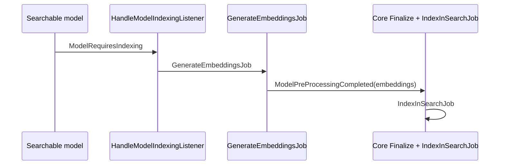
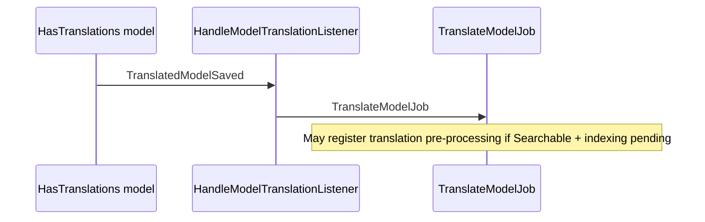

# AI Module - Architecture Documentation

How the parts of the module fit together. The message path of the in-app assistant (policy, guardrails,
scope, tools, the event stream) is described in `docs/rag/MODULE.md`, sections *Perimeters* and *Message
orchestration*; this file points there rather than repeating it.

## Table of Contents

- [Overview](#overview)
- [Core integration (indexing & moderation)](#core-integration-indexing--moderation)
- [Assistant messages](#assistant-messages)
- [Tool System (governed writes)](#tool-system-governed-writes)
- [Embedding & RAG System](#embedding--rag-system)
- [Translation System](#translation-system)
- [Memory & Summarization](#memory--summarization)
- [Contextual Suggestions](#contextual-suggestions)
- [API Endpoints](#api-endpoints)
- [Feature Status](#feature-status)

---

## Overview

```
┌─────────────────────────────────────────────────────────────────┐
│                        Controllers                              │
│  ChatController, AgentController, CapabilitiesController,       │
│  AssistantWriteController, SuggestionController                 │
└─────────────────────────────────────────────────────────────────┘
                              │
                              ▼
┌─────────────────────────────────────────────────────────────────┐
│                         Services                                │
│  InAppAssistanceService, ChatService, WriteProposalService,     │
│  DocumentationService, EmbeddingService, ModerationService, ... │
└─────────────────────────────────────────────────────────────────┘
                              │
                              ▼
┌─────────────────────────────────────────────────────────────────┐
│                    Neuron AI framework                          │
│  ChatAgent (one door to the model: forFeature, ask, structured),│
│  DocumentationAgent (RAG), providers built by ProviderFactory   │
└─────────────────────────────────────────────────────────────────┘
```

Each AI feature takes its provider and model from its own setting (`features.*.model`); see
`docs/rag/AI_MODEL_SELECTION_DEVELOPER.md`.

---

## Core integration (indexing & moderation)

Cross-module pipelines are documented with **Mermaid** diagrams in dedicated guides (keep this file for in-module features: assistant, RAG, tools).

| Pipeline | Canonical doc |
|----------|----------------|
| Search indexing, embeddings, `IndexInSearchJob` | [Core: EVENT_ORCHESTRATION §1](../../Core/docs/EVENT_ORCHESTRATION.md#1-search-indexing-embeddings--translations) · [AI: SEARCH_AND_TRANSLATION](./SEARCH_AND_TRANSLATION.md) |
| Modification moderation, registry, votes | [Core: EVENT_ORCHESTRATION §2](../../Core/docs/EVENT_ORCHESTRATION.md#2-modification-moderation-approvals--optional-ai) · [AI: MODERATION](./MODERATION.md) · [CMS: COMMENT_MODERATION](../../CMS/docs/COMMENT_MODERATION.md) |

---

## Assistant messages

| Component | File | Purpose |
|-----------|------|---------|
| `ChatController` | `Http/Controllers/ChatController.php` | Conversations and the JSON message route |
| `AgentController` | `Http/Controllers/AgentController.php` | `POST /app/ai/agent`: the run as an event stream, the answer sent whole |
| `InAppAssistanceService` | `Services/Assistance/InAppAssistanceService.php` | Every message: policy, guardrails, scope, documentation and tools, one validated answer |
| `ChatService` | `Services/ChatService.php` | Conversation lifecycle and the protected agent |
| `Conversation`, `Message` | `Models/` | Persistence |

Every message goes through `InAppAssistanceService::respond()`, which is policy-compiled, guardrailed,
scope-resolved and stateless per message: no history is replayed to the model. No token of the model is
streamed: `POST /app/ai/agent` streams lifecycle events and one validated message, and
`POST .../messages` answers the same message as JSON. The stream route `POST .../stream/...` answers 422
(`in_app_streaming_unavailable`).

```
POST /app/crud/insert/ai/conversations/{id}/messages   (or POST /app/ai/agent)
       │
       ▼
ChatController::insertMessage()  /  AgentController::run()
       │
       ▼
InAppAssistanceService::respond()
       ├─► policy and input guardrails (AssistanceGuardrailPipeline)
       ├─► scope, documentation retrieval (DocumentationService::retrieveForInApp)
       ├─► ChatAgent with the tools the policy allows (reads inline, writes as proposals)
       ├─► output guardrails, citations
       └─► conversation.addMessage('assistant', answer, metadata: citations, writes, ...)
```

---

## Tool System (governed writes)

The assistant never changes data by itself. A write tool (`crud_create_*`, `crud_update_*`, `crud_delete_*`, `crud_bulk_update_*`, `crud_bulk_delete_*`) only stores a **write proposal** (`ai_write_proposals`) and tells the model that nothing has changed. The person confirms or rejects the proposal through an authenticated action the model cannot perform, and only then is the stored payload applied, as that person, through `CrudService`. Whether the write is also sent for a vote is decided by Core approvals at the model (`HasApprovals`), not by the assistant.

```
model calls crud_update_core_role         person (UI)                         server
        │                                      │
        ▼                                      │
  proposal stored (status proposed)            │
  tool result: "nothing has changed"           │
        │                                      │
        ▼                                      │
  assistant message, metadata.writes ─────────▶│ shows what would change, as whom
                                               │
                                               ├── POST .../assistant-writes/{id}/confirm ─▶ apply the stored payload
                                               │                                             as the signed-in user:
                                               │                                             applied | pending_approval | failed
                                               └── POST .../assistant-writes/{id}/reject  ─▶ rejected
```

Read tools (`crud_list_*`, `crud_detail_*`, ...) run inline, under the permissions and row-level ACL of the person. Which tools exist for a person is the intersection of three things: the operator's opt-in (`ai.features.tools.crud.entities`, plus `unmoderated_writes` for entities without approvals), the person's permissions, and the policy capabilities `crud_reads` and `governed_writes` of the in-app profile. `approve` and `disapprove` are never offered: a decision on a pending change is made by a person in the panel. A read result whose text reads like an instruction is withheld from the model (`ToolResultGuard`).

Details, states, routes and the metadata shape are in `docs/rag/MODULE.md` (*Writes through the assistant*) and `docs/TOOLS_USAGE_EXAMPLE.md`.

---

## Embedding & RAG System

### Embedding generation flow

> **Full workflow (sequence + state diagrams):** [SEARCH_AND_TRANSLATION.md](./SEARCH_AND_TRANSLATION.md) · [Core EVENT_ORCHESTRATION](../../Core/docs/EVENT_ORCHESTRATION.md#1-search-indexing-embeddings--translations)


```mermaid
sequenceDiagram
    participant M as Searchable model
    participant AI as HandleModelIndexingListener
    participant J as GenerateEmbeddingsJob
    participant C as Core Finalize + IndexInSearchJob

    M->>AI: ModelRequiresIndexing
    AI->>J: GenerateEmbeddingsJob
    J->>C: ModelPreProcessingCompleted(embeddings)
    C->>C: IndexInSearchJob
```

### RAG (Documentation Search) Flow

```
php artisan ai:index-rag-docs [--profile=developer|user|all] [--full]
        │
        ▼
DocumentationService::indexDocuments()
        │
        ├─► Read files from the documentation roots
        ├─► Split into chunks
        ├─► Embed them as passages (PrefixingEmbeddingsProvider)
        └─► Store in the vector store of the setting features.faq.vector_store
            (elasticsearch or filesystem; memory in tests)
```

Questions are answered from it in two places: the in-app assistant retrieves the user corpus through
`DocumentationService::retrieveForInApp()` (see *Assistant messages*), and `php artisan ai:help` answers
from the developer corpus with `DocumentationAgent`, citing the documents it used. Details:
`docs/rag/MODULE.md`.

---

## Translation System

### Automatic translation flow

> **Full workflow:** [SEARCH_AND_TRANSLATION.md](./SEARCH_AND_TRANSLATION.md#2-automatic-translation)


```mermaid
sequenceDiagram
    participant M as HasTranslations model
    participant AI as HandleModelTranslationListener
    participant J as TranslateModelJob

    M->>AI: TranslatedModelSaved
    AI->>J: TranslateModelJob
    Note over J: May register translation pre-processing if Searchable + indexing pending
```

---

## Memory & Summarization

`MemoryService` summarises a conversation and extracts its key facts (a Neuron structured output,
`ExtractedFacts`), and keeps the snapshots in `ConversationSummary`. It is kept for the persistent user
memory plan, which reuses it; the in-app assistant does not call it today, because the assistant is
stateless and replays no history until a security review accepts it.

```php
// MemoryService::shouldSummarize()
if (!$conversation->memory_enabled) return false;
if (!config('ai.features.chat.summary.enabled')) return false;

$message_count = $conversation->messages()->count();
$threshold = config('ai.features.chat.summary_threshold', 20);

// Check messages since last summary
$last_summary = $conversation->summaries()->first();
if ($last_summary) {
    return ($message_count - $last_summary->message_count) >= $threshold;
}

return $message_count >= $threshold;
```

`features.chat.summary.enabled` is a setting in Filament (seeded off); `summary_threshold` is a fixed value
in `config.php`. `createSummarySnapshot()` runs `summarizeConversation()` and `extractFacts()`, stores the
summary on the conversation and writes a `ConversationSummary` row.

---

## Contextual Suggestions

### Purpose

Proactive AI suggestions based on user's current UI context (page, action, data).

### Flow

```
Frontend sends context
        │
        ▼
POST /app/crud/insert/ai/suggestions
        │
        ▼
SuggestionController::generateSuggestion()
        │
        ▼
ContextualSuggestionService::generateSuggestion()
        │
        ├─► Check rate limit (cooldown per user)
        │
        ├─► Check cache (same context = same suggestion)
        │
        ├─► Generate suggestion via LLM
        │
        └─► Store ContextualSuggestion record
```

---

## API Endpoints

All routes are under `/app`.

### Assistant Routes

| Method | Path | Controller Method | Purpose |
|--------|------|-------------------|---------|
| GET | `/app/ai/capabilities` | `CapabilitiesController::show` | What the assistant may do for the signed-in person |
| POST | `/app/ai/agent` | `AgentController::run` | The run as an event stream, the answer sent whole |
| GET | `/app/crud/select/ai/conversations` | `listConversations` | List the user's conversations |
| POST | `/app/crud/insert/ai/conversations` | `insertConversation` | Create a conversation |
| GET | `/app/crud/detail/ai/conversations/{conversation}` | `detailConversation` | Conversation details |
| DELETE | `/app/crud/delete/ai/conversations/{conversation}` | `deleteConversation` | Delete a conversation |
| GET | `/app/crud/select/ai/conversations/{conversation}/messages` | `listMessages` | List messages |
| POST | `/app/crud/insert/ai/conversations/{conversation}/messages` | `insertMessage` | Send a message, JSON answer |
| POST | `/app/crud/stream/ai/conversations/{conversation}/messages` | `streamMessage` | Answers 422: no token streaming |

### Assistant Write Routes (proposals)

| Method | Path | Controller Method | Purpose |
|--------|------|-------------------|---------|
| GET | `/app/crud/detail/ai/assistant-writes/{proposal}` | `show` | A proposal: what would change, as whom, its status |
| POST | `/app/crud/update/ai/assistant-writes/{proposal}/confirm` | `confirm` | The person applies it (once; a second call answers the same outcome) |
| POST | `/app/crud/update/ai/assistant-writes/{proposal}/reject` | `reject` | The person declines it |

### Suggestion Routes

| Method | Path | Controller Method | Purpose |
|--------|------|-------------------|---------|
| GET | `/app/crud/select/ai/suggestions` | `listSuggestions` | List pending suggestions |
| POST | `/app/crud/insert/ai/suggestions` | `generateSuggestion` | Generate a new suggestion |
| POST | `/app/crud/update/ai/suggestions/{suggestion}/dismiss` | `dismissSuggestion` | Dismiss a suggestion |

### Authorization

All endpoints require authentication. Conversation access is restricted to the owner, and the message
routes also require the in-app assistance profile (`AssistantAccessContextFactory::forInApp()`).

---

## Feature Status

| Feature | Status | Notes |
|---------|--------|-------|
| In-app assistant | Active | JSON answer or event stream; policy, guardrails and scope on every message |
| RAG/FAQ | Active | User corpus for the assistant, developer corpus for `ai:help` |
| Governed writes | Active | Propose, then the person confirms (`ai_write_proposals`) |
| Contextual Suggestions | Active | Setting `features.contextual_suggestions.enabled` (seeded off) |
| Memory/Summarization | Kept, not called | Setting `features.chat.summary.enabled`; reused by the persistent user memory plan |
