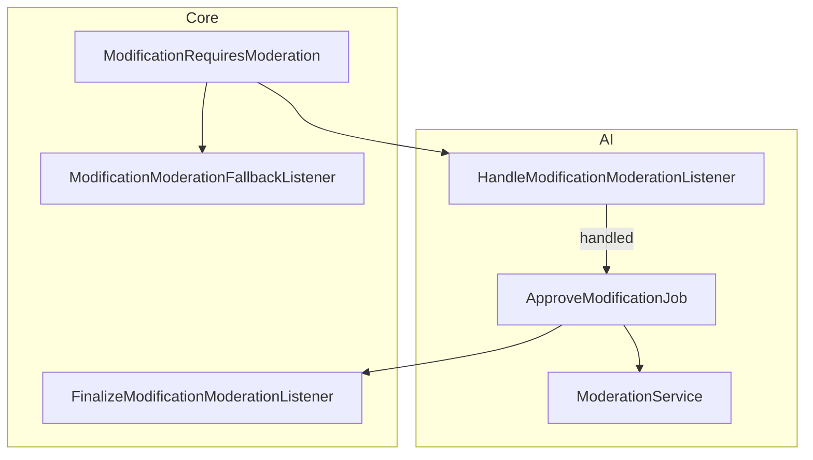
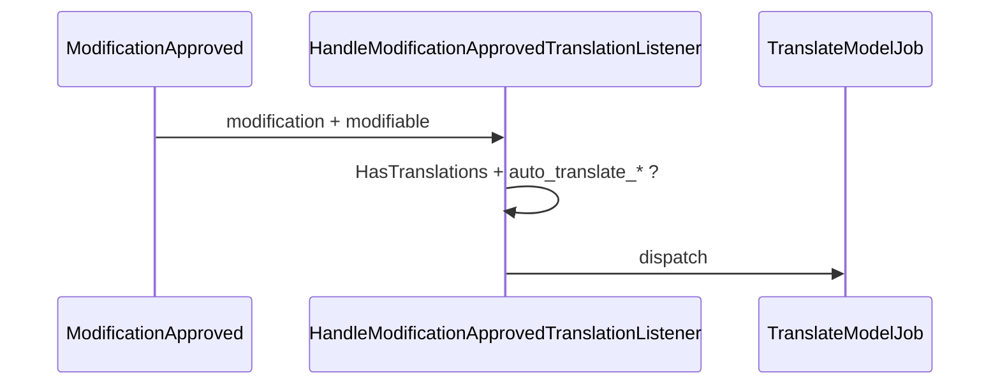

# AI modification moderation

AI participates in the **approval workflow** by analyzing pending `Modification` records and casting approve/disapprove votes as a configured system user.

**Canonical architecture:** [Modules/Core/docs/EVENT_ORCHESTRATION.md](../../Core/docs/EVENT_ORCHESTRATION.md) (section 2).

**CMS comment adapter:** [Modules/CMS/docs/COMMENT_MODERATION.md](../../CMS/docs/COMMENT_MODERATION.md).

---

## Decoupling rules

| Rule | Detail |
|------|--------|
| AI does not import CMS | No `Comment`, `Content`, or CMS events |
| Opt-in via registry | `ModerationContextBuilderRegistry::supports($modification)` |
| Per-model toggle | `ai_moderation_{table}` + `HasApprovals::aiModerationEnabledBySettings()` |
| Outcome on Core tables | `meta` JSON on `approvals` / `disapprovals` |

---

## Pipeline (AI responsibilities)



### Listener: `HandleModificationModerationListener`

Runs when:

1. `config('ai.features.moderation.enabled')`
2. `config('ai.features.moderation.system_user_id')` is set
3. `Modification` is active
4. Registry has a builder for `modifiable_type`
5. Modifiable model has AI moderation enabled (settings)

Actions:

- `addRequiredPreProcessing('ai_approval')`
- Cache event under `modification_moderation:{id}`
- Dispatch `ApproveModificationJob`
- `markAsHandled()`

### Job: `ApproveModificationJob`

1. `ModerationContextBuilderRegistry::build($modification)`
2. `ModerationService::analyze($context)` → `ModerationResult`
3. Apply policy (threshold / dual / uncertain fallback)
4. `User::approve()` / `disapprove()` as system user
5. Attach `meta` on latest vote row
6. `ModificationPreProcessingCompleted('ai_approval')`

### Service: `ModerationService`

- Prompt: `Ai\Prompts\ModerationPrompt`
- Structured JSON verdict (approve / reject / uncertain)
- Guardrails + optional retry on invalid JSON

---

## Approval modes

Configured via `ai.features.moderation.approval_mode` (`ModerationApprovalMode` enum):

| Mode | Behaviour |
|------|-----------|
| `threshold` | Auto approve/reject when confidence ≥ thresholds; else preliminary disapprove for human review |
| `dual` | AI casts first vote; `approvers_required = 2`; human second vote required |

Thresholds:

- `approve_confidence_threshold` (default 0.85)
- `reject_confidence_threshold` (default 0.85)
- `safe_to_auto_approve` from LLM JSON

---

## Configuration

```env
AI_MODERATION_ENABLED=true
AI_MODERATION_APPROVAL_MODE=threshold
AI_MODERATION_AI_VOTES=true
AI_MODERATION_APPROVE_THRESHOLD=0.85
AI_MODERATION_REJECT_THRESHOLD=0.85
AI_MODERATOR_USER_ID=1
AI_MODERATION_QUEUE=default
AI_MODERATION_PROVIDER=
```

Legacy `AI_COMMENT_*` env vars are still read as fallbacks in `config/config.php`.

Per-model (Core settings, group `moderation`):

- `ai_moderation_cms_comments` — enable AI for comments (default false until enabled in admin/seed)

---

## Post-approval translation

`HandleModificationApprovedTranslationListener` listens to Core `ModificationApproved`:



Independent from moderation config except shared `ai.features.translation.enabled`.

---

## Vote metadata (`meta`)

Example shape written by `ApproveModificationJob`:

```json
{
  "source": "ai",
  "status": "auto_approved",
  "verdict": "approve",
  "confidence": 0.92,
  "categories": [],
  "reason": "On-topic and respectful.",
  "analyzed_at": "2026-05-15T12:00:00+00:00"
}
```

Read in Filament via `Modification::latestAutomatedVoteMeta()`.

---

## Tests

| Test file | Coverage |
|-----------|----------|
| `tests/Feature/ModificationModerationListenerTest.php` | Listener gates + queue |
| `tests/Feature/Jobs/ApproveModificationJobTest.php` | Threshold outcomes + meta |
| `Modules/Core/tests/Feature/Events/ModificationRequiresModerationEmitTest.php` | Core emitter |
