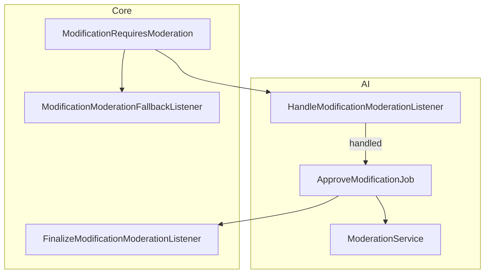
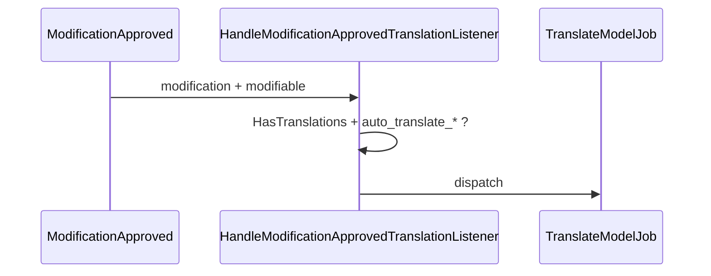

# AI modification moderation

AI participates in the **approval workflow** by analyzing pending `Modification` records and casting approve/disapprove votes as a configured system user.

**Canonical architecture:** [Modules/Core/docs/EVENT_ORCHESTRATION.md](../../Core/docs/EVENT_ORCHESTRATION.md) (section 2).

**CMS comment adapter:** [Modules/CMS/docs/COMMENT_MODERATION.md](../../CMS/docs/COMMENT_MODERATION.md).

---

## Decoupling rules

| Rule | Detail |
|------|--------|
| AI does not import CMS | No `Comment`, `Content`, or CMS events |
| Opt-in via registry | `ModerationContextBuilderRegistry::supports($modification)` |
| Per-entity toggle | `ai.features.moderation.entities.{table}`, seeded by the AI module for each model with a registered `ModerationAdapter` |
| Outcome on Core tables | `meta` JSON on `approvals` / `disapprovals` |

---

## Pipeline (AI responsibilities)


```mermaid
flowchart TB
    subgraph Core
        E[ModificationRequiresModeration]
        FB[ModificationModerationFallbackListener]
        FIN[FinalizeModificationModerationListener]
    end
    subgraph AI
        L[HandleModificationModerationListener]
        J[ApproveModificationJob]
        S[ModerationService]
    end
    E --> L
    L -->|handled| J
    J --> S
    J --> FIN
    E --> FB
```

### Listener: `HandleModificationModerationListener`

Runs when:

1. `config('ai.features.moderation.enabled')`
2. A user carries the username in `config('permission.users.system')` (Core seeds it; env `SYSTEM_USER`, default `system`)
3. `Modification` is active
4. Registry has a builder for `modifiable_type`
5. Modifiable model has AI moderation enabled (settings)

Actions:

- `addRequiredPreProcessing('ai_approval')`
- Cache event under `modification_moderation:{id}`
- Dispatch `ApproveModificationJob`
- `markAsHandled()`

### Job: `ApproveModificationJob`

1. `ModerationContextBuilderRegistry::build($modification)`
2. `ModerationService::analyze($context)` → `ModerationResult`. If the analysis fails, the uncertain fallback applies (only when AI votes are enabled).
3. Apply policy (threshold / dual / uncertain fallback), which sets the quorum: auto approve/reject 1/1, dual 2/2, uncertain fallback 1 approver / 2 disapprovers
4. Core `ModificationVoteService::castWithQuorum()` as system user: sets that quorum, records the vote with its `meta`, and applies the decision in one transaction. The quorum counts votes already cast (for example an author's approve credit), so a lowered quorum that existing votes reach is applied, never left pending. A failure while voting fails the job (it is retried); it does not fall back to a second vote. The job acts as the system user by setting the guard's user and restoring the previous one afterwards, without logging in or out, so the system user's remember token is never rotated.
5. `ModificationPreProcessingCompleted('ai_approval')`

### Service: `ModerationService`

- Prompt: `Ai\Prompts\ModerationPrompt`
- Structured JSON verdict (approve / reject / uncertain)
- Neuron structured output (`ModerationVerdictData`): an answer that does not fit the schema is asked again once, then the verdict is `uncertain`

---

## Approval modes

Configured via `ai.features.moderation.approval_mode` (`ModerationApprovalMode` enum):

| Mode | Behaviour |
|------|-----------|
| `threshold` | Auto approve/reject when confidence ≥ thresholds; else preliminary disapprove for human review |
| `dual` | AI casts first vote; `approvers_required = 2`; human second vote required |

Thresholds:

- `approve_confidence_threshold` (default 0.85)
- `reject_confidence_threshold` (default 0.85)
- `safe_to_auto_approve` from LLM JSON

---

## Configuration

```env
AI_MODERATION_ENABLED=true
AI_MODERATION_APPROVAL_MODE=threshold
AI_MODERATION_AI_VOTES=true
AI_MODERATION_APPROVE_THRESHOLD=0.85
AI_MODERATION_REJECT_THRESHOLD=0.85
AI_MODERATION_QUEUE=default
```

The moderation model is the setting `features.moderation.model` in Filament > Settings (see `rag/AI_MODEL_SELECTION_USER.md`); `AI_MODERATION_PROVIDER` and `AI_COMMENT_MOD_PROVIDER` were removed. Other legacy `AI_COMMENT_*` env vars are still read as fallbacks in `config/config.php`.

Per-model (Core settings, group `moderation`):

- `ai.features.moderation.entities.cms_comments` — enable AI for comments (seeded false)

---

## Post-approval translation

`HandleModificationApprovedTranslationListener` listens to Core `ModificationApproved`, which `ModificationVoteService` fires for every model once the approval is committed (`ModificationRejected` and `ModificationWithdrawn` are fired the same way and have no AI listener):


```mermaid
sequenceDiagram
    participant Core as ModificationApproved
    participant AI as HandleModificationApprovedTranslationListener
    participant J as TranslateModelJob

    Core->>AI: modification + modifiable
    AI->>AI: HasTranslations + auto_translate_* ?
    AI->>J: dispatch
```

Independent from moderation config except shared `ai.features.translation.enabled`.

---

## Vote metadata (`meta`)

Example shape written by `ApproveModificationJob`:

```json
{
  "source": "ai",
  "status": "auto_approved",
  "verdict": "approve",
  "confidence": 0.92,
  "categories": [],
  "reason": "On-topic and respectful.",
  "analyzed_at": "2026-05-15T12:00:00+00:00"
}
```

Read in Filament via `Modification::latestAutomatedVoteMeta()`.

---

## Tests

| Test file | Coverage |
|-----------|----------|
| `tests/Feature/ModificationModerationListenerTest.php` | Listener gates + queue |
| `tests/Feature/Jobs/ApproveModificationJobTest.php` | Threshold outcomes + meta |
| `Modules/Core/tests/Feature/Events/ModificationRequiresModerationEmitTest.php` | Core emitter |

---

## CRUD tools and approvals

The assistant's `create`, `update` and `delete` CRUD tools go through Core's `CrudService`. When the entity sends the write to approval, the write is not applied and the tool answers `status: pending_approval` with the request id (`modification`) and its `operation`, instead of a record. The tool descriptions tell the model so.
