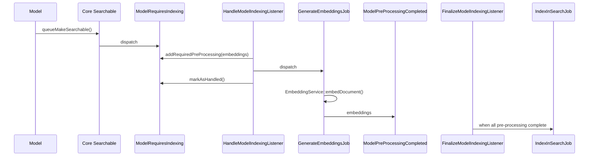
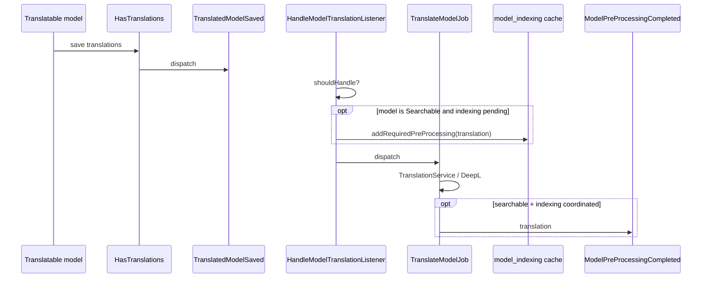
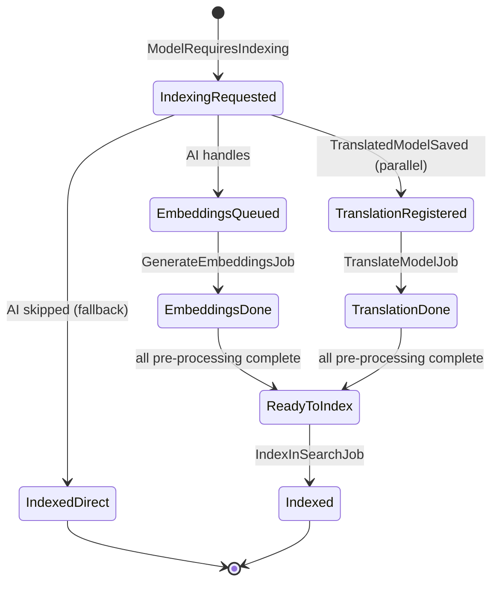

# Search indexing, embeddings, and translations

This module implements **AI-side** listeners and jobs for Core’s search orchestration. Core never imports AI; integration is event-only.

**Canonical overview (diagrams + comparison with moderation):** [Modules/Core/docs/EVENT_ORCHESTRATION.md](../../Core/docs/EVENT_ORCHESTRATION.md).

---

## Events listened by AI

| Core event | AI listener | Job |
|------------|-------------|-----|
| `ModelRequiresIndexing` | `HandleModelIndexingListener` | `GenerateEmbeddingsJob` |
| `TranslatedModelSaved` | `HandleModelTranslationListener` | `TranslateModelJob` |
| `ModelPreProcessingCompleted` | — (handled by Core `FinalizeModelIndexingListener`) | — |

Registration order: AI module priority **999** so AI listeners run before Core fallback listeners.

---

## 1. Embeddings → Elasticsearch / Typesense

### When AI handles indexing

`HandleModelIndexingListener` runs only if:

- `config('ai.features.embeddings.enabled')` is true
- Model uses `Searchable`
- Model has non-empty `$embed` and `vectorSearchEnabled()` is true

### Flow



### Embeddings job

- **Class:** `Modules\AI\Jobs\GenerateEmbeddingsJob`
- **Service:** `Modules\AI\Contracts\IEmbeddingService` / `EmbeddingService`
- **Output:** Vectors stored for the model; chunks for long documents
- **Completion:** `event(new ModelPreProcessingCompleted($model, 'embeddings'))`
- **Idempotent regeneration:** existing embeddings are deleted before the new set is written, so a retry or repair never appends duplicate `ModelEmbedding` rows.
- **Permanent failure (degrade):** `failed()` still emits `ModelPreProcessingCompleted($model, 'embeddings')`, so the document is indexed **keyword-only** rather than kept out of the index entirely.
- **Late-retry recovery:** the finalize step reads a `model_indexing` cache entry (10-min TTL). If it has expired (e.g. a manual `queue:retry` hours after the job failed), `FinalizeModelIndexingListener` dispatches `IndexInSearchJob` directly so the regenerated embedding still patches the document. Re-running `->searchable()` on the model achieves the same via the normal flow.

> **Do not** rely on `queue:retry` alone to re-index a document whose embed had failed: it regenerates the embedding but only patches the search document thanks to the late-retry recovery above. To backfill many degraded documents, use `ai:embeddings:repair` (below).

### Configuration

```env
AI_EMBEDDINGS_ENABLED=true
AI_PROVIDER=ollama
OPENAI_API_KEY=
OLLAMA_API_URL=http://localhost:11434
OLLAMA_MODEL=llama3.2:3b
```

Core / Scout (see Core README):

```env
SCOUT_DRIVER=elasticsearch
VECTOR_SEARCH_ENABLED=true
EMBEDDING_PROVIDER=openai
```

---

## 2. Automatic translation

### When AI handles translation

`HandleModelTranslationListener` runs when:

- `config('ai.features.translation.enabled')` is true
- Model uses `HasTranslations`
- `autoTranslateEnabledBySettings()` is true (setting `auto_translate_{table}` or model property)

### Flow



### Translation after comment approval

Separate path: `ModificationApproved` → `HandleModificationApprovedTranslationListener` → `TranslateModelJob` when `auto_translate` is enabled for comments.

See [MODERATION.md](./MODERATION.md#post-approval-translation).

### Configuration

```env
AI_TRANSLATION_ENABLED=true
DEEPL_API_KEY=
```

Per-model: `auto_translate_{table}` in group `translations` (seeded by Core for `HasTranslations` models).

---

## 3. Combined pipeline (searchable + auto-translate)



---

## 4. Fallback behaviour

| Scenario | Behaviour |
|----------|-----------|
| AI module disabled | `IndexModelFallbackListener` indexes without embeddings |
| Embeddings disabled in config | Same fallback |
| Model without `$embed` | AI listener returns early; fallback indexes |
| Embedding job fails permanently | Document indexed **keyword-only** (degraded); backfill later with `ai:embeddings:repair` |
| Pre-processing completes after cache expiry | `FinalizeModelIndexingListener` indexes the model directly (late-retry recovery) |
| Translation disabled | Indexing may still run with embeddings only |
| Translation without pending indexing | `TranslateModelJob` runs standalone |

---

## 5. Repairing missing embeddings

A document degraded to keyword-only (permanent embed failure) has no embedding row. Regenerate the missing embeddings for a model with:

```bash
php artisan ai:embeddings:repair "Modules\CMS\Models\Content" [--chunk=100] [--sync]
```

- Scans the model for records that have **no** `ModelEmbedding` and carry embeddable text (`prepareDataToEmbed()` non-empty).
- Dispatches `GenerateEmbeddingsJob` per record (or runs it inline with `--sync`); the regenerated embedding patches the search document through the finalize flow.
- Requires `VECTOR_SEARCH_ENABLED=true` and a searchable, embeddable model (non-empty `$embed`).

---

## Class reference

| Component | Path |
|-----------|------|
| Indexing listener | `app/Listeners/HandleModelIndexingListener.php` |
| Translation listener | `app/Listeners/HandleModelTranslationListener.php` |
| Embeddings job | `app/Jobs/GenerateEmbeddingsJob.php` |
| Translation job | `app/Jobs/TranslateModelJob.php` |
| Repair command | `app/Console/RepairMissingEmbeddingsCommand.php` |
| Finalize listener (Core) | `Modules/Core/app/Listeners/FinalizeModelIndexingListener.php` |
| Event registration | `app/Providers/EventServiceProvider.php` |
