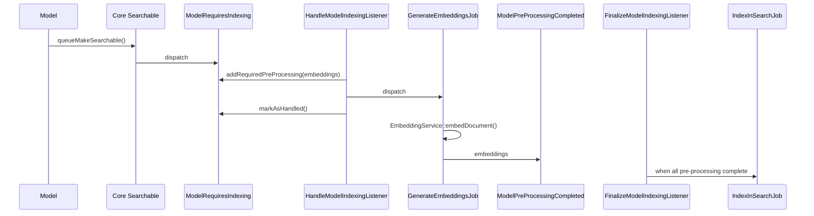
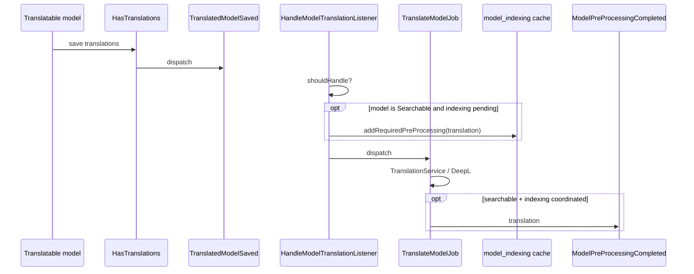
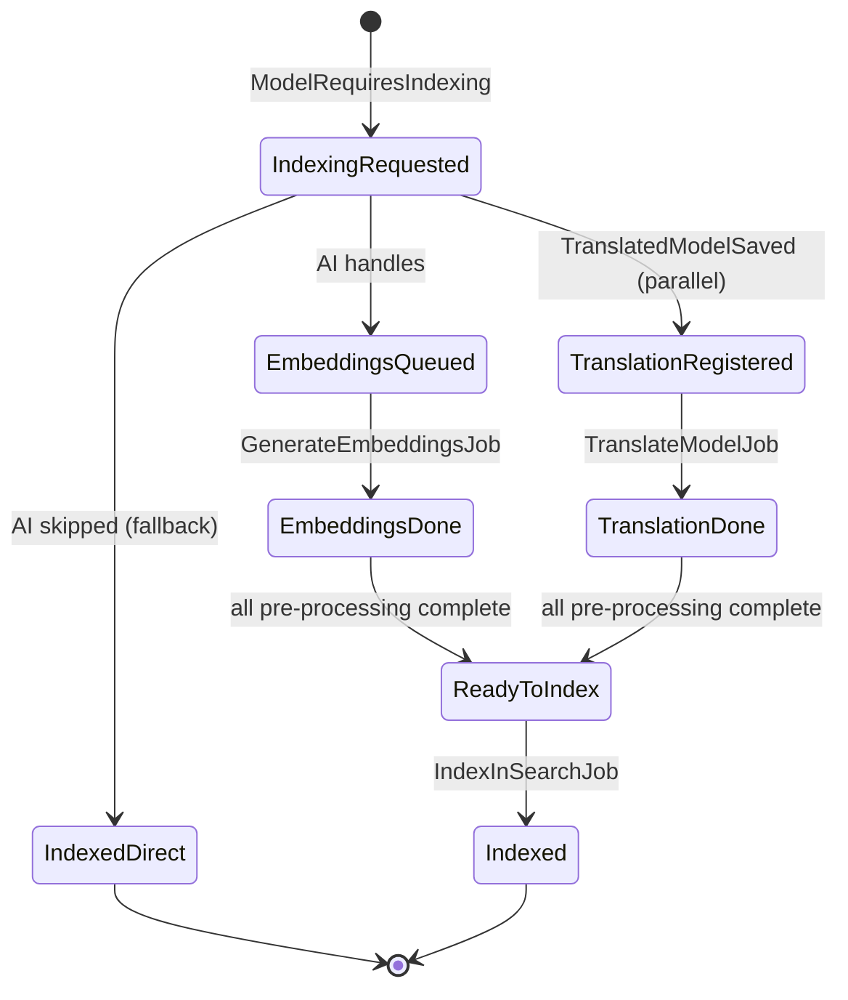

# Search indexing, embeddings, and translations

This module implements **AI-side** listeners and jobs for Core’s search orchestration. Core never imports AI; integration is event-only.

**Canonical overview (diagrams + comparison with moderation):** [Modules/Core/docs/EVENT_ORCHESTRATION.md](../../Core/docs/EVENT_ORCHESTRATION.md).

---

## Events listened by AI

| Core event | AI listener | Job |
|------------|-------------|-----|
| `ModelRequiresIndexing` | `HandleModelIndexingListener` | `GenerateEmbeddingsJob` |
| `TranslatedModelSaved` | `HandleModelTranslationListener` | `TranslateModelJob` |
| `ModelPreProcessingCompleted` | — (handled by Core `FinalizeModelIndexingListener`) | — |

Registration order: AI module priority **999** so AI listeners run before Core fallback listeners.

---

## 1. Embeddings → Elasticsearch / Typesense

### When AI handles indexing

`HandleModelIndexingListener` runs only if:

- `config('ai.features.embeddings.enabled')` is true
- Model uses `Searchable`
- Model has non-empty `$embed` and `vectorSearchEnabled()` is true

### Flow


```mermaid
sequenceDiagram
    participant M as Model
    participant C as Core Searchable
    participant E as ModelRequiresIndexing
    participant AI as HandleModelIndexingListener
    participant J as GenerateEmbeddingsJob
    participant P as ModelPreProcessingCompleted
    participant F as FinalizeModelIndexingListener
    participant I as IndexInSearchJob

    M->>C: queueMakeSearchable()
    C->>E: dispatch
    AI->>E: addRequiredPreProcessing(embeddings)
    AI->>J: dispatch
    AI->>E: markAsHandled()
    J->>J: EmbeddingService::embedDocument()
    J->>P: embeddings
    F->>I: when all pre-processing complete
```

### Embeddings job

- **Class:** `Modules\AI\Jobs\GenerateEmbeddingsJob`
- **Service:** `Modules\AI\Contracts\IEmbeddingService` / `EmbeddingService`
- **Output:** Vectors stored for the model; chunks for long documents
- **Completion:** `event(new ModelPreProcessingCompleted($model, 'embeddings'))`
- **Idempotent regeneration:** existing embeddings are deleted before the new set is written, so a retry or repair never appends duplicate `ModelEmbedding` rows.
- **Permanent failure (degrade):** `failed()` still emits `ModelPreProcessingCompleted($model, 'embeddings')`, so the document is indexed **keyword-only** rather than kept out of the index entirely.
- **Late-retry recovery:** the finalize step reads a `model_indexing` cache entry (10-min TTL). If it has expired (e.g. a manual `queue:retry` hours after the job failed), `FinalizeModelIndexingListener` dispatches `IndexInSearchJob` directly so the regenerated embedding still patches the document. Re-running `->searchable()` on the model achieves the same via the normal flow.
- **Rate-limit resilience:** the `embeddings` rate limiter (`RateLimiter::for('embeddings')`, 10/min) releases jobs beyond the limit during a mass backfill. `retryUntil()` (default 24h via `ai.features.embeddings.retry_until_minutes`) takes precedence over the `tries` count — including Horizon's supervisor `tries` — so released jobs wait for their slot instead of dying with `MaxAttemptsExceeded`. Real errors remain bounded by `$maxExceptions` (5): nothing on the way catches an embedding error (the job has no `ThrottlesExceptions`), so it reaches the worker, counts against that budget and, once spent, fails the job: a `failed_jobs` row, and `failed()` degrades the document to keyword-only. The five tries are spaced by `$backoff` (30, 60, 120 and 240 seconds, seven and a half minutes in all, inside the ten minutes the indexing coordination event lives in cache), so an outage longer than that degrades the document instead of holding it out of the index. `ai:embeddings:repair` brings those documents back, hourly on its own (below), and refuses to start while the service cannot embed. The equivalent for the `indexing` queue lives in Core (`SCOUT_QUEUE_RETRY_UNTIL_MINUTES`, `SCOUT_QUEUE_MAX_EXCEPTIONS`).

> **Do not** rely on `queue:retry` alone to re-index a document whose embed had failed: it regenerates the embedding but only patches the search document thanks to the late-retry recovery above. To backfill many degraded documents, use `ai:embeddings:repair` (below).

### Configuration

Embeddings use the profile chosen in the setting `features.embeddings.model` (`provider:model`), not an env var (and not `AI_PROVIDER`). The model that serves search is the managed setting `features.embeddings.active`; it changes only when `ai:embeddings:switch` activates the chosen model. Profiles, the switch, its commands and the vector length of each profile (`dimensions`, measured with `ai:embeddings:probe`): [rag/MODULE.md](rag/MODULE.md), section *Embedding model and model switch*. Self-hosted Sentence Transformers: [SENTENCE_TRANSFORMERS_INSTALLATION.md](SENTENCE_TRANSFORMERS_INSTALLATION.md).

```env
AI_EMBEDDINGS_ENABLED=true
SENTENCE_TRANSFORMERS_URL=http://embedding-host:8003
SENTENCE_TRANSFORMERS_API_KEY=
```

Other providers (example: Ollama embeddings):

```env
# select the `ollama:...` profile in the setting `features.embeddings.model`
OLLAMA_API_URL=http://localhost:11434
OLLAMA_MODEL=nomic-embed-text
```

Core / Scout (see Core README):

```env
SCOUT_DRIVER=elasticsearch
```

and the `core.search.vector.enabled` runtime setting set to true (Filament > Settings).

---

## 2. Automatic translation

### When AI handles translation

`HandleModelTranslationListener` runs when:

- `config('ai.features.translation.enabled')` is true
- Model uses `HasTranslations`
- `autoTranslateEnabledBySettings()` is true (setting `translations.auto.{table}` or model property)

### Flow


```mermaid
sequenceDiagram
    participant M as Translatable model
    participant C as HasTranslations
    participant E as TranslatedModelSaved
    participant AI as HandleModelTranslationListener
    participant J as TranslateModelJob
    participant Cache as model_indexing cache
    participant P as ModelPreProcessingCompleted

    M->>C: save translations
    C->>E: dispatch
    AI->>AI: shouldHandle?
    opt model is Searchable and indexing pending
        AI->>Cache: addRequiredPreProcessing(translation)
    end
    AI->>J: dispatch
    J->>J: TranslationService / DeepL
    opt searchable + indexing coordinated
        J->>P: translation
    end
```

### Translation after comment approval

Separate path: `ModificationApproved` → `HandleModificationApprovedTranslationListener` → `TranslateModelJob` when `auto_translate` is enabled for comments.

See [MODERATION.md](./MODERATION.md#post-approval-translation).

### Configuration

The provider is the setting `features.translation.model` in Filament > Settings: `deepl`, or an AI model
as `provider:model` (choices refreshed by `ai:models:refresh`). `DEEPL_API_KEY` configures DeepL. There is
no fallback: a failing provider saves and caches nothing for that locale, and the job is retried.

```env
DEEPL_API_KEY=
```

Per-model: `translations.auto.{table}` in group `translations` (seeded by Core for `HasTranslations` models).

---

## 3. Combined pipeline (searchable + auto-translate)


```mermaid
stateDiagram-v2
    [*] --> IndexingRequested: ModelRequiresIndexing
    IndexingRequested --> EmbeddingsQueued: AI handles
    EmbeddingsQueued --> EmbeddingsDone: GenerateEmbeddingsJob
    IndexingRequested --> TranslationRegistered: TranslatedModelSaved (parallel)
    TranslationRegistered --> TranslationDone: TranslateModelJob
    EmbeddingsDone --> ReadyToIndex: all pre-processing complete
    TranslationDone --> ReadyToIndex: all pre-processing complete
    ReadyToIndex --> Indexed: IndexInSearchJob
    IndexingRequested --> IndexedDirect: AI skipped (fallback)
    IndexedDirect --> [*]
    Indexed --> [*]
```

---

## 4. Fallback behaviour

| Scenario | Behaviour |
|----------|-----------|
| AI module disabled | `IndexModelFallbackListener` indexes without embeddings |
| Embeddings disabled in config | Same fallback |
| Model without `$embed` | AI listener returns early; fallback indexes |
| Embedding job fails permanently | Document indexed **keyword-only** (degraded); backfill later with `ai:embeddings:repair` |
| Pre-processing completes after cache expiry | `FinalizeModelIndexingListener` indexes the model directly (late-retry recovery) |
| Translation disabled | Indexing may still run with embeddings only |
| Translation without pending indexing | `TranslateModelJob` runs standalone |
| Translation provider fails | Nothing is saved or cached for that locale; the other locales are translated; the job retries (3 tries, backoff 30/60/120 s); indexing proceeds when the job succeeds or gives up |

---

## 5. Repairing missing or stale embeddings

A document degraded to keyword-only (permanent embed failure) has no embedding row. A document that has embeddings but none of the active model (for example a model removed from config, or rows written before the `provider:model` keys) is stale. Repair both with (changing the model needs no repair: `ai:embeddings:switch` re-embeds the corpus itself and deletes the previous model's rows at activation):

```bash
php artisan ai:embeddings:repair "Modules\CMS\Models\Content" [--chunk=100] [--sync] [--stale]
php artisan ai:embeddings:repair --all [--if-idle]
```

- Default: scans the model for records that have **no** `ModelEmbedding` and carry embeddable text (`prepareDataToEmbed()` non-empty). It scans the same population `scout:import` indexes (`makeAllSearchableQuery()`), not `query()`: content with no translation in the current locale, which `LocaleScope` hides, is repaired too. Records the search index would not hold (`shouldBeSearchable()` false, such as media drafts) are skipped: an embedding nobody indexes is wasted.
- `--stale`: instead targets records that have embeddings but **no** row stamped with the active profile's key (`EmbeddingModelRegistry::active()->key`). Rows of other models are kept until a switch activation deletes them, so a record that has a row of the active key is not stale however many other rows it keeps.
- `--all` repairs every embeddable model instead of one: searchable, `isEmbeddable()` (vector search on and an `$embed` list) and allowed by the `ai.features.embeddings.modules` allowlist, the predicates the indexing listener applies. It does nothing while `ai.features.embeddings.enabled` is off. `--if-idle` skips the run while embeddings jobs are still queued: a record keeps lacking its embedding until its job has run, so a backlog would otherwise be dispatched twice. The AI module schedules `ai:embeddings:repair --all --if-idle` hourly, one at a time and on one server: it brings back the records an outage degraded to keyword-only.
- Either way, regeneration dispatches `GenerateEmbeddingsJob` per record with `locale = null` (or runs it inline with `--sync`), which performs a full per-locale regenerate — all locales, stamped with the active `model_key` — through the finalize flow. The command itself does not stamp `model_key`.
- Queued runs are paced by the `embeddings` rate limiter (`EMBEDDINGS_QUEUE_RATE_PER_MINUTE`, default 10 jobs per minute): the jobs wait for their slot. A `--sync` run is not throttled, because a sync queue cannot release a job back, so the limiter would drop it silently. A record whose embedding fails under `--sync` is reported, the others still run, and the command exits with failure.
- Preflight on the embedding service, before scanning, two checks that abort the command with failure **before it dispatches anything**. The service must embed: a `POST /embed` with a probe text, the payload the jobs send (`model`, `truncation`, `normalize_embeddings`, `max_length`, the bearer token when configured), must answer with a vector of the active profile's dimensions, so a service that answers `/health` but returns 500 on `/embed` stops the run instead of losing every job. And it must run the model of the active profile, because embeddings of another model stored under the profile's `model_key` look right, are invisible to `--stale` and quietly degrade the semantic search: the model the `/embed` answer names is authoritative (a multi-model service answers for the model the request asked for), `/health` is the fallback (it only echoes what the service was started with), and names are compared by their last path segment, without case, so `sentence-transformers/all-MiniLM-L6-v2` is `all-MiniLM-L6-v2`. A service that names no model cannot be checked: a warning, and the run goes on. `/health` being unreachable is a warning too; the probe is what gates. The embeddings provider applies the same comparison to every `/embed` answer that names its model (an `EmbeddingsException`, so the job fails visibly), not only in the repair.
- Requires `core.search.vector.enabled` = true and a searchable, embeddable model (non-empty `$embed`).

---

## Class reference

| Component | Path |
|-----------|------|
| Indexing listener | `app/Listeners/HandleModelIndexingListener.php` |
| Translation listener | `app/Listeners/HandleModelTranslationListener.php` |
| Embeddings job | `app/Jobs/GenerateEmbeddingsJob.php` |
| Translation job | `app/Jobs/TranslateModelJob.php` |
| Repair command | `app/Console/RepairMissingEmbeddingsCommand.php` |
| Finalize listener (Core) | `Modules/Core/app/Listeners/FinalizeModelIndexingListener.php` |
| Event registration | `app/Providers/EventServiceProvider.php` |
