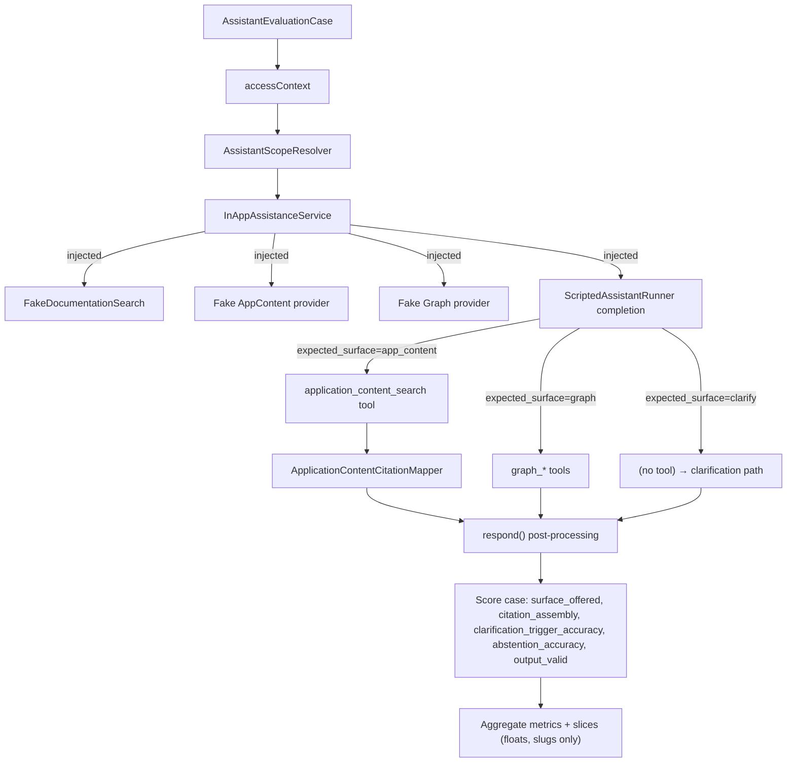

# Assistant end-to-end evaluation — developer guide

## Purpose

This document describes the design and internals of the assistant evaluation harness (RAG goal R1b). The harness measures the composed `InAppAssistanceService::respond()` over a per-module dataset in two modes:

- **Level 1 (deterministic, built now, CI regression gate):** runs the real `respond()` with a scripted router (fake completion provider) over the real documentation, application-content, and Graph retrieval paths. It measures composition *plumbing* — scope gating, citation assembly, clarification, abstention, and output validation — **not** the LLM's surface-routing accuracy.
- **Level 2 (live, defined now, built later, opt-in):** runs the same dataset against a live LLM to measure actual surface-routing, citation precision, and answer quality. Non-deterministic; outside CI and specified but unimplemented.

See also: `ASSISTANT_SCOPE.md` (module-scoped documentation retrieval that L1 verifies), `DOCUMENTATION_EVALUATION_DEVELOPER.md` (the mirror evaluation harness for documentation retrieval only, which L1 reuses).

## Capabilities

| Concern | Owner | Artifact |
|---------|-------|----------|
| Dataset schema and case value object | AI | `Modules\AI\Services\Assistance\Evaluation\{AssistantEvaluationCase, AssistantEvaluationDataset}` |
| Level-1 scoring service (deterministic) | AI | `Modules\AI\Services\Assistance\Evaluation\AssistantEvaluationService::evaluate()` |
| Scripted-completion fixture | AI | `Modules\AI\Tests\Stubs\Assistance\ScriptedAssistantRunner`, `ScriptedAssistantFixtures` |
| CI regression gate (Level 1) | AI | `Modules\AI\Tests\Feature\Assistance\AssistantBaselineGateTest` |
| Per-module dataset (JSON) | Each module | `Modules/{Module}/docs/rag/evaluations/assistant-{slug}.json` |
| Baseline report (committed) | Each module | `Modules/{Module}/docs/rag/evaluations/assistant-{slug}-baseline.json` |

**Deferred (Level 2):**
| Concern | Owner | Artifact |
|---------|-------|----------|
| CLI command (`ai:evaluate-assistant --live`) | AI | `Modules\AI\Console\EvaluateAssistantCommand` — not yet implemented; will be the future interface for Level-2 live evaluation |

The dataset contract mirrors `DocumentationEvaluationDataset`: JSON with exact-key validation, bounded sizes, and synthetic-only data classification.

## Internal Flow

### Level 1 (deterministic, built)

1. The regression gate test loads a dataset JSON from `Modules/{Module}/docs/rag/evaluations/assistant-{slug}.json` into `AssistantEvaluationDataset`.
2. For each case, `AssistantEvaluationService::evaluate()`:
   - Resolves the case's `AssistantAccessContext` (profile fixed to `InAppAssistance`, module/locale/permissions from the case).
   - Constructs `InAppAssistanceService` with:
     - Real `documentation_retrieval` (reusing R0 `FakeDocumentationSearch` fixture).
     - Fake application-content and Graph providers (fixture stubs with authored evidence/ambiguity per case).
     - **Scripted `completion` closure** from `ScriptedAssistantRunner` — given the case's `expected_surface`, invokes the matching tool with scripted arguments over the fake provider (which sets citation metadata), then returns a scripted answer string.
   - Calls the real `respond($query, $context)` method.
   - The scripted completion, per `expected_surface`, either:
     - Invokes `application_content_search` tool and scripted args → fake provider sets `ApplicationContentCitationMapper` state → returns scripted answer.
     - Invokes `graph_*` tool with scripted args → fake Graph provider → scripted answer.
     - Invokes nothing, so deterministic clarification/abstention paths in `respond()` fire → localized clarification/refusal output.
     - For `documentation` surface, uses the pre-retrieved documentation context.
   - `respond()` then runs post-processing (citation merge, abstention check, output validation, persistence) unchanged.
3. Scores the case per module:
   - `surface_offered` — resolved `AssistantScope` made `expected_surface` available.
   - `citation_assembly` — returned `Message` metadata citations match `expected_citations`.
   - `clarification_trigger_accuracy` — clarification output iff `expect_clarification`.
   - `abstention_accuracy` — abstention output iff a surface was attempted with no evidence (refuse cases).
   - `output_valid` — scripted output passed mandatory validation.
   - `unavailable_rate` — cases where `respond()` threw or returned unexpectedly (fail-closed).
4. Aggregates metrics per module and locale. Slices recompute each metric by `module`, `locale`, and case tag (deterministic `ksort`).
5. Outputs a report JSON containing only aggregate floats and slugged slice keys — never queries, citations, or record content.



### Level 2 (live, defined, deferred)

When built, will run the same dataset over the real LLM (not a scripted completion) and measure actual surface-routing accuracy, citation precision across sources, real clarification/refusal behavior, and answer grounding against retrieved evidence. The future `ai:evaluate-assistant --live` command will switch to Level-2 mode. **Level 2 is not yet implemented; this is a specification of the intended interface for a later phase.**

## How To Use — Add a Report Card for a New Module

1. **Author the dataset**: Create `Modules/{Module}/docs/rag/evaluations/assistant-{slug}.json`.

   Dataset structure (JSON):
   - `version` — schema version (string, e.g. `"1"`).
   - `corpus_revision` — commit/version of the test fixtures (string).
   - `module` — lowercase module name (string, e.g. `"cms"`).
   - `data_classification` — restricted to `"synthetic"` (string).
   - `cases` — bounded array (max 100 entries). Each case:
     - `id` — unique case slug (string, kebab-case).
     - `query` — the question asked (string).
     - `locale` — language code (string, e.g. `"en"`).
     - `module` — expected module scope (string, or null for generic/no-module case).
     - `expected_surface` — one of `"documentation"`, `"application_content"`, `"graph"`, `"clarify"`, `"refuse"` (string).
     - `expected_citations` — bounded list of safe citation labels/references (array of strings; empty for `clarify`/`refuse`).
     - `expect_clarification` — true iff `expected_surface == "clarify"` (boolean).
     - `expect_refusal` — true iff `expected_surface == "refuse"` (boolean).
     - `slices` — lowercase slug tags for breakdowns (array of strings, e.g. `["topic:crud", "hop:single"]`).

   Validation invariants:
   - `clarify`/`refuse` cases carry no expected citations.
   - `expected_surface` and boolean flags must agree (`clarify` → `expect_clarification=true`, etc.).
   - `graph` and `application_content` surfaces are valid only where the module scope could offer them (determined by case `module` and server configuration).
   - Slug patterns match `^[a-z][a-z0-9_]*(?::[a-z][a-z0-9_]*)?$`.

   Example excerpt:
   ```json
   {
     "version": "1",
     "corpus_revision": "main:a1b2c3d",
     "module": "cms",
     "data_classification": "synthetic",
     "cases": [
       {
         "id": "cms-doc-content-search",
         "query": "How do I search for pages by keyword?",
         "locale": "en",
         "module": "cms",
         "expected_surface": "documentation",
         "expected_citations": ["user:cms-search-guide"],
         "expect_clarification": false,
         "expect_refusal": false,
         "slices": ["topic:search", "hop:single"]
       }
     ]
   }
   ```

2. **Author fixture providers**: Add fake application-content and Graph provider stubs under `Modules/AI/tests/Stubs/Assistance/` (mirror `Modules/AI/tests/Stubs/Documentation/CoreUserDocumentationCorpus`).

   `ScriptedAssistantFixtures::forCMS()` (or per-module method) should:
   - Map each case query (via `crc32`) to a fake provider response with authored citations and ambiguity state.
   - For `application_content` surface: return `ApplicationContentResult` with `results` (safe text + metadata) and an optional `clarificationRequired` flag.
   - For `graph` surface: return `GraphResult` with relation/expansion results.
   - For `clarify`/`refuse` cases: return empty/ambiguous results so the guardrails fire.

3. **Add the gate test**: Create `Modules/AI/tests/Feature/Assistance/AssistantCMSBaselineGateTest.php` (mirror `DocumentationBaselineGateTest`).

   - Load the dataset via `base_path('Modules/CMS/docs/rag/evaluations/assistant-cms.json')`.
   - Run `AssistantEvaluationService::evaluate()` with the fixture providers.
   - Assert each Level-1 metric at or above committed thresholds (read from a baseline report JSON).
   - Assert `unavailable_rate === 0.0`.

4. **Run the gate test**:
   ```bash
   php artisan test Modules/AI/tests/Feature/Assistance/AssistantCMSBaselineGateTest.php
   ```

5. **Commit the dataset and baseline report**:
   ```bash
   git add Modules/CMS/docs/rag/evaluations/assistant-cms.json
   git add Modules/CMS/docs/rag/evaluations/assistant-cms-baseline.json
   git commit -m "test(cms): assistant evaluation baseline"
   ```

## Configuration


- `ai.features.faq.max_documents` — resolved top-K for documentation retrieval in evaluated cases (clamped 1–10). Tests set this to the dataset's intended K.
- `ai.features.faq.policy_classification_version` — must match the fixture documents' `policy_classification_version` (default `in-app-docs-v1`).
- No new configuration surface for assistant evaluation. Scope and profile are server-owned and fixed per-request, never read from config or model output.

## Permissions and Security

- **Scope is server-owned**: the module context comes from the case, never from user input or the assistant's own choice.
- **No live LLM or Elasticsearch in Level 1**: the real `respond()` path (scope resolution, guardrails, ACL-preserving tool authorization, output validation) runs; only the scripted completion provider is faked.
- **Scripted router cannot widen surfaces**: the completion can only invoke tools the resolved `AssistantScope` offers; it respects the same scope gating as production.
- **Reports leak no payload**: only aggregate metrics and slugged slice keys, never query text, citations, or record content.
- **Data classification**: restricted to `synthetic` to signal test-only data.
- **Level 2 (when built)** will run under the same server-owned profile/scope/ACL guarantees and remain opt-in, outside CI.

## Performance and Limits

- **Deterministic Level 1 only**: no external services in tests.
- **Per-module, dataset-driven**: each module owns its evaluation dataset under `Modules/{Module}/docs/rag/evaluations/assistant-*.json`; datasets are bounded to 100 cases per module to keep gate time reasonable.
- **Measures plumbing, not routing**: the scripted completion choice means L1 proves "given surface X, the plumbing handled X correctly," not "the assistant chose X." Routing accuracy is a Level-2 metric (not yet built).
- **Citation precision over deterministic scoring**: after a scripted surface tool invocation, the message metadata citations must match the case's `expected_citations` exactly — no fuzzy scoring.
- **Fail-closed on retrieval failure**: if `respond()` throws or returns unexpectedly, the case counts as `unavailable` with no impact on other metrics.

## Errors and Troubleshooting

| Symptom | Check |
|---------|-------|
| Gate test fails with mismatched citations | Verify fixture provider returns same citation labels as `expected_citations`; check safe label alignment byte-for-byte (e.g. Unicode middle dot) |
| Clarification/abstention does not fire in a case | Confirm the fake provider returns empty/ambiguous results for that case; check `ApplicationContentCitationMapper::clarificationRequired()` / `insufficientEvidence()` logic |
| `respond()` throws unexpectedly in Level 1 | Check fixture metadata (audience, locale, permissions); compare against `InAppAssistanceService` and guardrails requirements |
| Level-2 attempted | The `ai:evaluate-assistant --live` command is not yet implemented; Level 2 is deferred |
| Dataset validation rejects a new case | Check exact-key validation and bounded sizes; verify `expected_surface` and boolean flags agree; confirm slug patterns match `^[a-z][a-z0-9_]*(?::[a-z][a-z0-9_]*)?$` |

## Related

- `ASSISTANT_SCOPE.md` — module-scoped documentation retrieval, server-owned scope resolution (`AssistantScopeResolver`), confirmed by L1.
- `DOCUMENTATION_EVALUATION_DEVELOPER.md` — mirror deterministic evaluation harness for documentation retrieval only (R0); L1 reuses its `FakeDocumentationSearch` fixture.
- `Modules/AI/docs/rag/ASSISTANT_DATA_TOOLS_USER.md` — end-user guide to application content and Graph tools.
- Design spec: `docs/superpowers/specs/2026-08-29-assistant-end-to-end-evaluation-design.md`.
- Forward contract: R0 (`docs/superpowers/specs/2026-08-04-documentation-rag-evaluation-baseline-design.md`) defined the assistant-level evaluation shape; this realizes it for Level 1.
