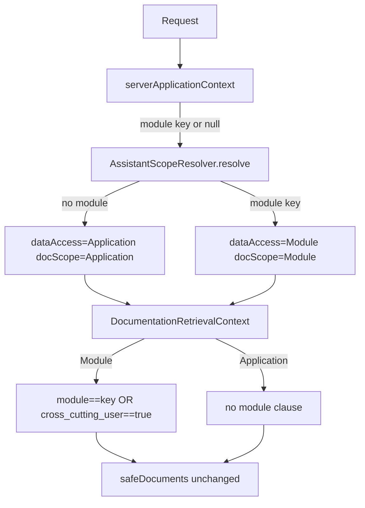

# AI — assistant profile scope (module-scoped in-app assistance)

## Purpose

`InAppAssistance` narrows the assistant's documentation retrieval (and, going forward, its data-tool surface) to the **module** the user is currently working in — instead of always answering from the full application corpus. When no module is recognizable, the assistant does not restrict itself: it falls back to the same generic, full-corpus behavior it had before scoping existed. Scope is a **relevance** concern layered on top of the unchanged security boundary (audience/permission/tenant filtering, safe projection); it never widens or narrows what a user is authorized to see.

See also: `MODULE.md` (RAG ingestion/indexing pipeline, security boundaries), `DOCUMENTATION_EVALUATION_DEVELOPER.md` (how the deterministic evaluation harness exercises the real retrieval path).

## Capabilities

| Concern | Owner | Artifact |
|---------|-------|----------|
| Scope value object | AI | `Modules\AI\Services\Assistance\Scope\AssistantScope` (`moduleKey`, `dataAccess`, `docScope`) |
| Scope resolution | AI | `AssistantScopeResolver::resolve(profile, moduleKey)` |
| Module clause on retrieval | AI | `DocumentationRetrievalContext::elasticsearchFilter()` |
| Cross-cutting marker | AI + module owners | `metadata.cross_cutting_user` frontmatter key, carried by `FileDocumentReader` |
| Scope wiring in respond() | AI | `InAppAssistanceService::respond()` |

`DataAccess` is `None | Module | Application`; `DocScope` is `Module | Application`. `AssistantScope::generic()` is `(moduleKey: null, dataAccess: None, docScope: Application)`.

## InternalFlow

1. `InAppAssistanceService::respond()` reads the server-set request attribute `assistant_application_context` (never a model- or user-supplied argument) via `serverApplicationContext()`, which yields a module key or `null`.
2. `AssistantScopeResolver::resolve($access->profile, $moduleKey)`:
   - Profile is not `InAppAssistance` → `AssistantScope::generic()` (`dataAccess: None`, `docScope: Application`). This branch is a defensive default; in practice the in-app request path always carries `InAppAssistance`.
   - Profile is `InAppAssistance` and no valid module key → `(moduleKey: null, dataAccess: Application, docScope: Application)`. **This is the "stays generic" case**: authorized data and documentation remain fully available, exactly as before module scoping was introduced.
   - Profile is `InAppAssistance` and a valid module key (`/^[a-z][a-z0-9_]*$/`) → `(moduleKey, dataAccess: Module, docScope: Module)`.
3. The resolved `AssistantScope` is passed to `DocumentationService::retrieveForInApp()` → `InAppDocumentationRetrieval::retrieve()` → `DocumentationRetrievalContext::fromAccessContextAndScope()`.
4. Under `DocScope::Module`, `elasticsearchFilter()` adds one additional `bool.filter` clause: `metadata.module == moduleKey OR metadata.cross_cutting_user == true`. Under `DocScope::Application` (generic case), no module clause is added — behavior is identical to the pre-scoping retrieval path.
5. `respond()` withholds all app-data tools only when `dataAccess === DataAccess::None` (`$tools = $scope->dataAccess === DataAccess::None ? [] : contextualTools(...)`). Because the in-app path never resolves to `None`, tools stay available regardless of module recognition today; `Module` vs `Application` is carried through for future per-module tool narrowing but does not yet change which tools are offered — tool candidates are still selected from the raw server module context, independent of `AssistantScope`.



## HowToUse — marking a guide as cross-cutting

Add `cross_cutting_user: true` to a doc's YAML frontmatter when it is a genuinely cross-module, hands-on **end-user** guide — a task a user performs from any module (e.g. adaptive search matching, which applies to CRUD search across every module):

```markdown
---
module: core
audience: user
cross_cutting_user: true
---
# Adaptive search matching — user and API guide
...
```

`FileDocumentReader::extractFrontMatter()` passes arbitrary frontmatter through unchanged into `Document::metadata`, so no reader code change is needed for the key itself to reach the index. Do **not** tag developer, operator, or architecture docs — the marker is scoped strictly to `audience: user` guides that are truly cross-module. If a candidate guide has no explicit `audience` classification yet, do not invent one just to add the marker.

The marker is **relevance-only**: it decides which documents survive the module clause in `elasticsearchFilter()`. It must never be added to the safe-field projection in `InAppDocumentationRetrieval::safeDocuments()` — that allowlist (`audience`, `heading_breadcrumb`, `locale`, `module`, `safe_source_label`, `version`) is a security boundary, not a relevance signal, and stays unchanged.

## Configuration

No new configuration surface. Scope is computed per-request from `assistant_application_context` (set server-side before `InAppAssistanceService::respond()` runs) and the caller's `AssistantProfile`; it is never read from config, the prompt, or model output.

## PermissionsAndSecurity

- Scope is **server-owned and never model-chosen**: the module key comes only from a request attribute set by trusted middleware, not from user input or the assistant's own output.
- The module clause is **additive** to the existing `bool.filter` — it narrows an already-authorized result set further by relevance, it cannot surface a document that audience/permission/tenant/locale filtering would otherwise reject.
- `safeDocuments()` and its metadata allowlist are untouched by this feature; `cross_cutting_user` never appears in the user-facing safe projection.
- Page-level scoping (filters, approvals, per-record actions) is explicitly **out of scope** here — this feature scopes to the current **module**, not the current page or record.

## ErrorsAndTroubleshooting

| Symptom | Check |
|---------|-------|
| Module-scoped retrieval returns nothing for an otherwise-valid module | The module's own guides may lack correct `metadata.module`, or no `cross_cutting_user` guide applies; confirm indexed metadata, not just source frontmatter |
| A guide that should be cross-cutting never surfaces outside its module | Frontmatter is missing `cross_cutting_user: true`, or the doc was indexed before the tag was added — reindex |
| In-app assistant behaves identically with and without a module | Expected when no module is recognizable — scope intentionally falls back to the generic, full-corpus behavior, not a bug |

## FAQPrompts

- What does module-scoped documentation retrieval mean for the in-app assistant?
- What happens when the in-app assistant cannot recognize the current module?
- What does `cross_cutting_user: true` do, and how is it different from `audience: user`?
- Does `cross_cutting_user` relax any security or permission filtering?
- Why does an in-app answer under one module cite a guide belonging to another module?

## Related

- `MODULE.md` — RAG ingestion/indexing pipeline and existing security boundaries.
- `DOCUMENTATION_EVALUATION_DEVELOPER.md` — evaluation harness exercising the real `InAppDocumentationRetrieval::retrieve()` path, including `safeDocuments()`.
- `Modules/Core/docs/rag/SEARCH_MATCHING_USER.md` — first tagged `cross_cutting_user` guide.
