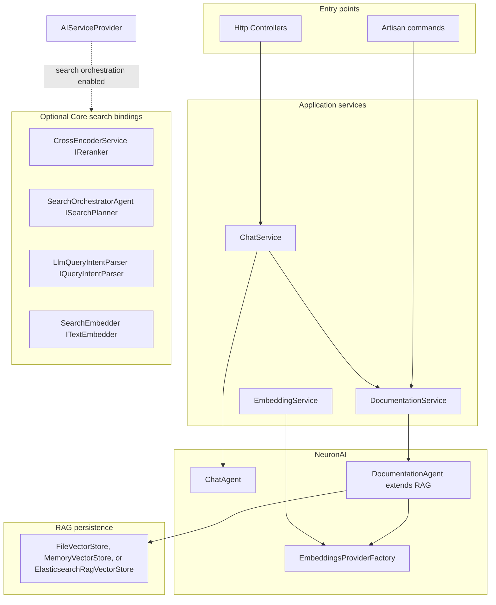
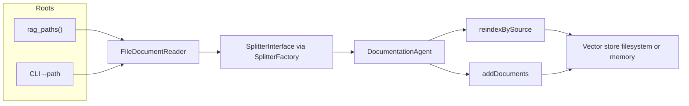
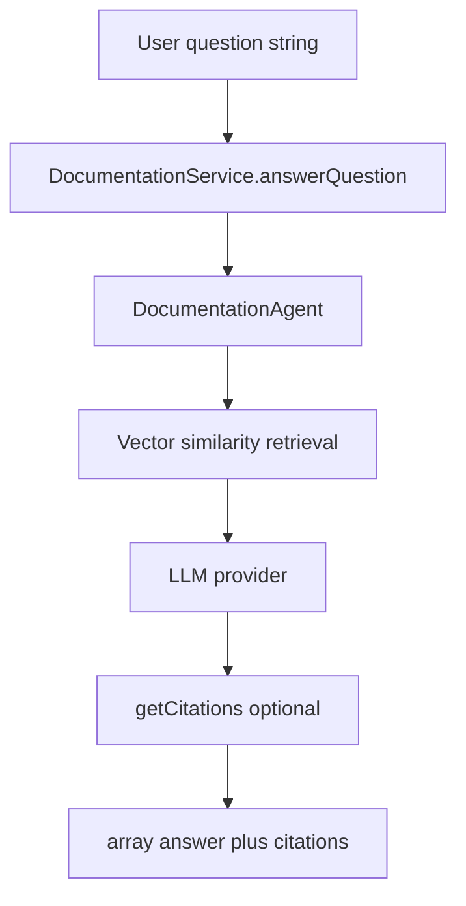
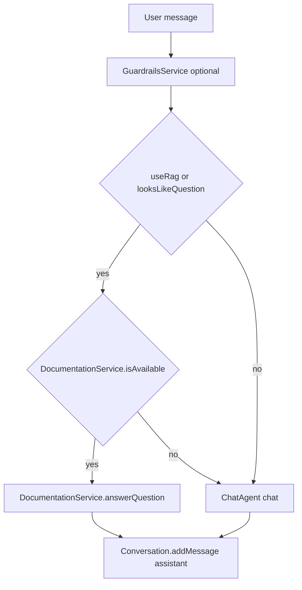
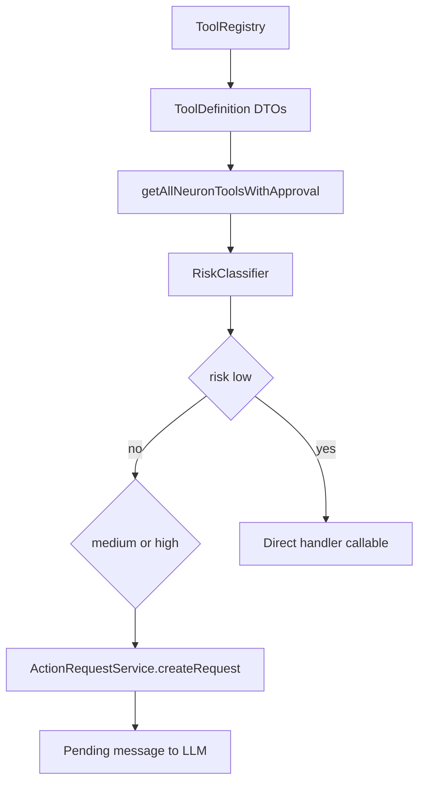
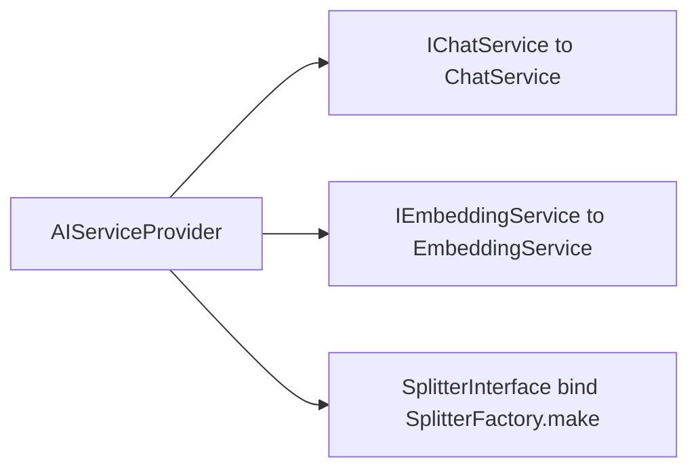

# AI module — RAG, tools, and assistant orchestration

## Purpose

`AI` provides documentation intelligence for Laraplate: ingest docs, index them for semantic retrieval, answer user questions with RAG, and orchestrate tool-assisted conversations with approval controls.

### Module boundaries

HTTP controllers and Artisan commands call **facade-level services** (`ChatService`, `DocumentationService`, `EmbeddingService`). RAG uses **NeuronAI** `DocumentationAgent` (extends `RAG`) with a pluggable vector store (`FileVectorStore`, `MemoryVectorStore`, or `ElasticsearchRagVectorStore`) and the embeddings provider from `EmbeddingsProviderFactory`. When **search orchestration** is enabled, the provider registers AI implementations for Core search contracts (`IReranker`, `ISearchPlanner`, `IQueryIntentParser`, `ITextEmbedder`). Document chunking goes through `SplitterInterface`, bound by default to `MarkdownAwareSplitter` via `SplitterFactory` so fenced blocks (including Mermaid in indexed docs) stay intact.

## Core capabilities

### RAG ingestion and indexing lifecycle

- Reads documentation files from roots resolved by `rag_paths()` (or explicit CLI `--path`).
- Splits documents into chunks and stores vectors in configured vector store backend.
- Supports incremental reindex-by-source and full rebuild (`--full`) modes.
- Keeps source prefixes to improve citation traceability by module/path.

For multi-instance deployments (shared corpus across replicas), see [`DEPLOYMENT.md`](DEPLOYMENT.md) (`filesystem` on a shared volume, or `elasticsearch` as the recommended production driver).

#### RAG indexing pipeline

`indexDocuments()` resolves one or more roots: either the CLI `--path` with a synthetic prefix, or every directory returned by `rag_paths()` with prefixes such as `faq-module-{Name}` or `faq-app-rag`. `FileDocumentReader` walks each root and builds one `Document` per file (`sourceName` includes the prefix). `SplitterInterface` (default `MarkdownAwareSplitter` from `SplitterFactory`) splits each document into chunks. If the configured vector store already holds data and `--full` was not passed, `DocumentationAgent::reindexBySource()` updates chunks per logical source; otherwise `addDocuments()` appends. A full rebuild deletes the filesystem store file or resets the in-memory singleton when the driver is `memory`.

### Question answering

- Uses retrieval + LLM response generation through `DocumentationService::answerQuestion`.
- Returns normalized output with answer + structured citations.
- Can append formatted citation section in final answer.

#### Retrieval strategy decision

The required baseline is curated **vector documentation RAG**. Elasticsearch kNN is the recommended production retrieval path; filesystem remains a simple single-instance option and memory is test-only. Laraplate does not currently depend on Graphify, GraphRAG, or a graph database.

Retrieval evolves only through measured stages: evaluation dataset, metadata/scoping, optional hybrid lexical + vector retrieval, optional reranking, and only then an evidence-gated graph spike for residual multi-hop failures. A future graph retriever must remain optional, disabled by default, preserve canonical document citations, and fall back to the non-graph path. The UI Graph Explorer is a separate product capability and is not the RAG knowledge graph.

The authoritative design and implementation roadmap are:

- `docs/superpowers/specs/2026-07-16-rag-retrieval-strategy-design.md`
- `docs/superpowers/plans/2026-07-16-rag-retrieval-strategy.md`

#### RAG question answering flow

`answerQuestion()` instantiates `DocumentationAgent::make()` with `topK` from `ai.features.faq.max_documents`. The agent runs Neuron RAG retrieval over the vector store, then the LLM produces the assistant message. If the message exposes `getCitations()`, each citation is mapped to `source`, `excerpt`, and `score`. When `ai.features.faq.format_citations` is true, a markdown **Sources** block is appended to the answer string returned to callers.

### Chat orchestration

- `ChatService` handles normal conversation, RAG-triggered responses, and stream mode.
- Question-detection rules can auto-route suitable prompts through FAQ/RAG path.
- Memory and guardrails services participate when enabled by configuration.

#### Chat path: RAG vs direct agent

Incoming text passes through input guardrails when enabled. For `sendMessage()`, the service checks explicit `use_rag` in context or heuristics via `looksLikeQuestion()`. If RAG should run and `DocumentationService::isAvailable()` is true, the flow uses `answerQuestion()` and stores citations on the assistant `Message` metadata. Otherwise `ChatAgent` handles the turn with the normal LLM stack. Optional conversation summarization runs after responses when configured.

### Tools ecosystem

The assistant has three independent retrieval surfaces:

| Surface | Purpose | Data and authorization |
| --- | --- | --- |
| Documentation RAG | Product and developer documentation | Separate `developer` and `user` corpora selected by a server-owned profile |
| Core Graph tools | Authorized relation search, expansion, and statistics | Current request identity, entity permission, record ACL, read-only Graph gateway |
| Application content tool | Bounded textual evidence from module-owned records | Current request identity, provider entity permission, row ACL, safe provider projection |

`CompositeContextualToolProvider` combines independent request-local definitions. It does not discover module providers: Core owns the explicit `ApplicationContentRetrievalProviderRegistry`, and each optional module registers its provider without depending on AI. `ApplicationContentSourceRouter` first builds an authorized source allowlist, then uses verified server page context when present. Without page context it selects the sole authorized source, routes an explicit source intent, or exposes no application tool when the request is ambiguous. Client presentation context cannot forge module routing.

`application_content_search` is available only to authenticated `InAppAssistance`. Its schema contains only the one server-selected source, query, locale, and bounded limit. It cannot accept user/tenant identity, roles, permissions, ACLs, filters, model/table/index/class names, prompts, or write operations. `graph_search`, `graph_expand`, and `graph_stats` remain separate read-only tools and may be used in the same turn.

The current tenant resolver supports only the global scope. Application content tools fail closed for `Tenant` scope until a server-owned per-tenant source policy is implemented; tenant identity or source policy can never be supplied through a tool argument or client context.

Retrieved application text is classified as untrusted data before it can influence generation. Safe hits are mapped to canonical application citations; unsafe evidence is discarded. If the model calls the application tool and retrieval is empty, denied, unavailable, timed out, or rejected by policy, `InAppAssistanceService` replaces any assumed answer with a localized insufficient-evidence response. The complete output is validated before persistence; streaming does not bypass full-response validation.

### Approvals flow for tools

- Medium/high-risk tool calls can be converted to `ActionRequest` items instead of immediate execution.
- Pending requests are returned to caller as structured metadata.
- Approval outcome controls whether tool execution proceeds or remains blocked.

#### Tools and approval wiring

`ToolRegistry::register()` stores `ToolDefinition` entries (name, parameters, handler, risk level). `getAllNeuronToolsWithApproval()` builds Neuron `Tool` instances: **low** risk keeps the original handler; **medium** or **high** wraps the callable so it calls `ActionRequestService::createRequest()` and returns a pending message to the model instead of executing. `RiskClassifier` merges config overrides from `ai.features.tools.definitions.{name}.risk_level`. The caller receives `action_requests` alongside the assistant message for UI or jobs to approve and replay execution.

## Developer-facing CLI

### Documentation indexing

- `php artisan ai:index-rag-docs`
- `php artisan ai:index-rag-docs --profile=developer|user|all`
- `php artisan ai:index-rag-docs --path=/some/path --full`

### Terminal help assistant

- `php artisan ai:help` opens interactive developer-documentation chat.
- `php artisan ai:help --question="..."` executes a one-shot developer query.

### Application content evaluation

`php artisan ai:evaluate-application-content --dataset=... --source=... --output=...` evaluates a registered provider without calling the chat model. Datasets must declare synthetic data, typed evaluation-only authorization filters, provider/corpus revisions, and expected safe references. Reports contain aggregate and locale/category-sliced hit@5, reciprocal rank, citation precision, authorized-empty accuracy, supported-answer rate, abstention accuracy, unavailable rate, and latency; they omit queries, content, users, permissions, ACL expressions, and raw scores. Existing reports are not overwritten without `--force`.

Phase 1 remains authenticated and non-guest only. Laraplate may attach the configured guest account to the session guard, but that principal cannot receive `InAppAssistance` or invoke application content retrieval. Session-based guest assistance is a Phase 2 decision requiring a dedicated `GuestAssistance` profile, session-subject conversation isolation in addition to the shared guest user ID, fixed source/field allowlists, a separate threat model and dataset, abuse/rate limits, and explicit approval. The provider contract is the extension point; it is not implicit permission to expose a provider to the guest.

## Configuration surfaces

Important groups include:

- `ai.features.faq.*` for RAG enablement, max docs, vector store behavior, and **splitter** (`driver`, `max_words`, `overlap_words`, `prepend_heading_breadcrumb`).
- `ai.features.tools.*` for tools and approval pipeline.
- `ai.features.guardrails.*` for prompt-injection and input hardening behavior.
- `ai.features.search_orchestration.*` for AI-driven search planner/reranking bindings.
- `AI_FAQ_DOCS_PATH` / `ai.features.faq.documentation_path` for extra documentation roots.

The current retrieval strategy is vector similarity. Do not document `graph` as a configuration value unless a separate graph spike spec passes the adoption gate and is explicitly approved.

#### Service container bindings relevant to RAG

`AIServiceProvider` registers singletons for `IChatService`, `IEmbeddingService`, and `ITranslatableModelClassNames`. `SplitterInterface` is **bound** (not singleton) to `SplitterFactory::make()` so each resolution reads current config—useful in tests that swap `ai.features.faq.splitter.driver` between `markdown_aware`, `sentence`, and `delimiter`.

## Operational guidance

### When to reindex

- Reindex after major docs updates, module feature changes, or terminology redesign.
- Use `--full` when source mapping changed significantly or stale vectors are suspected.

### Common failure modes

- RAG unavailable: index missing or vector store path not initialized.
- Empty/weak answers: low-quality docs, missing sections, wrong root coverage.
- Insufficient in-app evidence: no authorized module hit, ambiguous routing, provider timeout, or evidence rejected as unsafe.
- Tool calls pending forever: approval workflow not completed in caller layer.
- Slow responses: high top-k settings, large context, or provider latency.

## Security boundaries

- Developer documentation and in-app user documentation use separate corpora and profiles.
- End-user answers are limited to application usage assistance. Never expose licenses, code, tokens, secrets, databases, other users, hidden records, permission/ACL internals, or cryptographic implementation details.
- Permissions and ACLs are enforced in backend gateways and provider queries; prompt rules do not replace authorization.
- Guardrails are fail-closed on input, retrieved context, citations, and complete output.
- Application content is never inserted into either documentation index.
- `InAppAssistance` scopes documentation retrieval (and, for tools, `dataAccess`) to the current module and falls back to generic full-corpus behavior when no module is recognizable; scope is server-owned and additive to these filters — see `ASSISTANT_SCOPE.md`.

## FAQ prompts for RAG

- How does `ai:index-rag-docs --full` differ from incremental indexing?
- How does the system decide between direct answer and tool invocation?
- What happens when a tool call requires approval?
- How do I add extra docs roots with `AI_FAQ_DOCS_PATH` safely?
- Why is the assistant saying RAG is unavailable?
- How do I use `ai:help` in interactive versus one-shot mode?

## Documentation evaluation

`ai:evaluate-documentation` scores documentation retrieval per module and index
profile (Level-1, deterministic, no chat model), mirroring
`ai:evaluate-application-content`. Datasets are owned by each module under
`docs/rag/evaluations/`. The deterministic regression gate lives in
`Modules/AI/tests/Feature/DocumentationBaselineGateTest.php`. Live-generation
(Level-2) scoring is specified but opt-in. Design:
`docs/superpowers/specs/2026-08-04-documentation-rag-evaluation-baseline-design.md`.
Guides: `DOCUMENTATION_EVALUATION_USER.md` (operator) and
`DOCUMENTATION_EVALUATION_DEVELOPER.md` (internals + how to add a module report card).
