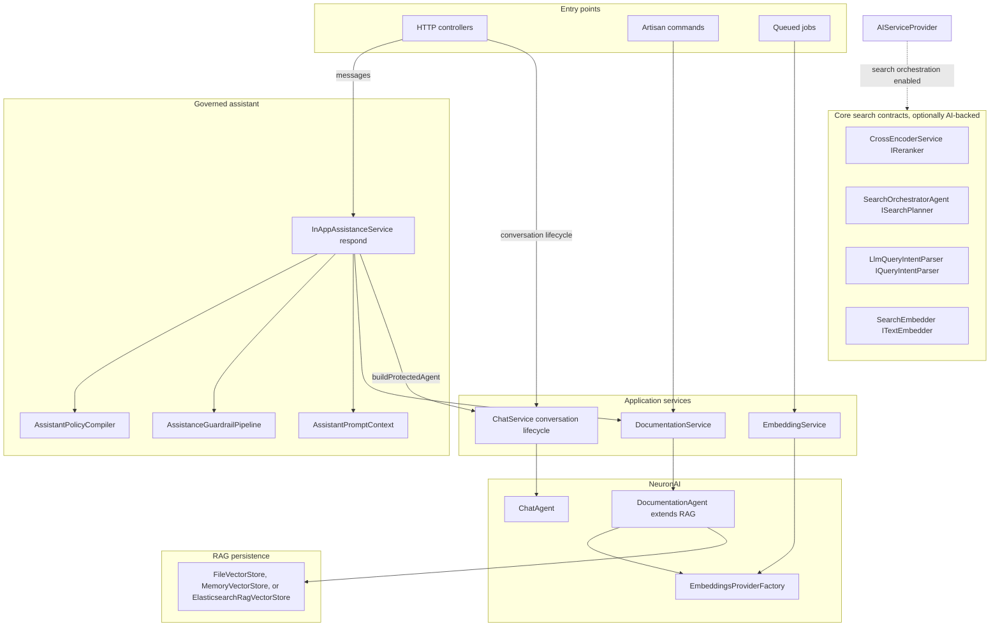
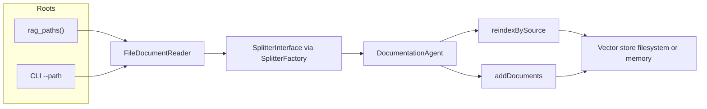
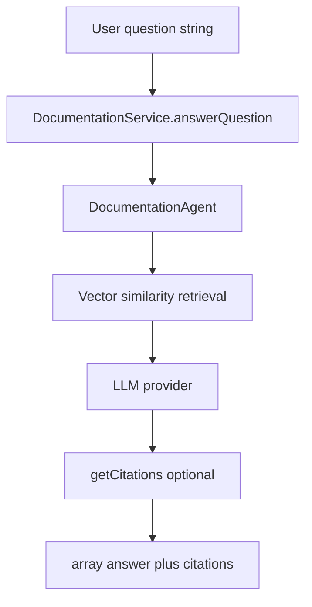
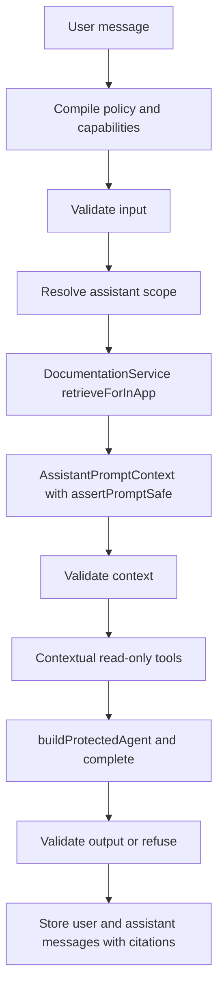
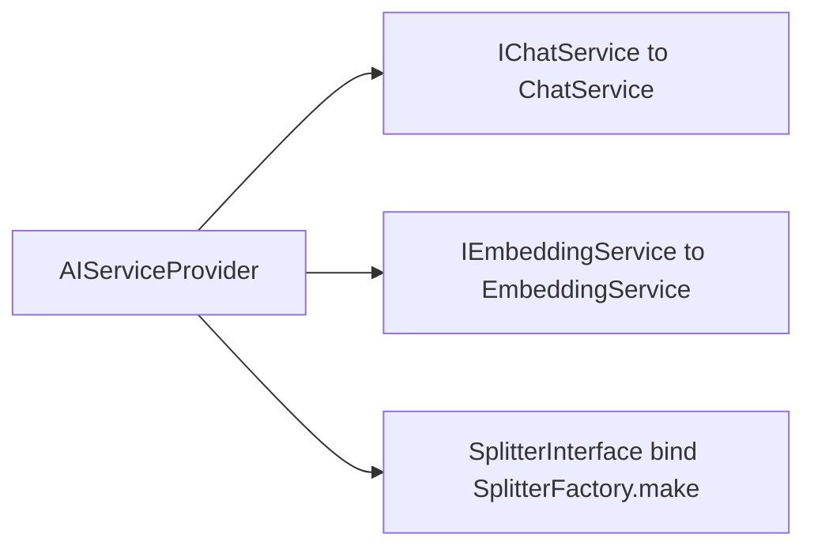

# AI module — RAG, tools, and assistant orchestration

## Purpose

`AI` provides documentation intelligence for Laraplate: ingest docs, index them for semantic retrieval, answer user questions with RAG, and orchestrate tool-assisted conversations with approval controls.

### Perimeters

The boundaries of this module are **contracts, not folders**. `AI` is not one system: it is a set of subsystems that touch each other rarely, and reading it as a single pipeline is what makes it feel larger than it is. The reliable way to tell them apart is by entry point, because an entry point cannot be wishful.

| Perimeter | Entry point | Boundary | Status |
|---|---|---|---|
| **In-app assistant** | `POST /crud/insert/ai/conversations/{conversation}/messages` → `InAppAssistanceService::respond()` | policy, guardrails, scope resolution | live; the only path a user message travels |
| **Search** | `CrudService` → `AdvancedSearchService` → `EnsembleSearchService` | Core contracts `ISearchPlanner` / `IReranker` | live |
| **Documentation RAG** | `DocumentationService`, from `respond()` and from `ai:help` | corpora plus the configured vector store | live |
| **Application content** | CMS and SAO retrieval providers, consumed by `respond()` | citations and authorized evidence | live |
| **Tools and ActionRequest** | `ActionRequestController`, read-only tools through the assistant | risk level and approval | management and execution live; see the note below on creation |
| **Contextual suggestions** | `SuggestionController` | per-context generation | live |
| **Moderation and translation** | queued jobs | asynchronous, no HTTP surface | live |
| **Conversation memory** | none | none | dormant |

**Search is not a chat feature, and it does not live here.** The perimeter belongs to `Modules/Core/Search`, which defines `ISearchPlanner` and `IReranker` and registers two non-AI implementations by default with `singletonIf` (`FallbackSearchPlanner`, `HeuristicReranker`). When the AI module is installed it overlays its own implementations on the same contracts, `SearchOrchestratorAgent` and `CrossEncoderService` (`AIServiceProvider`). Query planning and reranking are therefore an **optional upgrade to Core search**, which keeps working without AI in a degraded form. They meet the assistant only when it runs a search, through the same contract the CRUD layer uses.

**The compass for reading any of this:** when two subsystems speak through a contract in Core, they are separate by construction and can be understood one at a time. When they speak by importing each other directly, they are coupled and have to be thought about together. In this module almost everything goes through contracts; the only genuine direct dependencies are `respond()` towards documentation retrieval, tools and policy.

#### Two perimeters worth a caveat

- **ActionRequest has no producer today.** Records are managed by `ActionRequestController` and executed by `ExecuteActionRequestJob`, but nothing creates them: the approval-gated tool path (`ToolRegistry::getAllNeuronToolsWithApproval()`) was reached only from the superseded chat, and the in-app assistant deliberately exposes read-only tools, which never create an `ActionRequest`. Reconnecting that path or retiring it is an open decision, not an accident to fix silently.
- **Conversation memory is dormant, not broken.** `MemoryService` summarizes conversations and extracts facts, but its hook lived in the superseded chat, so it never runs. `respond()` is also stateless per message: it builds a fresh agent and sends only the current input, with no history and no summary.

#### What was removed, and why it still appears in history

`ChatService` once carried the unprotected message path: `sendMessage()`, `sendMessageStream()`, `sendMessageWithTools()` and their `buildAgent()` helper, including a RAG shortcut driven by question detection and a `use_rag` context flag. Those were superseded when the HTTP boundary moved to `InAppAssistanceService`, which applies policy, guardrails and scope, and which is non-streaming by design because output cannot be validated once it has been streamed. They were removed after a period of being unreachable. `ChatService` now holds only `createConversation()` and `buildProtectedAgent()`; older commits, tests and documentation that describe it as the chat orchestrator are describing a design that no longer exists.



## Core capabilities

### RAG ingestion and indexing lifecycle

- Reads documentation files from roots resolved by `rag_paths()` (or explicit CLI `--path`).
- Splits documents into chunks and stores vectors in configured vector store backend.
- Supports incremental reindex-by-source and full rebuild (`--full`) modes.
- Keeps source prefixes to improve citation traceability by module/path.

For multi-instance deployments (shared corpus across replicas), see [`DEPLOYMENT.md`](DEPLOYMENT.md) (`filesystem` on a shared volume, or `elasticsearch` as the recommended production driver).

#### RAG indexing pipeline

`indexDocuments()` resolves one or more roots: either the CLI `--path` with a synthetic prefix, or every directory returned by `rag_paths()` with prefixes such as `faq-module-{Name}` or `faq-app-rag`. `FileDocumentReader` walks each root and builds one `Document` per file (`sourceName` includes the prefix). `SplitterInterface` (default `MarkdownAwareSplitter` from `SplitterFactory`) splits each document into chunks. If the configured vector store already holds data and `--full` was not passed, `DocumentationAgent::reindexBySource()` updates chunks per logical source; otherwise `addDocuments()` appends. A full rebuild deletes the filesystem store file or resets the in-memory singleton when the driver is `memory`.



### Question answering

- Uses retrieval + LLM response generation through `DocumentationService::answerQuestion`.
- Returns normalized output with answer + structured citations.
- Can append formatted citation section in final answer.

#### Retrieval strategy decision

The required baseline is curated **vector documentation RAG**. Elasticsearch kNN is the recommended production retrieval path; filesystem remains a simple single-instance option and memory is test-only. Laraplate does not currently depend on Graphify, GraphRAG, or a graph database.

Retrieval evolves only through measured stages: evaluation dataset, metadata/scoping, optional hybrid lexical + vector retrieval, optional reranking, and only then an evidence-gated graph spike for residual multi-hop failures. A future graph retriever must remain optional, disabled by default, preserve canonical document citations, and fall back to the non-graph path. The UI Graph Explorer is a separate product capability and is not the RAG knowledge graph.

The authoritative design and implementation roadmap are:

- `docs/superpowers/specs/2026-07-16-rag-retrieval-strategy-design.md`
- `docs/superpowers/plans/2026-07-16-rag-retrieval-strategy.md`

#### RAG question answering flow

`answerQuestion()` instantiates `DocumentationAgent::make()` with `topK` from `ai.features.faq.max_documents`. The agent runs Neuron RAG retrieval over the vector store, then the LLM produces the assistant message. If the message exposes `getCitations()`, each citation is mapped to `source`, `excerpt`, and `score`. When `ai.features.faq.format_citations` is true, a markdown **Sources** block is appended to the answer string returned to callers.



### Message orchestration

Every message sent over HTTP goes through `InAppAssistanceService::respond()`. It compiles the policy for the profile and the enabled capabilities (`application_content`, `in_app_rag`, `read_only_graph`), validates the input, resolves the assistant scope, retrieves documentation for that scope, builds an `AssistantPromptContext` from the authorized evidence, validates that context, and only then completes the answer through `ChatService::buildProtectedAgent()`, which wraps the evidence in an explicitly untrusted block. Output is validated before it is stored, which is also why this path is non-streaming: an answer that has already been streamed cannot be refused.

`ChatService` no longer orchestrates messages. Its remaining responsibilities are creating conversations and building the protected agent on behalf of the assistant.

Two properties of this path are easy to assume wrongly:

- **There is no question detection and no `use_rag` flag.** Whether documentation is retrieved is decided by the compiled policy and the resolved scope, not by heuristics on the message text.
- **The path is stateless per message.** A fresh agent receives the current input only, with no prior turns and no conversation summary, so the assistant does not recall earlier messages in the same conversation.

#### Why this path does not stream, and what to do about it

Validation on the way in does not constrain what the model composes on the way out, so
`AssistanceOutputPolicy` checks the generated text for restricted topics, PHP and SQL shapes,
env-var assignments, API keys, bearer tokens and JWTs, plus a length bound. What blocks
token-by-token streaming is not validation as such: it is three decisions that apply to the
**whole** answer. Insufficient evidence replaces the entire response, and is only knowable
once the model has finished deciding which tools to call; the length bound is measured on the
total; and a violation does not censor a fragment, it turns the whole answer into a refusal.

Streaming exists for perceived latency, and nearly all of it can be recovered without giving
any of that up: generate fully, validate, then deliver the validated text to the client
progressively. The reader sees an answer appear, no unchecked byte ever reaches the wire, and
a refusal stays a clean refusal instead of a retraction after a secret has already been shown.

Where it is worth doing: a chat surface, where the wait is the whole experience. Where it is
not: an API response consumed by code, which gains nothing from arriving in pieces, unless
that API backs a public-facing chat.



## Developer-facing CLI

### Documentation indexing

- `php artisan ai:index-rag-docs`
- `php artisan ai:index-rag-docs --profile=developer|user|all`
- `php artisan ai:index-rag-docs --path=/some/path --full`

### Terminal help assistant

- `php artisan ai:help` opens interactive developer-documentation chat.
- `php artisan ai:help --question="..."` executes a one-shot developer query.

### Application content evaluation

These commands are an **offline** quality loop: no runtime code reads the reports they produce.
Their outputs feed committed baselines (CI regression gates) and human decisions about ranking
configuration. Nothing in the request path consumes an evaluation artifact. The retrieval pipeline
they exercise is documented in `Modules/Core/docs/rag/SEARCH_RETRIEVAL_PIPELINE.md`.

`php artisan ai:evaluate-application-content --dataset=... --source=... --output=...` evaluates a registered provider without calling the chat model. Datasets must declare synthetic data, typed evaluation-only authorization filters, provider/corpus revisions, and expected safe references. Reports contain aggregate and locale/category-sliced hit@5, reciprocal rank, precision/recall/nDCG at k, citation precision, authorized-empty accuracy, supported-answer rate, abstention accuracy, unavailable rate, and latency; they omit queries, content, users, permissions, ACL expressions, and raw scores. Existing reports are not overwritten without `--force`. Ranking metrics and committed baselines: see "Application content evaluation" below.

Phase 1 remains authenticated and non-guest only. Laraplate may attach the configured guest account to the session guard, but that principal cannot receive `InAppAssistance` or invoke application content retrieval. Session-based guest assistance is a Phase 2 decision requiring a dedicated `GuestAssistance` profile, session-subject conversation isolation in addition to the shared guest user ID, fixed source/field allowlists, a separate threat model and dataset, abuse/rate limits, and explicit approval. The provider contract is the extension point; it is not implicit permission to expose a provider to the guest.

## Configuration surfaces

Important groups include:

- `ai.features.faq.*` for RAG enablement, max docs, vector store behavior, and **splitter** (`driver`, `max_words`, `overlap_words`, `prepend_heading_breadcrumb`).
- `ai.features.tools.*` for tools and approval pipeline.
- `ai.features.guardrails.*` for prompt-injection and input hardening behavior.
- `ai.features.search_orchestration.*` for AI-driven search planner/reranking bindings.
- `ai.features.embeddings.modules` / `ai.features.translation.modules` — optional per-module allowlist gating auto embedding/translation by the model's owning `Modules\{Name}\` namespace (empty = every module; enforced by `FeatureModuleGate` in the indexing/translation listeners).
- `ai.features.tools.crud.entities` — opt-in `"module.entity" => [operations]` map exposing Core CRUD as in-app assistant tools (`CrudToolProvider`); tools are exposed only for operations the user is permitted to perform, ACL-enforced by `CrudService`, with moderation handled by `HasApprovals` on the model.
- `AI_FAQ_DOCS_PATH` / `ai.features.faq.documentation_path` for extra documentation roots.

The current retrieval strategy is vector similarity. Do not document `graph` as a configuration value unless a separate graph spike spec passes the adoption gate and is explicitly approved.

#### Service container bindings relevant to RAG

`AIServiceProvider` registers singletons for `IChatService`, `IEmbeddingService`, and `ITranslatableModelClassNames`. `SplitterInterface` is **bound** (not singleton) to `SplitterFactory::make()` so each resolution reads current config—useful in tests that swap `ai.features.faq.splitter.driver` between `markdown_aware`, `sentence`, and `delimiter`.



## Operational guidance

### When to reindex

- Reindex after major docs updates, module feature changes, or terminology redesign.
- Use `--full` when source mapping changed significantly or stale vectors are suspected.

### Common failure modes

- RAG unavailable: index missing or vector store path not initialized.
- Empty/weak answers: low-quality docs, missing sections, wrong root coverage.
- Insufficient in-app evidence: no authorized module hit, ambiguous routing, provider timeout, or evidence rejected as unsafe.
- Tool calls pending forever: approval workflow not completed in caller layer.
- Slow responses: high top-k settings, large context, or provider latency.

## Security boundaries

- Developer documentation and in-app user documentation use separate corpora and profiles.
- End-user answers are limited to application usage assistance. Never expose licenses, code, tokens, secrets, databases, other users, hidden records, permission/ACL internals, or cryptographic implementation details.
- Permissions and ACLs are enforced in backend gateways and provider queries; prompt rules do not replace authorization.
- Guardrails are fail-closed on input, retrieved context, citations, and complete output.
- Application content is never inserted into either documentation index.
- `InAppAssistance` scopes documentation retrieval (and, for tools, `dataAccess`) to the current module and falls back to generic full-corpus behavior when no module is recognizable; scope is server-owned and additive to these filters — see `ASSISTANT_SCOPE.md`.

## FAQ prompts for RAG

- How does `ai:index-rag-docs --full` differ from incremental indexing?
- How does the system decide between direct answer and tool invocation?
- What happens when a tool call requires approval?
- How do I add extra docs roots with `AI_FAQ_DOCS_PATH` safely?
- Why is the assistant saying RAG is unavailable?
- How do I use `ai:help` in interactive versus one-shot mode?
- Which subsystems does the AI module contain, and where does each one start?
- Why does search live in Core rather than in the AI module?
- Does the assistant remember earlier messages in the same conversation?
- Why does nothing create `ActionRequest` records any more?
- What replaced `ChatService::sendMessage()`, and why?

## Application content evaluation

`ai:evaluate-application-content` scores a registered provider (`cms.contents`,
`sao.tickets`) by running the real ranking pipeline — `provider->retrieve()` →
`AdvancedSearchService` → `EnsembleSearchService` (keyword + vector + hybrid,
RRF fusion, `IReranker`) with a DB `LIKE` lexical fallback — with no chat model.
`ApplicationContentEvaluationService::metrics()` emits, per report and per
locale/category slice: `hit_at_5`, `mean_reciprocal_rank`, `citation_precision`,
`authorized_empty_accuracy`, `supported_answer_rate`, `abstention_accuracy`,
`unavailable_rate`, plus IR ranking metrics `precision_at_k`, `recall_at_k`,
`ndcg_at_k` for `k ∈ {1, 3, 5}`. The `@k` metrics use binary relevance from each
case's `expected_hit_ids` and are averaged only over cases that carry ground
truth (cases with no expected hits do not dilute the denominator).

Two committed deterministic baselines — generated against a DB-seeded fixture
corpus (driver `database-generated-fixture`), exact-match gated in CI:

| Module | Baseline artifact | Fixture dataset | Gate test |
|---|---|---|---|
| CMS | `Modules/CMS/docs/evaluations/application-content/2026-07-record-baseline.json` | `Modules/CMS/tests/Fixtures/application-content/cms-contents.json` | `Modules/CMS/tests/Feature/ApplicationContent/CmsApplicationContentEvaluationBaselineTest.php` |
| SAO | `Modules/SAO/docs/evaluations/application-content/2026-09-record-baseline.json` | `Modules/SAO/tests/Fixtures/application-content/sao-tickets.json` (anchored to the deterministic `SAO-1..SAO-8` dev tickets) | `Modules/SAO/tests/Feature/ApplicationContent/SaoApplicationContentEvaluationBaselineTest.php` |

Regenerate a baseline by running its gate test with
`APP_CONTENT_BASELINE_REGEN=1` — this rewrites the artifact from the fresh
report (`JSON_PRESERVE_ZERO_FRACTION`, so whole-number floats stay floats).
Without the flag the test asserts the report is identical to the committed
artifact (`expect($report)->toBe($artifact)`). The live Elasticsearch
(vector/hybrid/rerank) baseline is produced on demand with the same command
against a dev-seeded + indexed corpus and is **not** part of the deterministic
CI gate. Design: `docs/superpowers/specs/2026-09-09-r3-retrieval-quality-baseline-design.md`.

### Per-strategy retrieval quality breakdown

`php artisan ai:evaluate-retrieval-strategies --source=<source> --dataset=<file>
--output=<file> [--force]` scores ranking quality **per strategy**
(`keyword`, `vector`, `hybrid`, `fused`, `reranked`) instead of one
end-to-end ordering. For every dataset case with `expected_hit_ids` it calls
`EnsembleSearchService` directly (via `PerStrategyEngineRetrieverInterface`,
raw engine ranking) **twice**: reranker off, reading the `keyword`/`vector`/
`hybrid` orderings from `AdvancedSearchResult.meta['per_strategy']` plus the
`fused` ordering from `ids()`; and reranker on, reading the `reranked`
ordering. This skips `provider->retrieve()` and its ACL/projection — the
report carries `pre_authorization: true`; it is a ranking diagnostic, not an
access-control check (the eval corpus is fully authorized). Real vector/
hybrid numbers need Elasticsearch. Phase-2 `expected_hit_ids` use the engine
key (`getKey()`) prefixed by source — for `cms.contents` this equals the
canonical id, but for `sao.tickets` it is the numeric ticket id, NOT the
`SAO-N` business key (because this benchmarks the pre-projection engine
ranking).

`ApplicationContentRetrievalStrategyEvaluationService::metrics()` nests the
same IR metrics (`precision_at_{1,3,5}`, `recall_at_{1,3,5}`,
`ndcg_at_{1,3,5}`, plus `hit_at_5`/`mean_reciprocal_rank`) per strategy under
`metrics`, sharing the `@k` math with Phase 1 via
`Modules\AI\Services\ApplicationContent\Evaluation\IrMetrics::atK()`.
Per-strategy averages divide by the scored cases where that strategy
actually ran (`meta['per_strategy']` had a key for it) — a case it didn't
run on isn't counted against it; `fused`/`reranked` always run, so they
divide by every scored case. A strategy that never runs on any scored case
is omitted from the report. Design:
`docs/superpowers/specs/2026-09-10-r3-phase2-per-strategy-breakdown-design.md`.

## Documentation evaluation

`ai:evaluate-documentation` scores documentation retrieval per module and index
profile (Level-1, deterministic, no chat model), mirroring
`ai:evaluate-application-content`. Datasets are owned by each module under
`docs/rag/evaluations/`. The deterministic regression gate lives in
`Modules/AI/tests/Feature/DocumentationBaselineGateTest.php`. Live-generation
(Level-2) scoring is specified but opt-in. Design:
`docs/superpowers/specs/2026-08-04-documentation-rag-evaluation-baseline-design.md`.
Guides: `DOCUMENTATION_EVALUATION_USER.md` (operator) and
`DOCUMENTATION_EVALUATION_DEVELOPER.md` (internals + how to add a module report card).

## Assistant end-to-end evaluation

The assistant evaluation harness (Level-1 deterministic, CI regression gate; Level-2
live, opt-in) measures the composed `InAppAssistanceService::respond()` per
module. L1 runs the real `respond()` over a scripted router (no LLM) and fake
providers to score composition plumbing — scope gating, citation assembly,
clarification, abstention, output validation — not routing accuracy. Datasets are
owned by each module under `docs/rag/evaluations/assistant-*.json`. The
regression gate lives in
`Modules/AI/tests/Feature/Assistance/AssistantBaselineGateTest.php`. The future
`ai:evaluate-assistant` command (Level-2 live interface) is deferred. Design:
`docs/superpowers/specs/2026-08-29-assistant-end-to-end-evaluation-design.md`.
Guide: `ASSISTANT_EVALUATION.md` (internals + how to add a module report card).

## Releases

This module is released from the application, not from its own repository: it carries no release scripts and no `cliff.toml`. From the `laraplate` root, `scripts/version.sh` bumps the `version` field of `Modules/AI/composer.json`, regenerates `Modules/AI/CHANGELOG.md` with the application's `cliff.toml`, commits `chore(release): vX.Y.Z` in the module repository, tags it and pushes both.

```bash
composer run version:dry AI      # print the plan, write nothing
composer run version:minor AI    # release with a forced level (also version:major, version:patch)
composer run version:all             # every module with pending commits, then the application
```

Without a forced level, git-cliff infers it from the conventional commits since the module's last tag. `CHANGELOG.md` lists released versions only. Releasing the module alone does not touch the application; `version:all` records the module in the application with a commit typed after the module's release level. Full reference: `docs/releasing.md` in the application.
