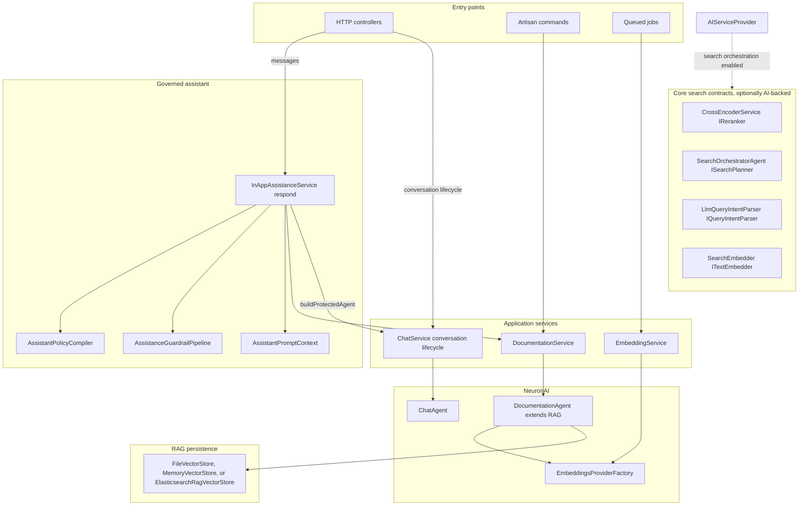
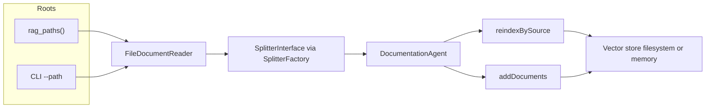
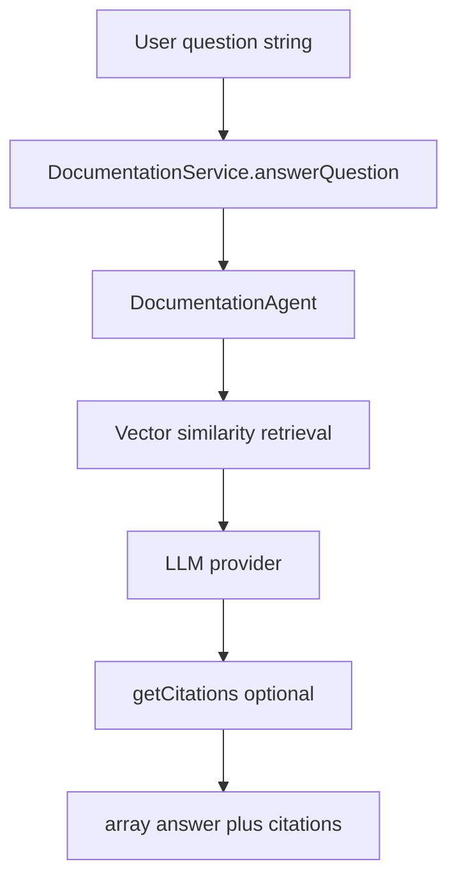
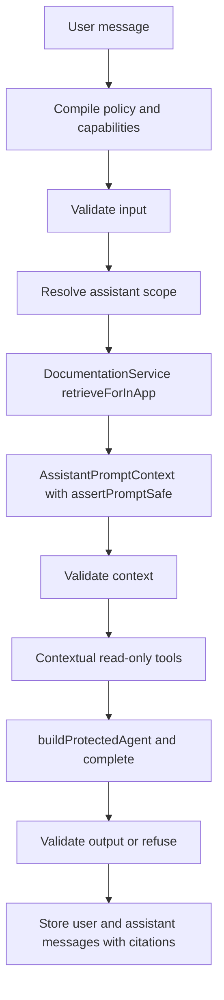
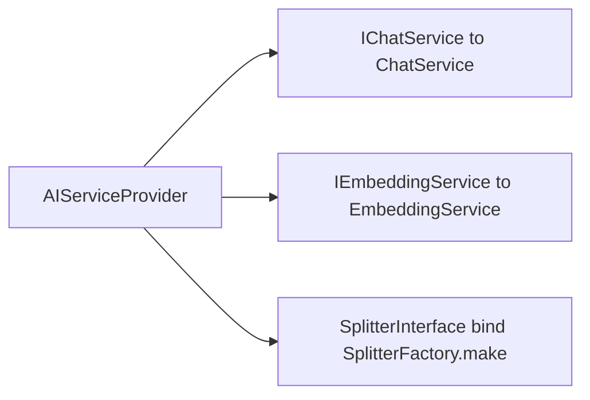

# AI module — RAG, tools, and assistant orchestration

## Purpose

`AI` provides documentation intelligence for Laraplate: ingest docs, index them for semantic retrieval, answer user questions with RAG, and orchestrate tool-assisted conversations with approval controls.

### Perimeters

The boundaries of this module are **contracts, not folders**. `AI` is not one system: it is a set of subsystems that touch each other rarely, and reading it as a single pipeline is what makes it feel larger than it is. The reliable way to tell them apart is by entry point, because an entry point cannot be wishful.

| Perimeter | Entry point | Boundary | Status |
|---|---|---|---|
| **In-app assistant** | `POST /crud/insert/ai/conversations/{conversation}/messages` → `InAppAssistanceService::respond()` | policy, guardrails, scope resolution | live; the only path a user message travels |
| **Search** | `CrudService` → `AdvancedSearchService` → `EnsembleSearchService` | Core contracts `ISearchPlanner` / `IReranker` | live |
| **Documentation RAG** | `DocumentationService`, from `respond()` and from `ai:help` | corpora plus the configured vector store | live |
| **Application content** | CMS and SAO retrieval providers, consumed by `respond()` | citations and authorized evidence | live |
| **Tools and governed writes** | tools offered by `CrudToolProvider` to `respond()`; `AssistantWriteController` for the person's confirmation | policy capabilities `crud_reads` / `governed_writes`, Core approvals at the model | live; writes are proposals the person confirms |
| **Contextual suggestions** | `SuggestionController` | per-context generation | live |
| **Moderation and translation** | queued jobs | asynchronous, no HTTP surface | live |
| **Conversation memory** | none | none | dormant |

**Search is not a chat feature, and it does not live here.** The perimeter belongs to `Modules/Core/Search`, which defines `ISearchPlanner` and `IReranker` and registers two non-AI implementations by default with `singletonIf` (`FallbackSearchPlanner`, `HeuristicReranker`). When the AI module is installed it overlays its own implementations on the same contracts, `SearchOrchestratorAgent` and `CrossEncoderService` (`AIServiceProvider`). Query planning and reranking are therefore an **optional upgrade to Core search**, which keeps working without AI in a degraded form. They meet the assistant only when it runs a search, through the same contract the CRUD layer uses.

**The compass for reading any of this:** when two subsystems speak through a contract in Core, they are separate by construction and can be understood one at a time. When they speak by importing each other directly, they are coupled and have to be thought about together. In this module almost everything goes through contracts; the only genuine direct dependencies are `respond()` towards documentation retrieval, tools and policy.

#### Two perimeters worth a caveat

- **Writes are proposals.** The in-app assistant can propose a create, update, delete or bulk change; it never applies one. See *Writes through the assistant* below. The earlier `ActionRequest` path (`ActionRequestService`, `RiskClassifier`, `ExecuteActionRequestJob`, the global tool registry) had no producer and duplicated Core approvals; it was retired on 2026-10-07 together with its table `ai_action_requests`.
- **Conversation memory is dormant, not broken.** `MemoryService` summarizes conversations and extracts facts, but its hook lived in the superseded chat, so it never runs. `respond()` is also stateless per message: it builds a fresh agent and sends only the current input, with no history and no summary.

#### Writes through the assistant

The assistant acts as the signed-in person, with exactly their permissions and row-level ACL, evaluated by `CrudService` at the moment of each call.

- **What exists.** `CrudToolProvider::offeredOperations()` is the single answer to "what may the assistant do for this person": the entities and operations the operator opted into (`ai.features.tools.crud.entities`), that the person is permitted to perform. An entity whose model has no approvals gets write tools only if it is listed under `ai.features.tools.crud.unmoderated_writes`. `approve` and `disapprove` are never offered. The policy (`AssistantPolicyCatalog`) admits the tools by wildcard name (`crud_*`) through two capabilities, `crud_reads` and `governed_writes`, granted to the in-app profile only; `DeveloperHelp` cannot receive them.
- **A write is a proposal.** The write tool stores a row in `ai_write_proposals` (operation, exact payload, a bounded summary of what would change, whether Core would send it for a vote, the acting user, an expiry) and returns "nothing has been changed". A bulk proposal stores the ids that matched, so the person confirms what they were shown; the cap is 200 records and a turn may create five proposals.
- **The person confirms outside the model.** `POST /app/crud/update/ai/assistant-writes/{proposal}/confirm` (and `/reject`, `GET .../{proposal}`) is an authenticated action of the person the proposal belongs to, in their own conversation. It applies the stored payload through `CrudService`; permission and ACL are decided again, and the operator's opt-in is checked again. The outcome is `applied`, `pending_approval` (Core captured it for a vote; the modification ids are recorded), `failed`, or the proposal was `rejected` or `expired`. Confirming twice writes once.
- **What the client sees.** The assistant message carries `metadata.writes`: `{id, tool, module, entity, operation, status, acting_user_id, acting_user_name, summary, requires_approval, outcome, expires_at, resolved_at}` per proposal, and its text always says that nothing changes until the person confirms, in the person's language; a sentence claiming a change was made is replaced. `GET /app/ai/capabilities` returns `features.writes` and `actions`: each entity and operation the assistant may perform for the signed-in person, with `kind` (`read` or `write`) and `requires_approval`.
- **Who is acting.** The system prompt carries a server-built block naming the acting user and listing exactly the entity/operation pairs offered; the name is quoted data. Every proposal, confirmation and rejection is logged (`Assistant write`) with actor, conversation, tool, entity, operation, a hash of the payload and the outcome, never the values.
- **Confinement.** Input is classified before anything runs (override, role reassignment, exfiltration, claimed authority, chat-markup impersonation, hidden characters; English and Italian). What an entity read tool returns is withheld from the model when its text reads like an instruction. A write cannot be applied by the model in any way: there is no parameter and no tool for it.
- **Not covered.** Core records no origin on a modification, so the log is where assistant writes are told apart. Mass query writes that bypass model events are outside Core approvals and outside this.

#### What was removed, and why it still appears in history

`ChatService` once carried the unprotected message path: `sendMessage()`, `sendMessageStream()`, `sendMessageWithTools()` and their `buildAgent()` helper, including a RAG shortcut driven by question detection and a `use_rag` context flag. Those were superseded when the HTTP boundary moved to `InAppAssistanceService`, which applies policy, guardrails and scope, and which is non-streaming by design because output cannot be validated once it has been streamed. They were removed after a period of being unreachable. `ChatService` now holds only `createConversation()` and `buildProtectedAgent()`; older commits, tests and documentation that describe it as the chat orchestrator are describing a design that no longer exists.


```mermaid
flowchart TB
  subgraph entry [Entry points]
    Http[HTTP controllers]
    Artisan[Artisan commands]
    Queue[Queued jobs]
  end
  subgraph governed [Governed assistant]
    Respond[InAppAssistanceService respond]
    Policy[AssistantPolicyCompiler]
    Guard[AssistanceGuardrailPipeline]
    Ctx[AssistantPromptContext]
  end
  subgraph services [Application services]
    ChatSvc[ChatService conversation lifecycle]
    DocSvc[DocumentationService]
    EmbSvc[EmbeddingService]
  end
  subgraph neuron [NeuronAI]
    ChatAgent[ChatAgent]
    DocAgent[DocumentationAgent extends RAG]
    EmbProv[EmbeddingsProviderFactory]
  end
  subgraph ragPersist [RAG persistence]
    VecStore[FileVectorStore, MemoryVectorStore, or ElasticsearchRagVectorStore]
  end
  subgraph coreSearch [Core search contracts, optionally AI-backed]
    Rerank[CrossEncoderService IReranker]
    Planner[SearchOrchestratorAgent ISearchPlanner]
    Intent[LlmQueryIntentParser IQueryIntentParser]
    Embedder[SearchEmbedder ITextEmbedder]
  end
  Prov[AIServiceProvider]

  Http -->|messages| Respond
  Http -->|conversation lifecycle| ChatSvc
  Artisan --> DocSvc
  Queue --> EmbSvc
  Respond --> Policy
  Respond --> Guard
  Respond --> Ctx
  Respond --> DocSvc
  Respond -->|buildProtectedAgent| ChatSvc
  ChatSvc --> ChatAgent
  DocSvc --> DocAgent
  DocAgent --> EmbProv
  DocAgent --> VecStore
  EmbSvc --> EmbProv
  Prov -.->|search orchestration enabled| coreSearch
```

## Core capabilities

### RAG ingestion and indexing lifecycle

- Reads documentation files from roots resolved by `rag_paths()` (or explicit CLI `--path`).
- Splits documents into chunks and stores vectors in configured vector store backend.
- Supports incremental reindex-by-source and full rebuild (`--full`) modes.
- Keeps source prefixes to improve citation traceability by module/path.

For multi-instance deployments (shared corpus across replicas), see [`DEPLOYMENT.md`](DEPLOYMENT.md) (`filesystem` on a shared volume, or `elasticsearch` as the recommended production driver).

#### RAG indexing pipeline

`indexDocuments()` resolves one or more roots: either the CLI `--path` with a synthetic prefix, or every directory returned by `rag_paths()` with prefixes such as `faq-module-{Name}` or `faq-app-rag`. `FileDocumentReader` walks each root and builds one `Document` per file (`sourceName` includes the prefix). `SplitterInterface` (default `MarkdownAwareSplitter` from `SplitterFactory`) splits each document into chunks. If the configured vector store already holds data and `--full` was not passed, `DocumentationAgent::reindexBySource()` updates chunks per logical source; otherwise `addDocuments()` appends. Chunks are embedded as passages (the `passage_prefix` of the active profile is added when the chunk is embedded, and is not part of the stored text). A documentation index built before this was done holds chunks embedded without the prefix on a model that expects it (E5): rebuild the documentation indexes after upgrading, with `php artisan ai:index-rag-docs --full` for each profile (or an embedding model switch). Chunks reach the agent in batches of about 100 that never split a source: `reindexBySource()` deletes every source it receives before adding it, so a source spread over two batches would lose the first batch's chunks. A source with more than 100 chunks travels as one batch. A full rebuild deletes the filesystem store file or resets the in-memory singleton when the driver is `memory`.


```mermaid
flowchart LR
  subgraph roots [Roots]
    RagPaths["rag_paths()"]
    CliPath["CLI --path"]
  end
  Reader[FileDocumentReader]
  Splitter[SplitterInterface via SplitterFactory]
  Agent[DocumentationAgent]
  Reindex["reindexBySource"]
  AddDocs["addDocuments"]
  Store[Vector store filesystem or memory]

  RagPaths --> Reader
  CliPath --> Reader
  Reader --> Splitter
  Splitter --> Agent
  Agent --> Reindex
  Agent --> AddDocs
  Reindex --> Store
  AddDocs --> Store
```

### Question answering

- Uses retrieval + LLM response generation through `DocumentationService::answerQuestion`.
- Returns normalized output with answer + structured citations.
- Can append formatted citation section in final answer.

#### Retrieval strategy decision

The required baseline is curated **vector documentation RAG**. Elasticsearch kNN is the recommended production retrieval path; filesystem remains a simple single-instance option and memory is test-only. Laraplate does not currently depend on Graphify, GraphRAG, or a graph database.

Retrieval evolves only through measured stages: evaluation dataset, metadata/scoping, optional hybrid lexical + vector retrieval, optional reranking, and only then an evidence-gated graph spike for residual multi-hop failures. A future graph retriever must remain optional, disabled by default, preserve canonical document citations, and fall back to the non-graph path. The UI Graph Explorer is a separate product capability and is not the RAG knowledge graph.

**Where the roadmap stands (2026-10-08).** Retrieval is vector-only: `InAppDocumentationRetrieval` (the user index, with the audience policy) and `DeveloperDocumentationRetrieval` (the developer index) embed the question with the active profile's `query:` prefix, search Elasticsearch kNN, and drop hits below `AI_FAQ_MIN_SIMILARITY` (off by default; on e5-small the useful band is about 0.01 wide, so it is tuned per corpus). There is no strategy setting and no retrieval factory: they were cancelled because there is only one strategy. Measured on the production model with symmetric prefixes, the developer datasets (`docs/rag/evaluations/2026-09-17-developer-core-vector-baseline.json`, `2026-09-18-developer-retrieval-report.json`) give hit@5 1.00 and 0.90, MRR 0.80. Hybrid lexical retrieval and documentation reranking are deferred: the measurement does not justify them, and they reopen if a larger corpus shows real misses. No graph spike is authorized: the gate needs at least 10 unsolved multi-hop cases and the largest dataset has 20 cases. Evaluate with `ai:evaluate-documentation --index=user|developer`.

The authoritative design and implementation roadmap are:

- `docs/superpowers/specs/2026-07-16-rag-retrieval-strategy-design.md`
- `docs/superpowers/plans/2026-07-16-rag-retrieval-strategy.md`

#### RAG question answering flow

`answerQuestion()` instantiates `DocumentationAgent::make()` with `topK` from `ai.features.faq.max_documents`. The agent runs Neuron RAG retrieval over the vector store, then the LLM produces the assistant message. If the message exposes `getCitations()`, each citation is mapped to `source`, `excerpt`, and `score`. When `ai.features.faq.format_citations` is true, a markdown **Sources** block is appended to the answer string returned to callers.


```mermaid
flowchart TB
  Q[User question string]
  DocSvc[DocumentationService.answerQuestion]
  Agent[DocumentationAgent]
  Retrieve[Vector similarity retrieval]
  Llm[LLM provider]
  Cit[getCitations optional]
  Out["array answer plus citations"]

  Q --> DocSvc
  DocSvc --> Agent
  Agent --> Retrieve
  Retrieve --> Llm
  Llm --> Cit
  Cit --> Out
```

### Message orchestration

Every message sent over HTTP goes through `InAppAssistanceService::respond()`. It compiles the policy for the profile and the enabled capabilities (`application_content`, `in_app_rag`, `read_only_graph`), validates the input, resolves the assistant scope, retrieves documentation for that scope, builds an `AssistantPromptContext` from the authorized evidence, validates that context, and only then completes the answer through `ChatService::buildProtectedAgent()`, which wraps the evidence in an explicitly untrusted block. Output is validated before it is stored, which is also why no token of the model is ever streamed: an answer that has already been streamed cannot be refused. `POST /app/ai/agent` streams the run as lifecycle events and one complete validated message, as a wrapper of this same method (see `ASSISTANT_PROPOSALS_DEVELOPER.md`).

`ChatService` no longer orchestrates messages. Its remaining responsibilities are creating conversations and building the protected agent on behalf of the assistant.

Two properties of this path are easy to assume wrongly:

- **There is no question detection and no `use_rag` flag.** Whether documentation is retrieved is decided by the compiled policy and the resolved scope, not by heuristics on the message text.
- **The path is stateless per message.** A fresh agent receives the current input only, with no prior turns and no conversation summary, so the assistant does not recall earlier messages in the same conversation.

#### Why this path does not stream, and what to do about it

Validation on the way in does not constrain what the model composes on the way out, so
`AssistanceOutputPolicy` checks the generated text for restricted topics, PHP and SQL shapes,
env-var assignments, API keys, bearer tokens and JWTs, plus a length bound. What blocks
token-by-token streaming is not validation as such: it is three decisions that apply to the
**whole** answer. Insufficient evidence replaces the entire response, and is only knowable
once the model has finished deciding which tools to call; the length bound is measured on the
total; and a violation does not censor a fragment, it turns the whole answer into a refusal.

Streaming exists for perceived latency, and nearly all of it can be recovered without giving
any of that up: generate fully, validate, then deliver the validated text to the client
progressively. The reader sees an answer appear, no unchecked byte ever reaches the wire, and
a refusal stays a clean refusal instead of a retraction after a secret has already been shown.

Where it is worth doing: a chat surface, where the wait is the whole experience. Where it is
not: an API response consumed by code, which gains nothing from arriving in pieces, unless
that API backs a public-facing chat.


```mermaid
flowchart TB
  UserMsg[User message]
  Policy[Compile policy and capabilities]
  InGuard[Validate input]
  Scope[Resolve assistant scope]
  Retrieve[DocumentationService retrieveForInApp]
  Ctx[AssistantPromptContext with assertPromptSafe]
  CtxGuard[Validate context]
  Tools[Contextual read-only tools]
  Agent[buildProtectedAgent and complete]
  OutGuard[Validate output or refuse]
  Store[Store user and assistant messages with citations]

  UserMsg --> Policy
  Policy --> InGuard
  InGuard --> Scope
  Scope --> Retrieve
  Retrieve --> Ctx
  Ctx --> CtxGuard
  CtxGuard --> Tools
  Tools --> Agent
  Agent --> OutGuard
  OutGuard --> Store
```

### Tool failures

A tool the model calls can fail: a missing required argument, a handler that throws, a tool called too often
in one turn. `ChatAgent` gives Neuron's `toolErrorHandler()` a handler that returns a fixed message as the
tool's result (never the exception text, which can name a parameter or a record) and logs the tool name
and the exception class; the model then tries again or answers without the tool, and the turn is not
refused. An `AssistancePolicyViolationException` is a policy decision, not a tool failure: it still ends
the turn. A tool may declare `ToolDefinition::$maxRuns`, how many times the model may call it in a turn
(`ToolRegistry` sets it with `Tool::setMaxRuns()`); `graph_*` and `crud_*` declare 3, Neuron's default is 10.

### Structured output of the model

Where the module needs the model's answer as data, it asks through Neuron's structured output
(`Agent::structured($message, $class, $maxRetries)`) and never parses JSON itself: the class under
`Modules/AI/app/Data` carries the schema (`#[SchemaProperty]`) and the validation rules; Neuron sends the
schema, extracts the JSON (a Markdown fence is fine), deserializes and validates it, and when any step
fails asks the model again with the list of what was wrong, up to `$maxRetries` times, then throws.

| Call | Class | Retries | When it never fits |
|------|-------|---------|--------------------|
| Conversation title | `GeneratedConversationTitle` | 1 | the title is the first words of the question |
| Comment moderation | `ModerationVerdictData` | 1 | verdict `uncertain`, a person decides |
| Search plan | `SearchPlanData` (with `Data/Search/*`) | 0 | no plan: the rule-based planner |
| Search intent | `SearchIntentData` | 0 | the raw query, no keywords |
| Image analysis | `ImageAnalysisData` | 1 | throws, `AnalyzeMediaJob` retries |
| Conversation facts | `ExtractedFacts` | 1 | no facts |

The retries are constants of the service that makes the call (`MAX_RETRIES`), not settings. The two calls
on the path of a search do not retry because a search waits for them. The prompt of each call describes
the answer in words; the schema is added by Neuron. `AI_GUARDRAILS_RETRY` (`ai.features.guardrails.retry_on_failure`)
no longer exists: it controlled the hand-written retry that `structured()` replaced.

## Developer-facing CLI

### Documentation indexing

- `php artisan ai:index-rag-docs`
- `php artisan ai:index-rag-docs --profile=developer|user|all`
- `php artisan ai:index-rag-docs --path=/some/path --full`

### Terminal help assistant

- `php artisan ai:help` opens interactive developer-documentation chat.
- `php artisan ai:help --question="..."` executes a one-shot developer query.

### Application content evaluation

These commands are an **offline** quality loop: no runtime code reads the reports they produce.
Their outputs feed committed baselines (CI regression gates) and human decisions about ranking
configuration. Nothing in the request path consumes an evaluation artifact. The retrieval pipeline
they exercise is documented in `Modules/Core/docs/rag/SEARCH_RETRIEVAL_PIPELINE.md`.

`php artisan ai:evaluate-application-content --dataset=... --source=... --output=...` evaluates a registered provider without calling the chat model. Datasets must declare their classification (`synthetic`, or `private` and kept outside the project: see "Evaluation datasets" below), typed evaluation-only authorization filters, provider/corpus revisions, and expected safe references. Reports contain aggregate and locale/category-sliced hit@5, reciprocal rank, precision/recall/nDCG at k, citation precision, authorized-empty accuracy, supported-answer rate, abstention accuracy, unavailable rate, and latency; they omit queries, content, users, permissions, ACL expressions, and raw scores. Existing reports are not overwritten without `--force`. Ranking metrics and committed baselines: see "Application content evaluation" below.

Phase 1 remains authenticated and non-guest only. Laraplate may attach the configured guest account to the session guard, but that principal cannot receive `InAppAssistance` or invoke application content retrieval. Session-based guest assistance is a Phase 2 decision requiring a dedicated `GuestAssistance` profile, session-subject conversation isolation in addition to the shared guest user ID, fixed source/field allowlists, a separate threat model and dataset, abuse/rate limits, and explicit approval. The provider contract is the extension point; it is not implicit permission to expose a provider to the guest.

## Configuration surfaces

Important groups include:

- `ai.features.faq.*` for RAG enablement, max docs, vector store behavior, and **splitter** (`driver`, `max_words`, `overlap_words`, `prepend_heading_breadcrumb`).
- `ai.features.tools.*` for the assistant tools (`tools.crud.*`, see *Writes through the assistant*). `tools.enabled` (`AI_TOOLS_ENABLED`) was removed on 2026-10-07: nothing read it.
- `ai.features.guardrails.in_app_*` for the policy version and the input and output limits of the in-app assistance guardrails (`AssistanceGuardrailPipeline`, `AssistantPolicyCatalog`). They have no switch. The optional guardrails (`GuardrailsService` with Lakera and an LLM fallback, `LAKERA_API_KEY`, `guardrails.enabled`, `prompt_injection_detection`, `json_validation`) were removed on 2026-10-07: nothing called them.
- `ai.features.search_orchestration.*` for AI-driven search planner/reranking bindings.
- `ai.features.embeddings.modules` / `ai.features.translation.modules` — optional per-module allowlist gating auto embedding/translation by the model's owning `Modules\{Name}\` namespace (empty = every module; enforced by `FeatureModuleGate` in the indexing/translation listeners).
- `ai.features.tools.crud.entities` — opt-in `"module.entity" => [operations]` map exposing Core CRUD as in-app assistant tools (`CrudToolProvider`); tools are exposed only for operations the user is permitted to perform, ACL-enforced by `CrudService`, with moderation handled by `HasApprovals` on the model.
- `AI_FAQ_DOCS_PATH` / `ai.features.faq.documentation_path` for extra documentation roots.

The current retrieval strategy is vector similarity. Do not document `graph` as a configuration value unless a separate graph spike spec passes the adoption gate and is explicitly approved.

#### Service container bindings relevant to RAG

`AIServiceProvider` registers singletons for `IChatService`, `IEmbeddingService`, and `ITranslatableModelClassNames`. `SplitterInterface` is **bound** (not singleton) to `SplitterFactory::make()` so each resolution reads current config—useful in tests that swap `ai.features.faq.splitter.driver` between `markdown_aware`, `sentence`, and `delimiter`.


```mermaid
flowchart LR
  SP[AIServiceProvider]
  Chat[IChatService to ChatService]
  Emb[IEmbeddingService to EmbeddingService]
  Split[SplitterInterface bind SplitterFactory.make]

  SP --> Chat
  SP --> Emb
  SP --> Split
```

## Embedding model and model switch

The embedding model is chosen in Settings and changed by a guided procedure, `ai:embeddings:switch`,
which re-embeds the corpus, rebuilds the indexes, verifies them and only then makes the new model
serve search. Vector search is off while it runs; search continues by keywords. Design record:
`docs/superpowers/specs/2026-10-05-embedding-model-switch-design.md`.

### Profiles

Profiles live in `ai.features.embeddings.models` (`Modules/AI/config/config.php`), keyed
`provider:service_model` and split at the first colon (`sentence_transformers:intfloat/multilingual-e5-small`,
`ollama:nomic-embed-text:latest`). The key is also the value of the settings below and the
`model_key` stamped on every `core_model_embeddings` row. A profile block holds:

| Key | Meaning |
|-----|---------|
| `dimensions` | required, at least 1: the length of the model's vectors. `EmbeddingModelRegistry::get()` throws without it |
| `similarity` | optional, default `cosine`; copied into Core's `search.vector.similarity` at activation |
| `query_prefix` / `passage_prefix` | text prepended to queries and documents (e5 models need `query: ` / `passage: `). `EmbeddingsProviderFactory::make()` wraps the provider of the profile in `PrefixingEmbeddingsProvider`, so every caller hands over the raw text: `embedText()` adds the query prefix, `embedDocument()` and `embedDocuments()` embed a prefixed copy and keep the vector, never touching `Document::$content` |
| `normalize` | whether the service normalizes the vectors |

The two shipped profiles, `sentence_transformers:intfloat/multilingual-e5-small` and
`sentence_transformers:all-MiniLM-L6-v2`, both declare 384. A profile is offered only when its
provider is configured (`ProviderConfiguration::isConfigured()`: its API key or URL is set;
`sentence_transformers` needs `SENTENCE_TRANSFORMERS_URL`). There is no environment variable for
the provider or the model: `AI_EMBEDDINGS_MODEL` and `AI_EMBEDDINGS_PROVIDER` were removed, and the
RAG index takes its vector length from the active profile, not from `AI_FAQ_ES_EMBEDDING_DIMS`.

`similarity` is written as is into the engine's configuration, so it must be a value the engine in
use accepts:

| Engine | Accepted values |
|--------|-----------------|
| PostgreSQL with pgvector (database engine) | `cosine`, `l2`, `ip`; any other value throws when the index is created or a vector query runs |
| Elasticsearch `dense_vector` | `cosine`, `l2_norm`, `dot_product`, `max_inner_product` |

Only `cosine` is valid on both; keep it unless one engine is the only one in use.

### Adding a profile

1. Add the block to `ai.features.embeddings.models` with the key `provider:service_model` and a
   provisional `dimensions`.
2. Run `php artisan ai:embeddings:probe <key>`. It embeds the fixed text `embedding service probe`
   with that profile's provider and service model and prints the profile, the model and the
   measured dimensions. It fails with the mismatch message when the declared value differs, and
   when the profile is unknown or the provider does not answer.
3. Put the measured number in `dimensions` and run the probe again; it must succeed.
4. Run the AI seeder again (`php artisan module:seed AI`): the choices of `features.embeddings.model`
   are written at seed time from the configured profiles.

The probe is the only way a length is trusted. A profile whose declared and measured lengths differ
cannot be the target of a switch, and a vector of the wrong length is refused when it is stored
(`ModelEmbeddingSynchronizer` throws `EmbeddingDimensionMismatch` and writes no row).

### Settings

| Setting | Module | Managed | Meaning |
|---------|--------|---------|---------|
| `features.embeddings.model` | AI | no | the profile the operator chose (the **target**), a dropdown of the configured profile keys. Changing it asks for confirmation and starts a switch |
| `features.embeddings.switch` | AI | yes | the switch state as JSON: `status` (`idle`, `running`, `failed`), `phase`, `target`, `previous`, `total`, `done`, `error`, `startedAt`, `updatedAt` |
| `search.vector.model` | Core | yes | the profile whose vectors serve search: the `model_key` Core queries and serializes into index documents. Written only at activation. The AI registry reads it too, as `core.search.vector.model`, falling back to the first configured profile, then the first declared one. There is no AI copy of it |
| `search.vector.dimensions` | Core | yes | the vector length the index mappings and the pgvector query use; written at activation |
| `search.vector.similarity` | Core | yes | the similarity of the mappings and the pgvector operator; written at activation |
| `search.vector.suspended_reason` | Core | yes | `switching` while a switch runs or failed after its start, JSON `null` otherwise; read by the vector guard |

A managed setting is read-only in the settings form and written by code through
`Setting::writeManaged()`, which skips approval (see `Modules/Core/docs/rag/SETTING_ACTIONS_DEVELOPER.md`).
A fresh installation gets its serving model from Core, which seeds `search.vector.model` with
`sentence_transformers:intfloat/multilingual-e5-small`, 384 and `cosine`, whatever profiles are
configured. The AI seeder runs after Core and defaults `features.embeddings.model` to that stored
value, adding it to the choices when its provider is not configured, so the target and the serving
model agree from the start. To serve another model, run a switch to it.

### Changing the model from Settings

In Filament > Settings, edit `features.embeddings.model`, pick another profile and save. Nothing is
saved yet: a confirmation lists

- the current and the target model, each with its dimensions;
- the class of change: **dimensions differ** (the index mapping is rebuilt and every record is
  re-embedded) or **dimensions equal** (every record is re-embedded, the mapping is kept);
- the number of texts to embed (searchable embeddable records times their translations) and a rough
  time, marked as an estimate. The time is the probe latency times the batch count, measured only for
  `sentence_transformers` with a 3-second timeout and cached (ten minutes, thirty seconds after a
  failure); other providers show no estimate;
- that vector search is off meanwhile and search uses keywords only;
- that going back to the previous model is the same procedure and costs the same.

Cancel leaves everything as it was. Confirm saves the value and queues
`ai:embeddings:switch <profile> --report-failure`. Saving the active profile again shows no
confirmation and starts nothing. A value that is not a configured profile shows a warning that the
switch will refuse it.

While a switch runs, or after it failed, the field is disabled and its helper text gives the phase
and counts, or the error and what to do. This is a form-level lock: the real guard is that
`ai:embeddings:switch` refuses to start while a switch is running or failed.

A change saved by a user who needs approval becomes a pending modification and starts no switch,
even once approved: run `ai:embeddings:switch <profile>` afterwards.

### Commands

| Command | What it does |
|---------|--------------|
| `ai:embeddings:probe {profile}` | measures the vector length of a profile, fails when it differs from `dimensions` |
| `ai:embeddings:switch {profile}` | checks the target and starts a switch (below) |
| `ai:embeddings:switch --resume` | continues a failed switch, or a running one with no progress for 30 minutes, from its stored phase; a failed `indexes` or `verify` restarts at `embeddings`, an interrupted `verify` at `indexes` |
| `ai:embeddings:switch --abandon` | gives the switch up (below) |
| `ai:embeddings:status` | prints the active model, status (flagged as interrupted after 30 minutes without progress), last progress, phase, target, previous, `done/total`, start time and error |
| `ai:embeddings:prune --model-key=<key>` | deletes the rows of one model key, and on pgvector its index; refuses the active key and any key while a switch runs. Manual cleanup for rows nobody uses: activation already deletes the previous model's rows |
| `ai:embeddings:repair [--stale]` | backfills missing embeddings; `--stale` targets records that have embeddings but **no** row of the active key (rows of other models are kept until an activation removes them) |

`--report-failure` is internal: the settings confirmation passes it so that a refusal is stored as a
failed switch in phase `preflight`, which locks the field and shows why; vector search stays on.
`--resume` and `--abandon` take no profile and never act on a switch that is running normally.

### The switch procedure

**Start.** `ai:embeddings:switch {profile}` refuses, changing nothing, when the profile is unknown or
already active, another start holds the start lock (cache lock `embeddings:switch`, 120 s), a switch
is already running or failed, the provider is not configured, the probe fails or measures other
dimensions, or (for `sentence_transformers`) the service does not answer `/health`, names no model,
or names another one (the `/embed` answer decides, `/health` is the fallback). Otherwise it stores
`running`/`preflight`, sets `search.vector.suspended_reason = switching` in the same transaction and
dispatches `SwitchEmbeddingModelJob`; when the job cannot be queued the start is rolled back.

`SwitchEmbeddingModelJob` carries no data. It advances one step, then dispatches itself again after
5 seconds while the switch runs; runs never overlap (`WithoutOverlapping`). It writes no document
itself, neither search nor documentation: the `indexes` and `verify` phases hand the documents to
`IndexDocumentsChunkJob` chunks and wait for them. Phases, in order:

1. **preflight**: the command already checked the target; the job counts the work.
2. **embeddings**: dispatches `GenerateEmbeddingsJob` with the target for every record still missing
   a row of the target with the hash of its current text, for each locale. It waits while the
   `embeddings` queue is not empty and dispatches what is still missing again, up to 3 rounds, then
   fails naming the records. Rows of the previous model are kept, so a failed switch leaves the
   serving model intact. Records created or edited during the switch are embedded with the target.
3. **indexes**: every step runs with the target as `VectorModelContext` and with the target's
   dimensions and similarity in that process only, so every document carries only the target's
   vectors. The first step does the once-only work: on pgvector the target's partial index is
   created; for each embeddable model, an index whose vectors have other dimensions (as Elasticsearch
   reports them) is recreated, otherwise it is emptied; the Elasticsearch documentation indexes are
   recreated empty (`ai:create-rag-index --profile=all --force`) with the target in force, when FAQ
   is on and `ai.features.faq.vector_store` is `elasticsearch`. It then stores a chunk plan in the
   switch state: per model, key ranges of `ai.features.embeddings.index_chunk_size` records
   (default 250), the first and last range open so that every record falls in one; and, when the
   documentation indexes were recreated, per documentation profile (`developer`, `user`), ranges of
   `ai.features.embeddings.rag_chunk_size` documentation files (default 20) in source-name order,
   open at both ends too, with ids `rag:<profile>#n`. The next step dispatches one
   `IndexDocumentsChunkJob` per chunk on the `embeddings-index` queue; a model chunk writes the
   searchable documents of its range, a documentation chunk indexes the documentation files of its
   range with the target as the active profile, replacing each file's documents (what
   `ai:index-rag-docs` does for one file, without the console command); each records the chunk as
   written. The phase waits while that
   queue holds jobs, dispatches the chunks still pending again, up to 3 rounds, then fails naming
   them (model and key range, or `rag:<profile>:[from, to)` for documentation files); before that
   last failure it reads the stored plan again, since the
   last chunk may have been written while the step ran. While the queue holds jobs and no chunk was
   written for `ai.features.embeddings.index_chunk_stall_seconds` (default 900 s) since the last
   dispatch or the last chunk written, the phase fails naming the `embeddings-index` queue and its
   supervisor: a missing or dead worker no longer keeps the switch running forever. A chunk is
   idempotent; one the state no longer expects (written already, another plan, a switch failed or
   abandoned) is skipped. Once every chunk is written the plan is cleared and the phase hands over
   to `verify`.
4. **verify**: rewrites every search document with the target's vectors first, in chunks, exactly as
   the indexes phase writes them (records edited since the indexes phase were indexed with the
   serving model's vectors; the documentation has no such edits and is not refreshed), then checks
   per model: the index holds one document per searchable record
   (engines with their own index; not the database engine), every record has target rows, and with
   vector search on, the mapping reports the target's dimensions and a vector query of the embedded
   text `test` runs.
5. **activate**: in one transaction writes `search.vector.dimensions`,
   `search.vector.similarity`, `search.vector.model` and sets `features.embeddings.model` to the
   target; then clears the suspension, sets the state `idle`, forgets the guard's cached dimension
   checks, deletes the rows of every other model key (and rows with none) and, on pgvector, drops
   their indexes. A failed drop is logged with the `ai:embeddings:prune` command that retries it and
   does not fail the activation. This is the first moment the new model serves anything.

**Failure.** A check that does not hold stores `failed` with the phase and the error. Any other error
is retried by the job (3 tries, backoff 10 and 30 s) and recorded when they are spent, including a
run killed by the 900-second timeout. `search.vector.model`, the previous model's rows and the suspension of vector
search are left as they are. `--resume` continues; repeating the activation is harmless. A failed
`indexes` or `verify` resumes at `embeddings`: a record edited while the switch was failed, or one
whose `GenerateEmbeddingsJob` failed, is embedded again (when nothing is missing the phase moves
straight on), so the verification cannot fail on it forever. The chunk plan survives the resume: a
failed or interrupted `indexes` writes only the chunks still pending (model and documentation
alike), without emptying or recreating the indexes again; a `verify` whose refresh ran out of rounds goes back to `verify` and refreshes every document
again; a `verify` that failed a check, or was interrupted, empties and rebuilds the indexes.
`ai:embeddings:status` shows the chunks written, pending and the round; the settings page and the
refusal of `--resume`/`--abandon` on a running switch show the chunks written.

**Abandon.** A start refused in its preflight is cleared: state `idle`, `features.embeddings.model`
set back to the active model, suspension lifted, nothing re-embedded. After a later failure, or when a
running switch stopped making progress, the same procedure runs with the previous model as target:
its rows still exist, so only missing records are embedded, the indexes are rebuilt for its
dimensions, verified and it is activated again. Before it stores the return switch, `--abandon`
checks that the previous profile is still declared and, for `sentence_transformers`, that the service
runs its model (the start's identity check); otherwise it refuses and changes nothing. The probe of
the start is not repeated.

### Operating notes

- A switch uses three queues. `SwitchEmbeddingModelJob` (`SwitchEmbeddingModelJob::QUEUE`) and the
  command queued by the settings confirmation go to `embeddings-switch`, watched by the shipped
  Horizon supervisor `supervisor-embeddings-switch` (`config/horizon.php`) with 1 process and a
  timeout of 960 s, above the job's 900 s. `GenerateEmbeddingsJob` goes to `embeddings`
  (`supervisor-embeddings`). `IndexDocumentsChunkJob` (`IndexDocumentsChunkJob::QUEUE`) goes to
  `embeddings-index`, watched by `supervisor-embeddings-index` with 1 process (pgvector index writes
  are not parallel; more processes are safe for the switch state, whose writes are serialised by the
  cache lock `embeddings:switch:state`) and a timeout of 300 s, above the chunk's 240 s. The switch
  job is on neither of the other two queues because the phases wait while those hold jobs. Without
  a worker on each of the three a started switch stops advancing.
- `ai.features.embeddings.index_chunk_size` (env `AI_EMBEDDINGS_INDEX_CHUNK_SIZE`, default 250) is
  the number of records per index chunk. It is plain config, not a setting. Smaller chunks give
  finer progress and cheaper retries, larger ones fewer jobs. A value below 1 or not a number falls
  back to 250; a value above 2000 is capped at 2000, so a chunk still fits in its 240 s.
- `ai.features.embeddings.index_chunk_stall_seconds` (env `AI_EMBEDDINGS_INDEX_CHUNK_STALL_SECONDS`,
  default 900) is how long a chunked phase waits on a non-empty `embeddings-index` queue with no
  chunk written before it fails. The default is above the 760 s one chunk may take over its 3 tries
  (240 s each, backoff 10 and 30 s) with the single shipped worker. Below 1 or not a number: 900.
  The waiting steps still write the state, so a switch whose job is alive is never reported as
  interrupted; the stall is a failure, which `--resume` and `--abandon` accept.
- The switch state is written under the cache lock `embeddings:switch:state`. A writer waits for it
  `ai.features.embeddings.state_lock_wait_seconds` (env `AI_EMBEDDINGS_STATE_LOCK_WAIT_SECONDS`,
  default 10; below 1 or not a number: 10), then fails and its job is retried. The lock, like the
  start lock `embeddings:switch`, excludes across workers only on a cache store the workers share
  and that supports atomic locks: redis, database or memcached. On the `array` store a lock is
  local to its process, and the shipped default store `failover` (redis, then array) falls back to
  it when redis fails: during such a fallback concurrent writers of the state are not serialised.
  `--resume`, `--abandon` and the rollback of a dispatch that failed write the state under the same
  lock. When `SwitchEmbeddingModelJob` fails and cannot get the lock, it writes the failed state
  without it rather than leave the switch `running`.
- `ai.features.embeddings.rag_chunk_size` (env `AI_EMBEDDINGS_RAG_CHUNK_SIZE`, default 20) is the
  number of documentation files per documentation chunk; each file is split and every piece
  embedded, so a chunk costs a few hundred embeddings. Below 1 or not a number falls back to 20;
  above 200 is capped at 200.
- The queue connection's `retry_after` must exceed the longest job timeout, or a job still running
  is handed out a second time: 300 s for the chunks, and 1000 s for the switch job. The switch job
  writes no document any more (neither search nor documentation), but its timeout stays 900 s:
  several of its steps grow with the corpus and have not been timed on a large one (an
  `embeddings` pass and the `verify` checks walk every searchable record, the first `embeddings`
  round dispatches one job per record, the step that prepares the `indexes` phase builds the
  target's pgvector HNSW index and recreates or empties each search index, the activation deletes
  every row of the previous model). Lowering it without a measurement could make a step fail on
  every resume. The shipped `redis` connection reads `REDIS_QUEUE_RETRY_AFTER` with a default of
  90: raise it to at least 1000 where switches run. No dedicated connection is shipped.
- The switch state (`features.embeddings.switch`) holds the pending chunks while a chunked phase
  runs, about a hundred bytes per chunk: it grows with the corpus (about 400 KB for a million
  records at the default size), plus one chunk per 20 documentation files per profile.
- During the indexes phase an index is recreated or emptied before its documents are written again:
  for that window keyword search on the model returns fewer results or none.
- RAG answers are inconsistent during a switch: the Elasticsearch documentation indexes are
  recreated empty and refilled chunk by chunk for the target while questions are still embedded
  with the serving model, until activation; until its chunk is written a documentation file is
  missing from the answers. A `filesystem` or `memory` documentation store is not rebuilt by the
  switch: run `php artisan ai:index-rag-docs --full` after it.
- A record edited between the moment its chunk of the verify refresh is written and the activation
  keeps a document with the previous model's vectors until it is saved again. With chunks the
  window is the rest of the refresh plus the checks, no longer seconds.
- Embeddings from `openai`, `ollama`, `mistral` and `voyageai` use the service model of the profile
  in force (the part after `provider:` in the key); `ai.providers.*.model` is only the fallback when a
  provider other than the profile's is asked for explicitly.
- With the embeddings feature off, or before anything is embedded, the AI guard answers `no_vectors`
  (Core: `Modules/Core/docs/rag/SEARCH_RETRIEVAL_PIPELINE.md`, vector availability guard).

### Developer reference

| Component | Path |
|-----------|------|
| Registry, `withActive()` override | `Modules/AI/app/Ai/Embeddings/EmbeddingModelRegistry.php` |
| Probe and mismatch exception | `Modules/AI/app/Ai/Embeddings/EmbeddingDimensionProbe.php`, `EmbeddingDimensionMismatch.php` |
| State, store, lock | `Modules/AI/app/Ai/Embeddings/Switching/EmbeddingSwitchState.php`, `EmbeddingSwitchStore.php` |
| Phases | `Switching/EmbeddingSwitchOrchestrator.php`, `EmbeddingSwitchCorpus.php`, `EmbeddingSwitchIndexes.php`, `EmbeddingSwitchVerifier.php`, `EmbeddingSwitchActivation.php` |
| Confirmation and preview | `Switching/EmbeddingModelSettingConfirmation.php`, `EmbeddingSwitchPreview.php` |
| Job and commands | `Modules/AI/app/Jobs/SwitchEmbeddingModelJob.php`, `Modules/AI/app/Console/Embeddings{Probe,Switch,Status,Prune}Command.php` |
| AI side of the guard | `Modules/AI/app/Services/EmbeddingVectorSearchAvailability.php` |
| RAG rebuild (recreate, plan, write a documentation chunk) | `Modules/AI/app/Ai/Rag/RagIndexRebuilder.php`, `DocumentationService::indexSources()` |

`EmbeddingModelSettingConfirmation::warn()` is called twice by Core, before the modal and again
after the save: it must stay cheap and write nothing.

## Operational guidance

### When to reindex

- Reindex after major docs updates, module feature changes, or terminology redesign.
- Use `--full` when source mapping changed significantly or stale vectors are suspected.

### Common failure modes

- RAG unavailable: index missing or vector store path not initialized.
- Empty/weak answers: low-quality docs, missing sections, wrong root coverage.
- Insufficient in-app evidence: no authorized module hit, ambiguous routing, provider timeout, or evidence rejected as unsafe.
- Tool calls pending forever: approval workflow not completed in caller layer.
- Slow responses: high top-k settings, large context, or provider latency.

## Security boundaries

- Developer documentation and in-app user documentation use separate corpora and profiles.
- End-user answers are limited to application usage assistance. Never expose licenses, code, tokens, secrets, databases, other users, hidden records, permission/ACL internals, or cryptographic implementation details.
- Permissions and ACLs are enforced in backend gateways and provider queries; prompt rules do not replace authorization.
- Guardrails are fail-closed on input, retrieved context, citations, and complete output.
- Application content is never inserted into either documentation index.
- `InAppAssistance` scopes documentation retrieval (and, for tools, `dataAccess`) to the current module and falls back to generic full-corpus behavior when no module is recognizable; scope is server-owned and additive to these filters — see `ASSISTANT_SCOPE.md`.

## FAQ prompts for RAG

- How do I change the embedding model, and what happens to search meanwhile?
- How do I add an embedding profile and find its dimensions?
- An embedding model switch failed: how do I resume or abandon it?
- Which similarity values does an embedding profile accept on pgvector and on Elasticsearch?
- How does `ai:index-rag-docs --full` differ from incremental indexing?
- How does the system decide between direct answer and tool invocation?
- What happens when a tool call requires approval?
- How do I add extra docs roots with `AI_FAQ_DOCS_PATH` safely?
- Why is the assistant saying RAG is unavailable?
- How do I use `ai:help` in interactive versus one-shot mode?
- Which subsystems does the AI module contain, and where does each one start?
- Why does search live in Core rather than in the AI module?
- Does the assistant remember earlier messages in the same conversation?
- Why can the assistant not apply a change by itself, and how does a person confirm one?
- What happened to `ActionRequest` and `RiskClassifier`?
- What replaced `ChatService::sendMessage()`, and why?

## Application content evaluation

`ai:evaluate-application-content` scores a registered provider (`cms.contents`,
`sao.tickets`) by running the real ranking pipeline — `provider->retrieve()` →
`AdvancedSearchService` → `EnsembleSearchService` (keyword + vector + hybrid,
RRF fusion, `IReranker`) with a DB `LIKE` lexical fallback — with no chat model.
`ApplicationContentEvaluationService::metrics()` emits, per report and per
locale/category slice: `hit_at_5`, `mean_reciprocal_rank`, `citation_precision`,
`authorized_empty_accuracy`, `supported_answer_rate`, `abstention_accuracy`,
`unavailable_rate`, plus IR ranking metrics `precision_at_k`, `recall_at_k`,
`ndcg_at_k` for `k ∈ {1, 3, 5}`. The `@k` metrics use binary relevance from each
case's `expected_hit_ids` and are averaged only over cases that carry ground
truth (cases with no expected hits do not dilute the denominator).

Two committed deterministic baselines — generated against a DB-seeded fixture
corpus (driver `database-generated-fixture`), exact-match gated in CI:

| Module | Baseline artifact | Fixture dataset | Gate test |
|---|---|---|---|
| CMS | `Modules/CMS/docs/evaluations/application-content/2026-07-record-baseline.json` | `Modules/CMS/tests/Fixtures/application-content/cms-contents.json` (seeded by `Modules\CMS\Tests\Stubs\ApplicationContent\EvaluationContentCorpus`) | `tests/Integration/ApplicationContent/CmsApplicationContentEvaluationBaselineTest.php` in the application, skipped when AI or CMS is not installed |
| SAO | `Modules/SAO/docs/evaluations/application-content/2026-09-record-baseline.json` | `Modules/SAO/tests/Fixtures/application-content/sao-tickets.json` (anchored to the deterministic `SAO-1..SAO-8` dev tickets, seeded by `Modules\SAO\Tests\Support\ApplicationContent\EvaluationTicketCorpus`) | `tests/Integration/ApplicationContent/SaoApplicationContentEvaluationBaselineTest.php` in the application, skipped when AI or SAO is not installed |

A gate that scores another module's provider needs both modules, which do not depend on each other, so it lives in the application's `tests/Integration` and skips itself when either module is missing; the module keeps its dataset, its corpus seeding and a test of its own provider over the dataset.

Regenerate a baseline by running its gate test with
`APP_CONTENT_BASELINE_REGEN=1` — this rewrites the artifact from the fresh
report (`JSON_PRESERVE_ZERO_FRACTION`, so whole-number floats stay floats).
Without the flag the test asserts the report is identical to the committed
artifact (`expect($report)->toBe($artifact)`). The live Elasticsearch
(vector/hybrid/rerank) baseline is produced on demand with the same command
against a dev-seeded + indexed corpus and is **not** part of the deterministic
CI gate. Design: `docs/superpowers/specs/2026-09-09-r3-retrieval-quality-baseline-design.md`.

### Per-strategy retrieval quality breakdown

`php artisan ai:evaluate-retrieval-strategies --source=<source> --dataset=<file>
--output=<file> [--force]` scores ranking quality **per strategy**
(`keyword`, `vector`, `hybrid`, `fused`, `reranked`) instead of one
end-to-end ordering. For every dataset case with `expected_hit_ids` it calls
`EnsembleSearchService` directly (via `PerStrategyEngineRetrieverInterface`,
raw engine ranking) **twice**: reranker off, reading the `keyword`/`vector`/
`hybrid` orderings from `AdvancedSearchResult.meta['per_strategy']` plus the
`fused` ordering from `ids()`; and reranker on, reading the `reranked`
ordering. This skips `provider->retrieve()` and its ACL/projection — the
report carries `pre_authorization: true`; it is a ranking diagnostic, not an
access-control check (the eval corpus is fully authorized). Real vector/
hybrid numbers need Elasticsearch. Phase-2 `expected_hit_ids` use the engine
key (`getKey()`) prefixed by source — for `cms.contents` this equals the
canonical id, but for `sao.tickets` it is the numeric ticket id, NOT the
`SAO-N` business key (because this benchmarks the pre-projection engine
ranking).

`ApplicationContentRetrievalStrategyEvaluationService::metrics()` nests the
same IR metrics (`precision_at_{1,3,5}`, `recall_at_{1,3,5}`,
`ndcg_at_{1,3,5}`, plus `hit_at_5`/`mean_reciprocal_rank`) per strategy under
`metrics`, sharing the `@k` math with Phase 1 via
`Modules\AI\Services\ApplicationContent\Evaluation\IrMetrics::atK()`.
Per-strategy averages divide by the scored cases where that strategy
actually ran (`meta['per_strategy']` had a key for it) — a case it didn't
run on isn't counted against it; `fused`/`reranked` always run, so they
divide by every scored case. A strategy that never runs on any scored case
is omitted from the report. Design:
`docs/superpowers/specs/2026-09-10-r3-phase2-per-strategy-breakdown-design.md`.

**Did the reranker run?** The second call only asks for the reranker: when the cross-encoder service is
down or the reranker is disabled, `EnsembleSearchService` keeps the fused order and sets
`meta['reranked'] = false`, and the `reranked` figures would be the `fused` ones under another name. The
report therefore carries `reranker: {requested, ran, status, model}` (`ran` counts the cases whose result had
`meta['reranked'] === true`; `status` is `ran`, `partial` or `not_run`; `model` is the model the
service named in `meta['reranker_model']`, or null when none did, so a report says which model it measured), and both
`ai:evaluate-retrieval-strategies` and `ai:tune-retrieval` print a warning when it is not `ran`. A
`reranked` block next to a `not_run` status measures nothing: start the service (see
`SENTENCE_TRANSFORMERS_INSTALLATION.md`) and run again. `RerankerRun` holds the summary and the wording.

### Evaluation datasets: `synthetic` and `private`

A dataset of application content carries `data_classification`. `synthetic` is invented data, small
enough to commit as a fixture (it gates the CI baselines). `private` is built from a real corpus:
its queries are about content nobody may redistribute, so `ApplicationContentEvaluationDataset::fromFile()`
refuses it inside the project directory (it resolves the real path, so a link from outside does not get
around the rule) and it is kept in a folder outside the repository. What is committed from a private run
is the report only: metrics, parameters and counts, no query text and no ids, plus the context it was
measured in (`embedding`, `corpus.size`, `dataset.sha256`), so whoever holds the file can check it is
the one measured. `ai:evaluate-retrieval-strategies` and `ai:tune-retrieval` run each case in the
locale it declares (`PerStrategyEngineRetriever` sets it around the search and restores it): under
another one a model's `LocaleScope` hides the rows with no translation in it, and the evaluation would
never see them.

### Retrieval tuning (`ai:tune-retrieval`)

`php artisan ai:tune-retrieval --source=<source> --dataset=<file> --output=<file>
[--grid=default|<grid.json>] [--metric=ndcg_at_5] [--holdout=0.3] [--min-class-cases=8]
[--class-margin=0.01] [--noise-margin=auto] [--force]` produces the values of
Core's retrieval tuning profile (`Modules/Core/config/search_tuning.php`, applied
when the Core setting `search.adaptive_tuning` is on; see
`Modules/Core/docs/rag/SEARCH_RETRIEVAL_PIPELINE.md`). Per dataset case with
`expected_hit_ids` it retrieves **once** with the reranker off through
`PerStrategyEngineRetrieverInterface` (recording `meta['per_strategy']`) and once
with it on. Every grid candidate then re-fuses the recorded rankings with
`Modules\Core\Search\Services\RankFusion` instead of re-querying the engine,
and is scored with `IrMetrics::atK()` overall and per `QueryClass`
(`identifier`, `short_keyword`, `multi_term`, `natural_language`, derived from the
same query analysis the runtime uses).

- Candidates are partial fusion parameter sets (`keyword_weight`, `vector_weight`,
  `hybrid_weight`, `rrf_k`, `rrf_weight`, `agreement_boost`); what a candidate omits
  keeps the planner value for that query. `--grid=default` is 108 candidates (six
  weight triples crossed with `rrf_k`, `rrf_weight`, `agreement_boost`); a JSON file
  holding a list of parameter sets replaces it. Ranking parameters (`rerank_top_k`,
  `rerank_blend`) are rejected: the rerank blend cannot be replayed from fused
  scores, so the reranked ordering is reported separately under `reranked`.
- **Overfitting safeguards.** The grid is searched and scored on the same cases, so a
  small or lopsided dataset can crown a winner that only memorised it. Three guards
  (`RetrievalTuningSafeguards`, defaults of the command in brackets): `--holdout` [0.3]
  keeps that share of the cases out of the selection, picked deterministically from a
  hash of the case id, and the winner must not score below the committed profile on
  them, otherwise there is **no winner** (`winner` is `null`, the block says to keep the
  committed profile and `validation.rejected_params` shows what lost); `--min-class-cases`
  [8] withholds a class override that has fewer selection cases; `--class-margin` [0.01]
  withholds one that does not beat the overall winner by more than that. Withheld classes
  are listed in `class_winners_skipped` with the reason (`too_few_cases`, `margin` or `within_noise`). A
  dataset too small for the split gives `validation.status` `skipped`, and `--holdout=0`
  gives `disabled`: in both the block opens with a comment saying the profile is not
  validated on held-out cases. Ties resolve to the first candidate, which is the L0
  constants. These narrow the risk, they do not remove it: a few dozen cases remain noisy.
- **Noise margin.** A gain that one flipped case could produce is not a result.
  `--noise-margin` [`auto`] is that margin: the winner must beat the committed profile on
  the selection cases by **more than** it, or `winner` is `null` and the block says to keep
  the committed profile (`noise.status` `within_noise`). `auto` is one case of the sample
  (`1 / selection cases`) with a floor of 0.01, a number from 0 to 1 fixes it, and `0` turns
  the check off (`disabled`). The same margin, sized on the class's own selection cases, is a
  floor for a class override: with eight cases in a class, one case is 0.125, so a smaller
  gain is withheld as `within_noise`. It checks the gain against the sample size, not the
  winner against chance: it does not replace the held-out validation.
- The report (`version`, `source`, `dataset`, `metric`, `case_count`,
  `class_counts`, `train_case_count`, `holdout_case_count`, `train_class_counts`,
  `safeguards`, `committed`, `reranked`, `candidates` sorted by the metric with
  `metrics`, `per_class_metrics` and `delta_vs_committed`, `winner`, `validation`,
  `noise`, `class_winners`, `class_winners_skipped`, plus the context it was measured in: `embedding`
  (profile key, `service_model`, `dimensions`), `corpus.size` and `dataset.sha256`) is written atomically with `JSON_PRESERVE_ZERO_FRACTION` and
  never overwritten without `--force`. `committed` scores the currently committed
  profile the same way.
- The command prints a ready-to-paste `default` / `classes` block and writes
  **no file but its report**: a human reads the per-class table, accepts a
  candidate only if it wins both overall and on the class it targets, pastes it,
  bumps `version`, copies the report to `Modules/Core/docs/evaluations/retrieval-tuning/`
  and cites it in the profile with `'report' => 'docs/evaluations/retrieval-tuning/<file>.json'`.
  A test (`CommittedRetrievalTuningProfileTest`) fails a profile with measured values
  that cites no report, or whose report did not pass both the held-out validation and the
  noise check, or holds other values; a profile that only restates the L0 constants is exempt.
  The report holds metrics and parameters only, no query text and no content, so it can be
  committed even when the corpus is not.

Real numbers need Elasticsearch and embeddings (a dev-seeded, indexed corpus). The
CMS and SAO baseline gate tests assert that the committed profile, switched on, does
not score below their committed baselines on `ndcg_at_5` and `recall_at_5`, but the
suite runs Scout on the `collection` driver, where a profile change cannot move those
numbers: that gate guards the wiring, not the quality of a profile. The quality check is
the held-out validation above, run against a real engine.

## Documentation evaluation

`ai:evaluate-documentation` scores documentation retrieval per module and index
profile (Level-1, deterministic, no chat model), mirroring
`ai:evaluate-application-content`. Datasets are owned by each module under
`docs/rag/evaluations/`. The deterministic regression gate lives in
`Modules/AI/tests/Feature/DocumentationBaselineGateTest.php`. Live-generation
(Level-2) scoring is specified but opt-in. Design:
`docs/superpowers/specs/2026-08-04-documentation-rag-evaluation-baseline-design.md`.
Guides: `DOCUMENTATION_EVALUATION_USER.md` (operator) and
`DOCUMENTATION_EVALUATION_DEVELOPER.md` (internals + how to add a module report card).

## Assistant end-to-end evaluation

The assistant evaluation harness (Level-1 deterministic, CI regression gate; Level-2
live, opt-in) measures the composed `InAppAssistanceService::respond()` per
module. L1 runs the real `respond()` over a scripted router (no LLM) and fake
providers to score composition plumbing — scope gating, citation assembly,
clarification, abstention, output validation — not routing accuracy. Datasets are
owned by each module under `docs/rag/evaluations/assistant-*.json`. The
regression gate lives in
`Modules/AI/tests/Feature/Assistance/AssistantBaselineGateTest.php`. The future
`ai:evaluate-assistant` command (Level-2 live interface) is deferred. Design:
`docs/superpowers/specs/2026-08-29-assistant-end-to-end-evaluation-design.md`.
Guide: `ASSISTANT_EVALUATION.md` (internals + how to add a module report card).

## Releases

This module is released from the application, not from its own repository: it carries no release scripts and no `cliff.toml`. From the `laraplate` root, `scripts/version.sh` bumps the `version` field of `Modules/AI/composer.json`, regenerates `Modules/AI/CHANGELOG.md` with the application's `cliff.toml`, commits `chore(release): vX.Y.Z` in the module repository, tags it and pushes both.

```bash
composer run version:dry AI      # print the plan, write nothing
composer run version:minor AI    # release with a forced level (also version:major, version:patch)
composer run version:all             # every module with pending commits, then the application
```

Without a forced level, git-cliff infers it from the conventional commits since the module's last tag. `CHANGELOG.md` lists released versions only. Releasing the module alone does not touch the application; `version:all` records the module in the application with a commit typed after the module's release level. Full reference: `docs/releasing.md` in the application.
